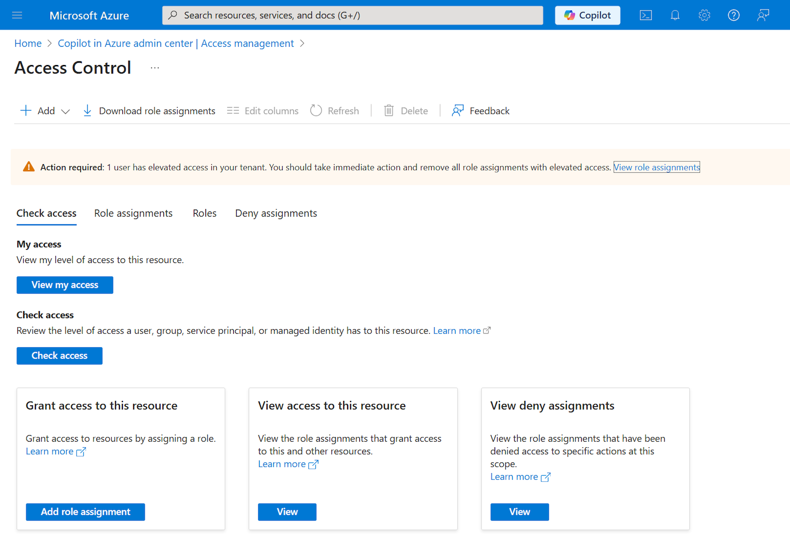

By default, Microsoft Copilot in Azure is available to all users in a tenant. However, Global Administrators can manage access to Microsoft Copilot in Azure for their organization. Access can also be optionally granted to specific Microsoft Entra users or groups.

If Microsoft Copilot in Azure isn't available for a user, they see an unauthorized message when they select the Copilot button in the Azure portal.

Regardless of access to Microsoft Copilot in Azure, Microsoft Copilot in Azure itself only has access to resources that the user has access to. It can only take actions that the user has permission to perform and requires confirmation before making changes. Microsoft Copilot in Azure complies with all existing access management rules and protections such as Azure role-based access control (Azure RBAC), Privileged Identity Management, Azure Policy, and resource locks.

To manage access to Microsoft Copilot in Azure for users in your tenant, any Global Administrator in that tenant can follow these steps.

1. Elevate your access so that your Global Administrator account can manage all subscriptions in your tenant.
1. In the Azure portal, search for Copilot in Azure admin center and select it.
1. In Copilot in Azure admin center, under Settings, select Access management.
1. Select the toggle next to On for entire tenant to change it to Off for entire tenant.
1. To grant access to specific Microsoft Entra users or groups, select Manage RBAC roles.
1. Assign the Copilot for Azure User role to specific users or groups. For detailed steps, see Assign Azure roles using the Azure portal.
1. When you're finished, remove your elevated access.

Global Administrators for a tenant can change the Access management selection at any time.

