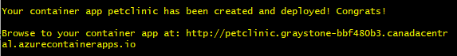

This section guides you through deploying a Spring Boot application to Azure Container Apps. We'll cover packaging the application, setting up the Azure environment, and pushing the  application to Azure Container Apps.

## Prerequisite

To successfully complete this project, ensure you have the following prerequisites:

| Requirement     | Instructions                                                                                                                                       |
|-----------------|-----------------------------------------------------------------------------------------------------------------------------------------------------|
| Azure account   | If you don't have one, [create an account for free](https://azure.microsoft.com/free/). You need the Contributor or Owner permission on the Azure subscription to proceed. Refer to [Assign Azure roles using the Azure portal](https://learn.microsoft.com/en-us/azure/role-based-access-control/role-assignments-portal?tabs=current) for details. |
| git             | [Install git](https://git-scm.com/downloads).                                                                                              |
| Azure CLI       | Install the [Azure CLI](https://learn.microsoft.com/en-us/cli/azure/install-azure-cli).                                                                                             |


## Setup

To sign in to Azure from the CLI, run the following command and follow the prompts to complete the authentication process.

```bash
az login
```

To ensure you're running the latest version of the CLI, run the upgrade command.

```bash
az upgrade
```

Next, install or update the Azure Container Apps extension for the CLI.

If you receive errors about missing parameters when you run `az containerapp` commands in Azure CLI, be sure you have the latest version of the Azure Container Apps extension installed.

```bash
az extension add --name containerapp --upgrade
```

Now that the current extension or module is installed, register the `Microsoft.App` and `Microsoft.OperationalInsights` namespaces.

```bash
az provider register --namespace Microsoft.App
```

```bash
az provider register --namespace Microsoft.OperationalInsights
```

## Create environment variables

Now that your Azure CLI setup is complete, you can define the environment variables that are used throughout this article.

```bash
export RESOURCE_GROUP="petclinic-containerapps"
export LOCATION="canadacentral"
export ENVIRONMENT="env-petclinic-containerapps"
export API_NAME="petclinic"
```

## Locate the sample code

Since we have already prepared the code sample in the last chapter, make sure that your are now in the `azure-container-apps-java-samples/spring-petclinic/spring-petclinic` directory of the project.

## Build and deploy the container app

Build and deploy your first Spring Boot app with the containerapp up command. This command will:

- Create the resource group.
- Create an Azure Container Registry.
- Build the container image and push it to the registry.
- Create the Container Apps environment with a Log Analytics workspace.
- Create and deploy the container app using the built container image.

The `up` command uses the Dockerfile in the root of the repository to build the container image. In the following code example, the `..` (dot dot) tells `containerapp up` to run the `dockerfile` in the previous folder.

```bash
az containerapp up \
    --name $API_NAME \
    --resource-group $RESOURCE_GROUP\
    --location $LOCATION \
    --environment $ENVIRONMENT \
    --source ..
```

## Verify deployment
Once your deployment is done, you should be able to see a success message with the project endpoint printed in the console. You may open the url to verify your project deployed on azure.


