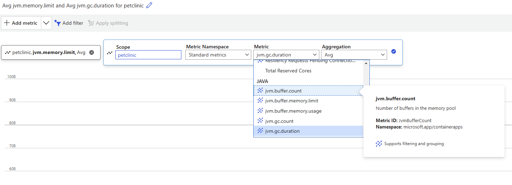

Now that you’ve deployed the Spring Pet Clinic application on Azure Container Apps, you can enhance its performance by enabling Azure’s built-in Java support features, known collectively as the **Java Stack.**. One of these features, Java metrics, can help to collect and monitor data include memory usage, garbage collection, thread count of your JVM.

This chapter will guide you through **Javak Stack** to enhance your Spring Boot application on Azure Container Apps. 

## Enable Java Stack in Azure Container Apps

Open your portal and find your deployed Container App, click on the **manage** of Development stack, in the pop up window, select **Java**. This will turn on the **Java Stack** to accelerate your Java applications, click on "Apply" to confirm the change.

Now you will see that your development stack is now set to **Java**.

## Explore the accelerated Java experiences on Azure
1. In the Azure portal, navigate to your **Azure Container Apps** instance.

2. Go to **Monitoring** > **Metrics**.

3. From there, you're presented with a chart that plots the metrics you're tracking in your application.

Azure Container Apps can run any containerized Java application in the cloud while giving flexible options for how you deploy your applications. With the the support of Java Stack, you can accelerate your application with Automatic memory fitting, varies deployment options and built-in Java diagnostics tools. You can learn more on [Java on Azure Container Apps overview](https://learn.microsoft.com/en-us/azure/container-apps/java-overview).