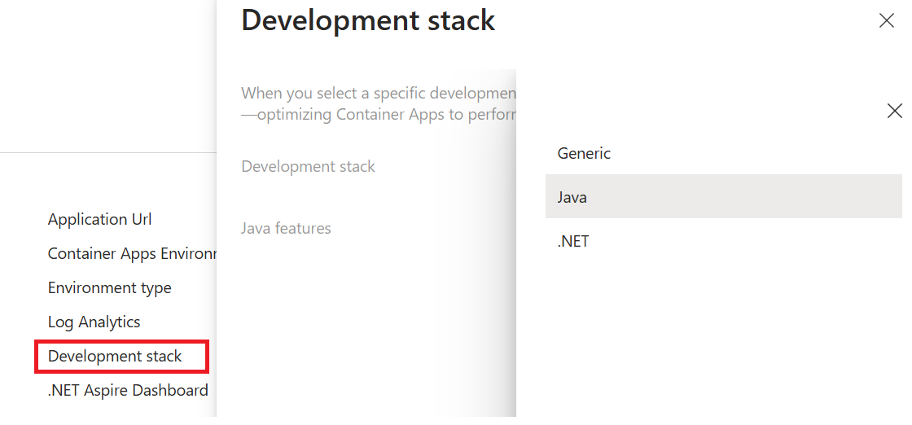

Now that you’ve deployed the Spring Pet Clinic application on Azure Container Apps, you can enhance its performance by enabling Azure’s built-in Java support features, known collectively as the **Java Stack.**. One of these features, Java metrics, can help to collect and monitor data include memory usage, garbage collection, thread count of your JVM.

This chapter will guide you through **Javak Stack** to enhance your Spring Boot application on Azure Container Apps. 

## Enable built-in Java features in Azure Container Apps

Open your portal and find your deployed Container App, click on the **manage** of Development stack, in the pop up window, select **Java**. This will turn on the **Java Stack** to enhance your Java applications, click on "Apply" to confirm the change.



Now you will see that your development stack is now set to **Java**.


## Explore the enhanced Java experiences on Azure

1. In the Azure portal, navigate to your **Azure Container Apps** instance.

2. Go to **Monitoring** > **Metrics**.

3. From there, you're presented with a chart that plots the metrics you're tracking in your application.


## View log streams via the Azure CLI

You can view your container app's log streams from the Azure CLI with the `az containerapp logs show` command or your container app's environment system log stream with the `az containerapp env logs show` command.

```bash
az containerapp logs show -n petclinic -g petclinic-containerapps
{"TimeStamp": "2024-12-13T08:16:41.11806", "Log": "Connecting to the container 'petclinic'..."}
{"TimeStamp": "2024-12-13T08:16:41.20563", "Log": "Successfully Connected to container: 'petclinic' [Revision: 'petclinic--kx4kswa-7988849646-554xk', Replica: 'petclinic--kx4kswa']"}
{"TimeStamp": "2024-12-13T08:16:11.328+00:00", "Log": "INFO 1 --- [           main] o.apache.catalina.core.StandardService   : Starting service [Tomcat]"}
{"TimeStamp": "2024-12-13T08:16:11.329+00:00", "Log": "INFO 1 --- [           main] o.apache.catalina.core.StandardEngine    : Starting Servlet engine: [Apache Tomcat/10.1.30]"}
{"TimeStamp": "2024-12-13T08:16:11.373+00:00", "Log": "INFO 1 --- [           main] o.a.c.c.C.[Tomcat].[localhost].[/]       : Initializing Spring embedded WebApplicationContext"}
{"TimeStamp": "2024-12-13T08:16:11.375+00:00", "Log": "INFO 1 --- [           main] w.s.c.ServletWebServerApplicationContext : Root WebApplicationContext: initialization completed in 2313 ms"}
{"TimeStamp": "2024-12-13T08:16:11.695+00:00", "Log": "INFO 1 --- [           main] com.zaxxer.hikari.HikariDataSource       : HikariPool-1 - Starting..."}
{"TimeStamp": "2024-12-13T08:16:11.976+00:00", "Log": "INFO 1 --- [           main] com.zaxxer.hikari.pool.HikariPool        : HikariPool-1 - Added connection conn0: url=jdbc:h2:mem:98e8760a-b48e-414c-8117-520195a6d22f user=SA"}
{"TimeStamp": "2024-12-13T08:16:11.978+00:00", "Log": "INFO 1 --- [           main] com.zaxxer.hikari.HikariDataSource       : HikariPool-1 - Start completed."}
{"TimeStamp": "2024-12-13T08:16:12.187+00:00", "Log": "INFO 1 --- [           main] o.hibernate.jpa.internal.util.LogHelper  : HHH000204: Processing PersistenceUnitInfo [name: default]"}
{"TimeStamp": "2024-12-13T08:16:12.283+00:00", "Log": "INFO 1 --- [           main] org.hibernate.Version                    : HHH000412: Hibernate ORM core version 6.5.3.Final"}
{"TimeStamp": "2024-12-13T08:16:12.325+00:00", "Log": "INFO 1 --- [           main] o.h.c.internal.RegionFactoryInitiator    : HHH000026: Second-level cache disabled"}
{"TimeStamp": "2024-12-13T08:16:12.681+00:00", "Log": "INFO 1 --- [           main] o.s.o.j.p.SpringPersistenceUnitInfo      : No LoadTimeWeaver setup: ignoring JPA class transformer"}
{"TimeStamp": "2024-12-13T08:16:13.722+00:00", "Log": "INFO 1 --- [           main] o.h.e.t.j.p.i.JtaPlatformInitiator       : HHH000489: No JTA platform available (set 'hibernate.transaction.jta.platform' to enable JTA platform integration)"}
```

You can check more on [View log streams in Azure Container Apps](https://learn.microsoft.com/azure/container-apps/log-streaming).

Azure Container Apps can run any containerized Java application in the cloud while giving flexible options for how you deploy your applications. With the the support of Java Stack, you can enhance your application with Automatic memory fitting, varies deployment options and built-in Java diagnostics tools. You can learn more on [Java on Azure Container Apps overview](https://learn.microsoft.com/azure/container-apps/java-overview).
