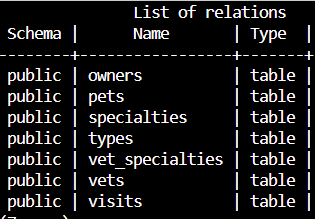

Since you’ve deployed the Spring Pet Clinic application with the default H2 in-memory database, you might want to connect it to a more powerful, persistent database like PostgreSQL. This will ensure that your application data is stored even when the application is restarted, providing greater durability and scalability for production use.

> [!NOTE]
> This chapter is optional, you may skip it if you are already familar with database configurations.

## Create the PostgreSQL Server

These environment variables will be used to create necessary database connections in this section.

```bash
export POSTGRESQLSERVER="petclinic-server"
export DATABASE="petclinic"
```

Now, let's create a PostgreSQL flexible server.

```bash
az postgres flexible-server create --name $POSTGRESQLSERVER --resource-group $RESOURCE_GROUP
```

You may find the auto-generated admin username and admin password in the output, save in a secure place if you want to connect and config later on.

### Create a new Database

We will create a new database on the PostgreSQL flexible server instance.

```bash
az postgres flexible-server db create \
   --database-name $DATABASE \
   --resource-grou $RESOURCE_GROUP \
   --server-name $POSTGRESQLSERVER
```

You may check [Create an Azure Database for PostgreSQL - Flexible Server instance using Azure CLI](https://learn.microsoft.com/azure/postgresql/flexible-server/quickstart-create-server-cli) for more details.

### Connect via Service Connector

With the database been created, now let's connect our previously deployed container app to the PostgreSQL Database.

```bash
az containerapp connection create postgres-flexible --resource-group $RESOURCE_GROUP \
   --name $APP_NAME \
   --target-resource-group $RESOURCE_GROUP \
   --server $POSTGRESQLSERVER \
   --database $DATABASE \
   --system-identity \
   --container $APP_NAME
```

You may check [Connect to PostgreSQL Database from a Java Quarkus Container App without secrets using a managed identity](https://learn.microsoft.com/azure/container-apps/tutorial-java-quarkus-connect-managed-identity-postgresql-database) for more details.

### Update `spring.profiles.active` for PostgreSQL

Now let's set the environment variables of the deployed container apps to set the database as PostgreSql

```bash
az containerapp update -n $APP_NAME -g $RESOURCE_GROUP --set-env-vars "spring.profiles.active"="postgres"
```

This will restart the app and apply changes, such as initializing the SQL tables.

## Validate the Database setup
Now that the configuration is complete. If you connect to your PostgreSQL, you will see that the table has already been created.


