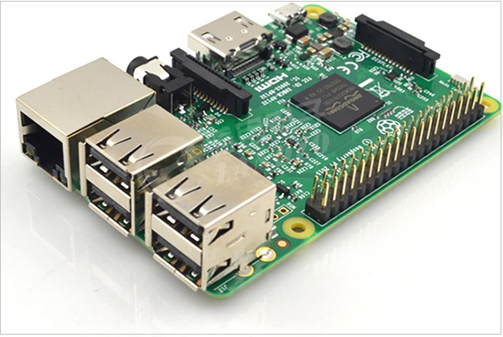

For many businesses, the Internet of Things (IoT) is new territory opened up by the cloud. It's a technology that enables a mass of devices, with _some_ computational power, to connect to a single cloud process with a mass of computational power.

The amount of data that IoT devices can capture creates a significant challenge for IT operations. Businesses expect IT administrators to help them understand what data to collect, and to help them realize the full potential of that data.

## Flatten the IoT learning curve

IT professionals who have plenty of experience with computer technology, but who are new to IoT, will want to experiment with test hardware or simulated IoT devices. Getting one "thing" communicating with the Azure platform is a giant step in gaining confidence and knowledge with working with this new technology.

A "thing" in the IoT world is often a sensor device. The device has some processing power but isn't a computer that can compare with a smartphone, laptop, PC, or workstation. The sensor device typically takes some measurements (including temperature, velocity, acceleration, and humidity) at a specified time interval. The device then transmits the values for processing to the cloud. These values are called _telemetry_.

In another example, an IoT system might capture and run predictive analytics on data from health monitors. Doctors can then make informed treatment plans for their patients. And it's all handled remotely.

In addition to transmitting data, IoT devices can get some instructions from the cloud. For example, the time interval might be changed, or additional sensors might be enabled or disabled. For a more complex device, one that both records telemetry and changes settings, the device can receive _desired_ values from the cloud. The device will then adjust its settings to try to match the desired values it has received. These values might be temperature, humidity, velocity, and related telemetry.

In the world of IoT devices, _recorded_ values and _desired_ values are key concepts. In this module, we'll test only recorded values.

Imagine a scenario where there are many sensor devices. For example, devices record weather data, devices record the temperature of the contents of refrigeration units, and devices record the vibration in a series of conveyor belts. All the telemetry data is transmitted to a single source for processing. That source is an Azure IoT hub. And you've been assigned the job as administrator of that hub!

In this module, you'll learn the basics of hub administration.

A popular device for getting experience with IoT is the Raspberry Pi device. This device is a small circuit board with some LED lights, some sensors (including for temperature), and the ability to communicate with an IoT hub. Some developers will want to physically connect the device and gain experience that way. A simpler alternative is to use Microsoft's Raspberry Pi simulator and do everything in software on your computer. This process is the approach we take in this module: you'll set up an IoT hub, define a single device, and then use the simulator to send telemetry to the hub.

As the hub admin, you'll learn about the portal that's used to set up, monitor, and control external devices.

Let's get started by learning a bit more about the Raspberry Pi simulator.

## Learning objectives

In this module, you will:

- Get an introduction to IoT  
- Configure an Azure IoT hub to capture data
- Interact with a Raspberry Pi simulator
- Explore the IoT hub's left menu
