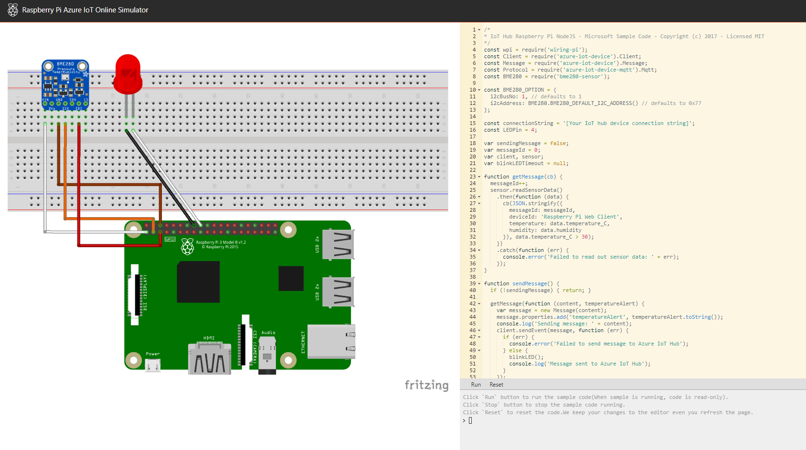

Raspberry Pi boards have garnered much interest of late for testing theories or
even making cool things. While the cost on this boards are quite low, some may
be interested in testing out the Raspberry Pi functionality before investing in
one.

Microsoft has built an online [Raspberry Pi Azure IoT Simulator](https://azure-samples.github.io/raspberry-pi-web-simulator?azure-portal=true) allowing users to control
the emulated hardware via code. The emulator portrays a graphic of a Raspberry
Pi connected to a temperature, humidity, pressure sensor, and a red LED via
breadboard allowing circuits to be wired together. The displayed side panel
allows users to enter Node.js JavaScript code to control the LED and collect
dummy data from the simulated sensor.

## Raspberry Pi Azure IoT Online Simulator

At first run, the simulator operates a sample temperature capture program which
is displayed via the command line. The same sample application can also be run
on a real Pi as the simulator is designed to allow people to test code before
transferring it to a real device.

There are three areas in the web simulator:

1. **Assembly Area**. This is where you can see your device status. By default, this is a Pi connecting with a BME280 sensor and an LED light. This configuration isn't customizable at this time.
2. **Coding Area**. An online code editor for you to make an app on Raspberry Pi with Node.js. The
    default sample application helps to collect sensor data from the BME280 sensor and sends it to your Azure IoT Hub.
3. **Integrated console window**. This is where you can see the output of your app. Within the console there are three functions:
    - `run` - Runs the sample code (When sample is running, code is read-only).
    - `Stop` - Stops the sample code running.
    - `Reset` - Resets the code.

Now that you have an overview of the Raspberry Pi simulator, we'll explore the IoT Hub in Azure where you will create a new resource to capture data from the simulator.

<!-- Reference links 
-   Online Raspberry Pi Emulator:
    <https://docs.microsoft.com/azure/iot-hub/iot-hub-raspberry-pi-web-simulator-get-started>
-   <https://azure-samples.github.io/raspberry-pi-web-simulator/#GetStarted>-->