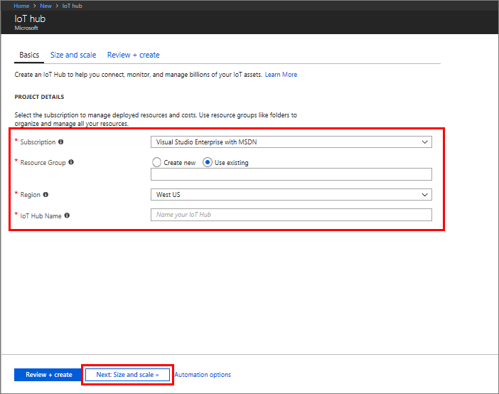
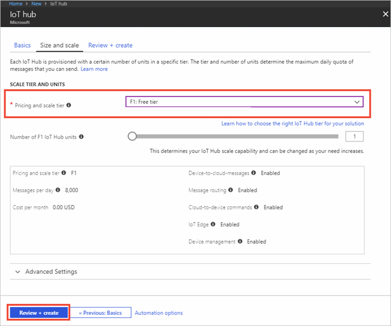

Capturing of weather data is an important task as weather can effect everything
from traffic patterns to how heating, ventilation, and air conditioning (HVAC) systems in retail stores are operated. In this
exercise, you will be interacting with the online Raspberry Pi simulator you learned about in the previous unit to capture
simulated weather data and via the Azure IoT Hub.

[!include]

While this exercise is being conducted in a simulated environment, the application running on the simulated device can be transferred to a real device in the future.

## Create an IoT hub
Azure IoT Hub provides the features and an extensibility model that enable device and back-end developers to build robust device management solutions. Devices range from constrained sensors and single purpose microcontrollers, to powerful gateways that route communications for groups of devices. In addition, the use cases and requirements for IoT operators vary significantly across industries. Despite this variation, device management with IoT Hub provides the capabilities, patterns, and code libraries to cater to a diverse set of devices and end users.

In order to start collecting the data from the Raspberry Pi simulator, you need to first create an IoT hub.

1. Sign into the [Azure portal](https://portal.azure.com/learn.docs.microsoft.com?azure-portal=true) using the same account you activated the sandbox with.

2. Choose **Create a resource** in the upper left-hand corner of the Azure portal.

3. Select **Internet of Things**, and then select **IoT Hub**.

4. In the **IoT hub** pane, enter the following information for your IoT hub:

   - **Subscription**: Use the default subscription for this example.
   - **Resource group**: Use the existing resource group. By putting all related resources in the same group you can manage them all together. For example, deleting the resource group deletes all resources contained in that group.
   - **Name**: Create a unique name for your IoT hub. If the name you enter is available, a green check mark appears.
   - **Region**: Select the closest location to you from the following list.

    [!include]

    > [!IMPORTANT]
    > The IoT hub will be publicly discoverable as a DNS endpoint, so make sure to avoid any sensitive information while naming it.

    

1. Select **Next: Size and scale** to continue creating your IoT hub.
2. Choose your **Pricing and scale tier**. For this example, select the **F1 - Free** tier.

    

3. Select **Review + create**.

4. Review your IoT hub information, then click **Create**. Your IoT hub might take a few minutes to create. You can monitor the progress in the **Notifications** pane.

<!--STOPPED HERE-->
<!--
Now that you have created an IoT hub, it's time to locate the important information that you use to connect devices and applications to your IoT hub. In your IoT hub navigation menu, open **Shared access policies**. Select the **iothubowner** policy, and then copy the **Connection string---primary key** of your IoT hub. For more information, see [Control access to IoT Hub](https://docs.microsoft.com/azure/iot-hub/iot-hub-devguide-security).

> [!NOTE]
> You do not need this iothubowner connection string for this set-up exercise. However, you may need it for some of the tutorials or different IoT scenarios after you complete this set-up.

-->

## Register a device
A device must be registered with your IoT hub before it can connect.

1. In your IoT hub navigation menu, open **IoT devices**, then click **Add** to register a device in your IoT hub.

   

2. Enter a **Device ID** for the new device. Choose a meaningful ID to represent your device. Device IDs are case sensitive.

    > [!IMPORTANT]
    > The device ID may be visible in the logs collected for customer support and troubleshooting, so make sure to avoid any sensitive information while naming it.

3. Click **Save**.
4. After the device is created, open the device from the list in the **IoT devices** pane.
5. Copy the **Connection string---primary key** to use later.

   

## Send simulated telemetry

1. Open the [Raspberry Pi Azure IoT Simulator](https://azure-samples.github.io/raspberry-pi-web-simulator?azure-portal=true).
1. Replace the placeholder in Line 15 with the Azure IoT hub device connection string you just copied.
1. Click the `Run` button or type `npm start` in the console window to run the application.

    

1. You should see the following output that shows the sensor data and the messages that are sent to your IoT hub.

    

## Read the telemetry from your hub
So what's happening? IoT hub is receiving the device-to-cloud messages sent from the simulated device. In order to see that, let's take a quick look at how Azure IoT Hub is processing the incoming data. In your IoT Hub, under **Monitoring**, select **Metrics**. Give it a few minutes as you wait for the data to come into the picture.

<!--Reference links
https://docs.microsoft.com/azure/iot-hub/iot-hub-raspberry-pi-web-simulator-get-started-->
