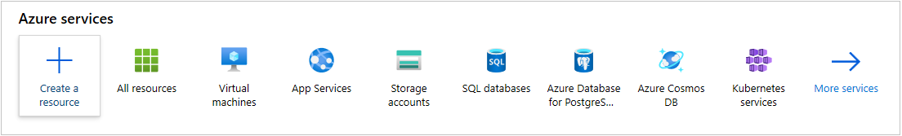
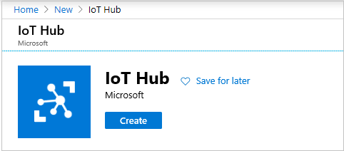
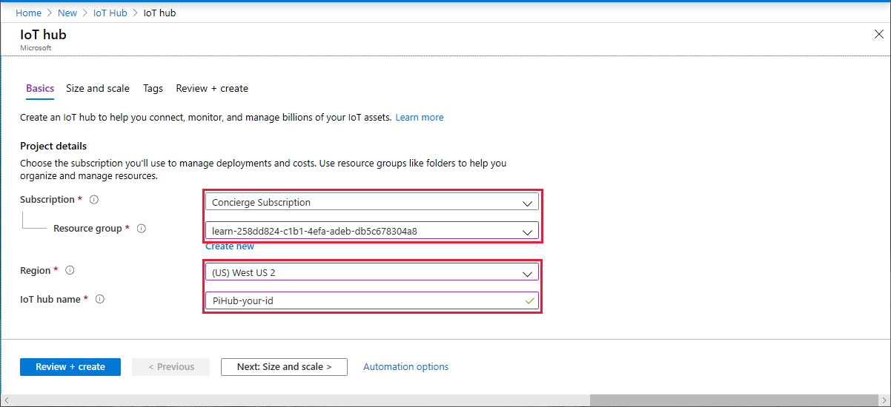
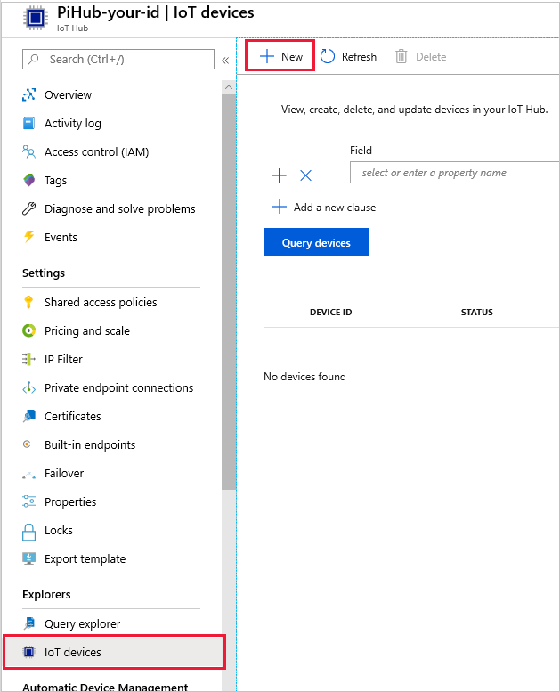
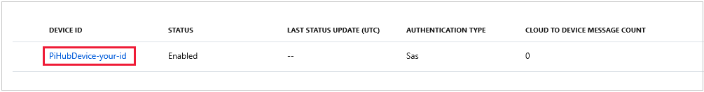
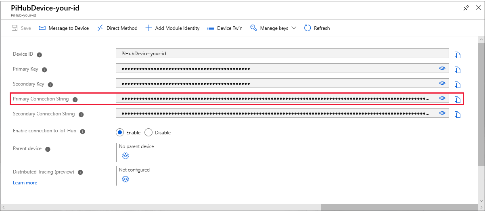
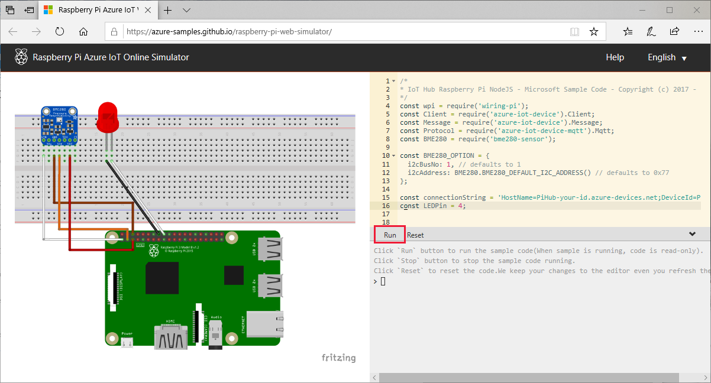
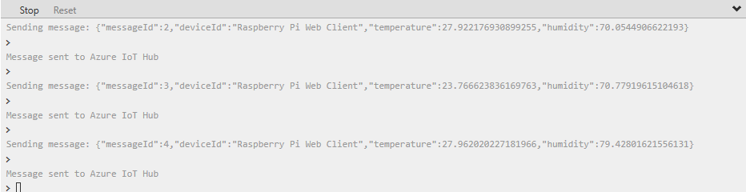
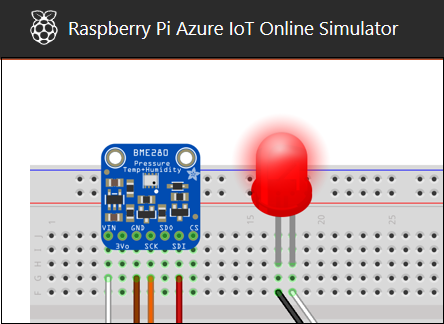
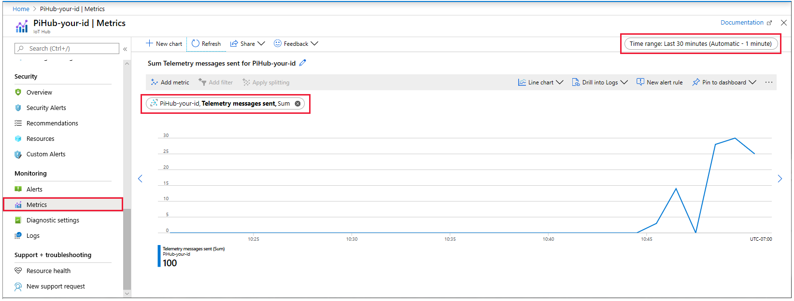

In this unit, you'll be interacting with the online Raspberry Pi simulator you learned about in the previous unit.

While this exercise is being conducted in a simulated environment, the app running on the simulated device is similar to the code that would be running on a real device. In the IoT world, device simulation is a valuable step when building a production grade solution.

## Create an IoT hub

In order to start collecting the data from the Raspberry Pi simulator, you need to first create an IoT hub.

1. Right-click [Azure portal](https://portal.azure.com/learn.docs.microsoft.com?azure-portal=true), and select **Open in new window**.

1. Choose **Create a resource** in the upper left-hand corner of the Azure portal, then search for **IoT Hub**.

    

1. Create an IoT Hub resource.

     

1. In the **IoT hub** pane, enter the following information for your IoT hub:

   - **Subscription**: Use the **Concierge subscription** for this example. This entry is the sandbox subscription.
   - **Resource group**: Use the sandbox resource group.
   - **Name**: Create a unique name for your IoT hub, something like "PiHub-your-id", replacing "your-id" with something appropriate. If the name you enter is available, a green check mark appears.
   - **Region**: Select the closest region to your location.

    > [!IMPORTANT]
    > The IoT hub will be publicly discoverable as a DNS endpoint, so make sure to avoid any sensitive information while naming it.

     

1. Select **Review + create**.

1. Review your IoT hub information, then click **Create**. Your IoT hub might take a few minutes to deploy. 

1. Click **Go to resource**, when the deployment is complete.

## Register a device

A device must be registered with your IoT hub before the device can connect.

1. In your IoT hub navigation menu, open **IoT devices**, then click **+ New** to register a device in your IoT hub.

    

1. Enter a **Device ID** for the new device. Choose a meaningful ID to represent your device, something like "PiHubDevice-your-id", again replacing "your-id" with something appropriate. Device IDs are case-sensitive.

    > [!IMPORTANT]
    > The device ID may be visible in the logs collected for customer support and troubleshooting, so make sure to avoid any sensitive information while naming it.

1. Click **Save**.

1. After the device is created, open the device from the list in the **IoT devices** pane.

    

1. Copy the **Primary Connection String** to a text file, to use in the next section. The icon to the far right of the string copies the key to the clipboard for you.

   

## Send simulated telemetry

1. Right-click [Raspberry Pi Azure IoT Simulator](https://azure-samples.github.io/raspberry-pi-web-simulator?azure-portal=true), and select **Open in new window**.

1. Replace the placeholder in line 15 with the Azure IoT hub device connection string from your text file.

    

1. Click the `Run` button, or type `npm start` in the console window, to run the application.

   

1. You should see output similar to the following, showing the sensor data and messages sent to your IoT hub.

   

1. Make sure you don't miss the LED flash, each time a message is sent!

   

## Read the telemetry from your hub

So what's happening? IoT hub is receiving the device-to-cloud messages sent from the simulated device. In order to see that, let's take a quick look at how Azure IoT Hub is processing the incoming data.

1. In your IoT Hub, under **Monitoring**, select **Metrics**.

1. For **Metric** locate  **Telemetry messages sent** - it is near the end of the list of available metrics. Select **Sum**, for **Aggregation**.

1. Change the time range to **Last 30 minutes**, in the box top-right. Give it a few minutes as you wait for the data to come into the picture.

   

1. The shape of the graph will depend on the volume of messages arriving, and the sequence of `Run`, `Stop`, and `Reset` commands that you use. Feel free to stop, and restart, the sending of telemetry. Notice how the graph changes, and when it changes, as there's some latency.

### Next steps

For the penultimate unit of this module, let's look at some of the most useful left-hand menu entries for your job as hub administrator.
