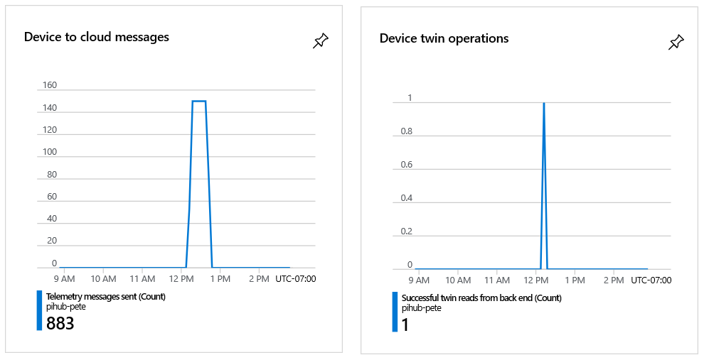
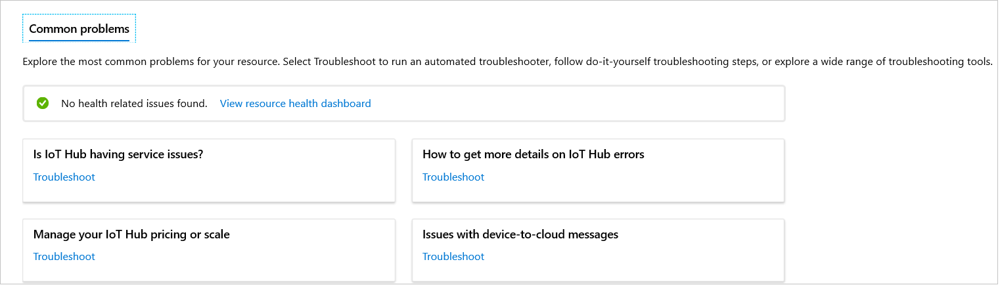
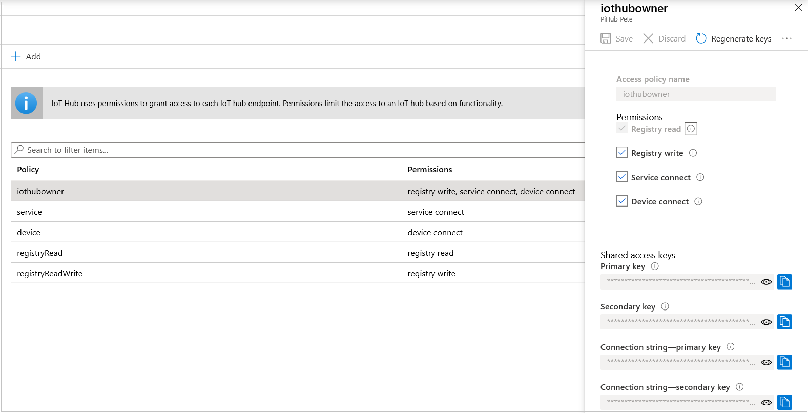
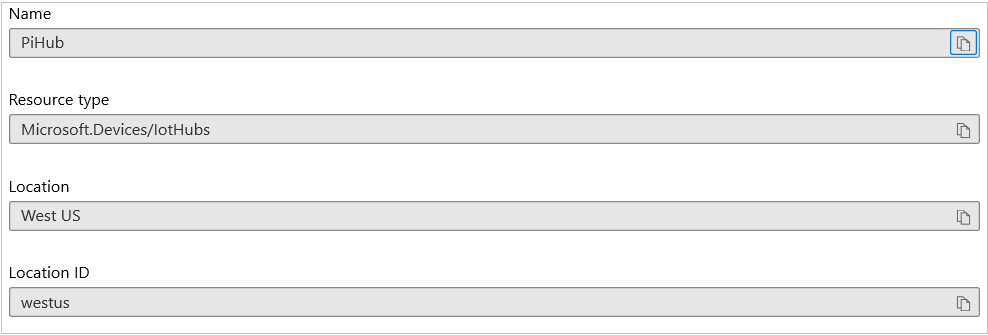
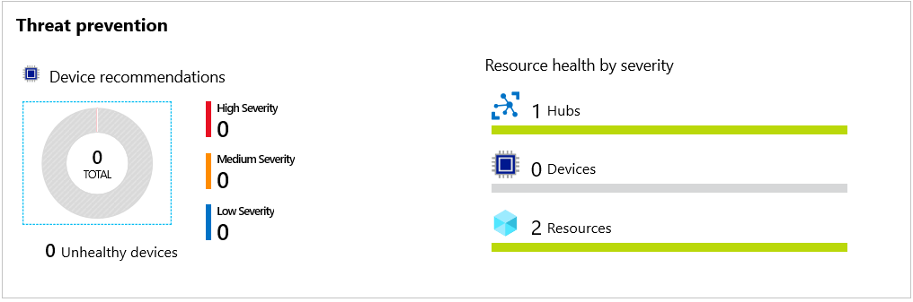

As an IoT admin, you need to get familiar with the left menu for your IoT hub. In this unit, we examine the most commonly used of these menu items. We don't examine them all, because some won't make sense until you have specific resources that will show up when you select these entries. 

There's no need to try to learn everything at once. The purpose of this unit is to identify the menu items that are most valuable to you when you begin your adventure in IoT hub administration.

## Explore the IoT hub menu

This section will help you build up a _to-do_ list of other Learn modules relevant to you.

Start by selecting the **Overview** menu entry.

### Overview

The overview contains some useful data. If you scroll to the bottom of the page, you'll see two charts. By default, the **Telemetry messages sent** and **Successful twin reads from back end** metrics are displayed here. These charts are a good place to go to when you're verifying that the telemetry from a device is being received.

The overview, however, isn't the most useful of the menu entries, as we'll see as we explore the menu. You can select **Activity log**, though you might not understand why the entries are there. Logs often contain too much information! Also, select **Diagnose and solve problems**. This page is a resource to go to if problems arise. There's no guarantee that it will have all the information you need, but it's a good place to start.

Next, find the **Settings** section.

### Settings

The important entry here is **Shared access policies**. You have already used this entry to extract the primary key for your hub. This entry is used to get the keys for all the policies that have been defined for the hub. You can create custom policies if needed. 

The default list of policies is shown in the following image. Each policy has its own set of keys.

Another useful entry is **Properties**. Select this entry to bring up a range of strings that apply to your hub, including name, region, and subscription. This entry is a good point of reference. It's something to check if you get an unexpected error, for example. Also note that you can copy any of the strings by using the icon to the right.

Now, find the **Explorers** section.

### Explorers

The **IoT devices** entry, which you've already used, is one of the most important entries on the left menu. When you start adding multiple devices to a hub, you'll see how helpful this entry is in administering remote devices. One of the main uses of this entry is to locate the _device_ connection strings and keys. Device keys are distinct from the _service_ keys for the hub itself.

For more experience with devices, consider adding the following two Learn modules to your to-do list:
- [Remotely monitor and control devices with Azure IoT Hub](/learn/modules/remotely-monitor-devices-with-azure-iot-hub/)
- [Automate IoT devices management with Azure IoT Hub](/learn/modules/automate-iot-devices-management-with-azure-iot-hub/)

Next, find the **Security** section.

### Security

Select the **Overview** menu entry for this section. There will be nothing dramatic in this example, but you can see where to go for security recommendations when you have a production hub running.

If securing devices is important to your scenarios, add the following module to your to-do list: 
[Automatically provision IoT devices securely and at scale with the Device Provisioning Service](/learn/modules/securely-provision-iot-devices-at-scale-with-device-provisioning-service/).

Finally, find the **Monitoring** section.

### Monitoring

You have already used **Metrics**, in the previous unit. Another useful entry is **Alerts**. Alerts fire when certain conditions, usually errors or warnings, are met.

To get detailed experience with metrics, and to set up some alerts, add the following module to your to-do list:
[Manage your Azure IoT hub with alerts and metrics](/learn/modules/manage-azure-iot-hub-with-metrics-alerts/).

### Next steps

Perhaps you've created a to-do list of one or two Learn modules to investigate at a later date. Learning one step at a time is a good way to go with IoT hub. 

You have almost completed this module. Let's finish with a summary and short knowledge check.