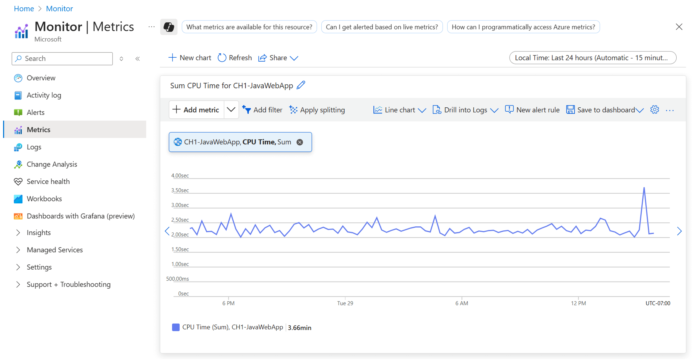

Microsoft Foundry's observability capabilities help organizations manage and optimize their AI agent investments through monitoring, evaluations, and OpenTelemetry-based tracing. The Agent Monitoring Dashboard surfaces operational signals such as token usage, latency, run success rate, and evaluation outcomes, while traces expose model calls, tool invocations, and dependencies for troubleshooting. Together, these capabilities help teams improve agent reliability, quality, safety, and cost efficiency as they scale agent solutions.

## Monitor agents with Azure Monitor Application Insights

Monitoring AI agents with Azure Monitor Application Insights is essential for improving return on investment (ROI) because it provides deep visibility into agent behavior, performance, and user interactions. By capturing telemetry data such as response times, failure rates, and usage patterns, organizations can identify inefficiencies, optimize resource allocation, and proactively resolve issues before they impact users. This level of observability enables data-driven decisions that reduce operational costs and enhance agent effectiveness. Additionally, Application Insights supports custom metrics and distributed tracing,
allowing teams to fine-tune agent workflows and ensure alignment with business goals. Ultimately, this leads to more reliable, scalable, and cost-effective AI solutions that deliver measurable value.

Azure Monitor Application Insights stores the traces and monitoring telemetry associated with a Foundry project. After you connect an Application Insights resource at the project level, Foundry automatically enables server-side tracing for agents hosted in Foundry. No per-agent deployment setting or code change is required.

You can:

- Review token usage, latency, run success rate, and evaluation outcomes in the Agent Monitoring Dashboard.
- Inspect model calls, tool invocations, exceptions, and latency in **Traces**.
- Create Azure Monitor alert rules from supported metric or log signals.
- Use Application map as an optional topology view when an instrumented application emits the required request and HTTP dependency telemetry.

### Steps

1. In Foundry (new), open the project that contains your agent.
1. Select **Agents** > **Traces** > **Connect**, and then create or connect an Application Insights resource.
    - If **Connect** isn't available, select **Manage** > **Project details** > **Connected resources** > **Add connection** > **Application Insights**.
1. Run the agent at least once, and then return to **Agents** > **Traces** to inspect the trace and its spans.
1. Select **Build**, select the agent, and then select **Monitor** to review agent-level operational and evaluation data.
1. Configure Azure Monitor alerts only after you identify a supported metric or log query for the resource you want to monitor.

> [!IMPORTANT]
> Traces can contain prompts, model outputs, tool arguments, and tool results. Minimize or redact sensitive data before it reaches telemetry, and apply appropriate access controls and retention settings. For setup and security guidance, see [Set up tracing for AI agents](/azure/foundry/observability/how-to/trace-agent-setup).

## Analyze metrics with Azure Monitor Metrics Explorer

Analyzing metrics with Azure Monitor Metrics Explorer is a strategic way to improve ROI on AI agent investments by enabling data-driven performance optimization. This tool provides real-time visibility into key operational metrics such as latency, throughput, error rates, and resource utilization, allowing teams to identify inefficiencies and performance bottlenecks quickly. By visualizing trends and setting up alerts, organizations can proactively address issues before they escalate, ensuring consistent service quality and minimizing downtime. Moreover, correlating agent behavior with infrastructure metrics helps
fine-tune resource allocation, reducing overprovisioning and cutting unnecessary costs. Ultimately, this level of observability empowers teams to make informed decisions that enhance agent reliability, user satisfaction, and financial efficiency.

Metrics Explorer charts the platform or custom metrics emitted by the resources in the selected scope. Select the signal source that owns the metric:

- For model request, token, and latency metrics, select the Foundry or Azure OpenAI resource that emits those metrics.
- For App Service, Azure Functions, containers, or other hosting resources, select the hosting resource and use only the host or runtime metrics it supports, such as requests, CPU, memory, or network usage where available.
- For application-specific business or agent metrics, instrument the application to emit custom metrics through Azure Monitor or OpenTelemetry.

### Steps

1. In the Azure portal, select **Monitor** > **Metrics**.
1. Set **Scope** to the resource that emits the signal you want to analyze.
1. For an Azure OpenAI deployment, select supported metrics such as **Azure OpenAI Requests**, **Processed Prompt Tokens**, **Generated Completion Tokens**, **Time to Response**, **Time to Last Byte**, or **Provisioned-managed Utilization V2**.
1. Select the correct aggregation, and use supported dimensions such as **ModelDeploymentName** or **StatusCode** to filter or split the chart.
1. Set the time range, correlate the chart with host or agent data for the same period, and optionally pin the chart or create an alert.
1. In Foundry, select **Manage** > **Quota** to view or change TPM allocations for standard deployments and PTU allocations for provisioned deployments.

> [!NOTE]
> App Service and Azure Functions don't expose Azure OpenAI token or model-latency metrics unless your application publishes equivalent custom metrics. TPM and PTU allocations are configuration values, not a generic **AI quota usage** metric. See the [Azure OpenAI monitoring data reference](/azure/foundry/openai/monitor-openai-reference) and [quota management guidance](/azure/foundry/openai/how-to/quota).

## Analyze model costs with Cost Analysis in Microsoft Cost Management

Microsoft Cost Management Cost Analysis is a financial analytics tool for billed or estimated cost. It breaks down charges by scope, resource, billing meter, and supported tags. It doesn't provide per-agent operational telemetry or compare model quality, latency, and success rate with cost by itself. Use Foundry **Monitor**, Azure Monitor, traces, and evaluations for those signals, and correlate the datasets when you need cost-per-outcome analysis.

You need Cost Management read access at the scope you analyze.

### Steps

1. In the Azure portal, open the Foundry resource or resource group, and then select **Cost Management** > **Cost analysis**.
1. Choose a scope that contains all relevant charges. Use the resource-group scope when model or Azure Marketplace meters are recorded at that level.
1. Group costs by **Resource**, and then by **Meter**, to identify the resources and input, output, hosting, or other billing meters that generated the charges.
1. At a broader subscription scope, use the **Service tier: Azure OpenAI** filter to focus on Azure OpenAI usage.
1. For supported project-level attribution, which is in preview, add a **Tag** filter for `project`. Project attribution currently supports Models sold by Azure, including Azure OpenAI, but not Azure Marketplace models.
1. Include Azure AI Search, Azure Speech in Foundry, storage, networking, and other dependent resources only when you calculate the total solution cost; don't use those services as a proxy for model-inference cost.
1. Save or share the view for recurring financial analysis.
1. Use the agent or model **Monitor** tab and Azure Monitor for token usage, latency, success rate, and evaluation results. Export and correlate financial and operational data in Power BI or Fabric when you need a combined analysis.

> [!IMPORTANT]
> Budgets and cost anomaly alerts notify users and support investigation; they don't impose a hard spending cap or stop Azure OpenAI consumption or billing. Cost data is delayed, budgets are evaluated periodically, and subscription anomaly detection occurs daily about 36 hours after the end of the day in UTC. Any automated stop, throttle, or remediation action must be designed, authorized, and tested separately. For current limitations, see [Plan and Manage Costs](/azure/foundry/concepts/manage-costs).

## Export Cost Management data for Power BI or Fabric

Cost Management exports automate delivery of cost-impacting datasets to Azure Storage. Power BI or Microsoft Fabric can then ingest the exported files for advanced analysis; the export isn't a direct publication to a Power BI report or Fabric model.

Before you create an export, make sure you have permission to create exports at the selected Cost Management scope and permission to use the destination storage account.

### Steps

1. In the Azure portal, search for and select **Cost Management**.
1. Select the scope whose data you want to export, and then select **Exports** in the left navigation.
1. Select **+ Create**.
1. On the **Basics** tab, select a template, or select **Create your own export**, and then select **Next**.
1. On the **Datasets** tab, review the preselected exports or select **+ Add export**. For each export, configure:
    - **Type of data**, such as cost and usage details, FOCUS cost and usage details, price sheet, reservation details, reservation recommendations, or reservation transactions.
    - **Dataset version**.
    - **Export name** and, if needed, an export description.
    - A frequency offered for that dataset and scope.
1. On the **Destination** tab, configure the Azure Blob Storage destination, storage account, container and directory path, file format (**CSV** or **Parquet**), and supported compression option.
1. Select **Review + create**, create the export, and use its run history to verify successful delivery.
1. In Power BI, use the [Azure Blob Storage connector](/power-query/connectors/azure-blob-storage). In Fabric Data Factory, use the [Azure Blob Storage connector overview](/fabric/data-factory/connector-azure-blob-storage-overview) to ingest the exported files.

> [!NOTE]
> Available data types and frequencies depend on the billing account type, scope, and dataset. Don't assume that every dataset supports the same daily, monthly, actual-cost, or amortized-cost options. See [Create and manage Cost Management exports](/azure/cost-management-billing/costs/tutorial-improved-exports) for the current matrix.

## Continuously evaluate your AI agents in Microsoft Foundry

The Agent Monitoring Dashboard combines operational telemetry from the Application Insights resource connected to a Foundry project with evaluation results for sampled agent traffic. Use it to review token usage, latency, run success rate, evaluation outcomes, and related traces.

> [!WARNING]
> The agent metrics view and recurring evaluations are preview. Preview features are provided without a service-level agreement and aren't recommended for production workloads. Before you use them with production traffic, verify region availability, limits, current support status, and your organization's preview-risk approval.

Recurring evaluation supports two patterns:

- **Continuous evaluation** samples eligible live traffic as responses complete.
- **Scheduled evaluation** executes on a fixed schedule by using selected trace traffic or a dataset.

Use recurring evaluation to detect quality or safety regressions in controlled preproduction environments. If your organization accepts the preview risk, you can also use it with production traffic as one monitoring input; continue to use predeployment evaluations and operational monitoring as complementary controls.

### Prerequisites

Before you begin, make sure you have:

- A project in Foundry (new) with at least one agent.
- An Azure Monitor Application Insights resource connected to the project.
- Azure RBAC access to the connected Application Insights resource. For log-based views, assign **Log Analytics Reader** on the associated Log Analytics workspace. If the relevant tables are protected, also assign **Privileged Monitoring Data Reader**.
- The **Foundry User** role assigned to the Foundry project's managed identity so that continuous evaluation rules can run.
- Representative agent traffic and evaluators that match the quality and safety risks you need to measure.

### Set up continuous evaluation in the Foundry portal

1. Open your project in Foundry and make sure the **New Foundry** experience is enabled.
1. Select **Agents** > **Traces** > **Connect**, and then create or connect an Application Insights resource.
    - If **Connect** isn't available, select **Manage** > **Project details** > **Connected resources** > **Add connection** > **Application Insights**.
1. In the Azure portal, configure the required access:
    - Verify the monitoring roles listed in the prerequisites for the Application Insights resource and associated Log Analytics workspace.
    - On the Foundry project resource, select **Access control (IAM)** > **Add role assignment**, assign **Foundry User**, and select the project's managed identity as the member.
1. In Foundry, select **Build** > **Agents**, and then create or select the agent to evaluate.
1. Select **Build** > **Evaluations** > **Recurring Configs** > **Create**.
1. Select the agent or agents and the evaluation turn level.
1. Select **Continuous evaluation**, and then select **Live traffic** as the data source.
1. Select **Random** or **Intelligent sampling**, set the applicable maximum number of traces or agent executions, choose the evaluators, and complete the wizard.

### Verify continuous evaluation

1. Generate representative agent traffic by testing the agent in Foundry or running the application that calls it.
1. Select **Build**, select the agent, and then select **Monitor**. Set the time range and review the operational and evaluation charts.
1. Select **Build** > **Evaluations** > **Recurring Configs**, open the configuration, and confirm that recurring evaluations complete with a **Completed** status.
1. Select **Agents** > **Traces**, open a related trace, and use its spans to investigate failures or unexpected scores.

> [!NOTE]
> Continuous evaluation samples live traffic; it doesn't guarantee that every response is evaluated. Telemetry ingestion, evaluation processing, sampling settings, and hourly run limits affect which results appear and when they become available.

For SDK automation, use a currently supported `azure-ai-projects` 2.x release, agent versions, and the Responses and Conversations flow. Migrate any Agents v1 implementation to the current agent-version and Responses and Conversations model. Use the [maintained continuous-evaluation samples](/azure/foundry/observability/how-to/how-to-monitor-agents-dashboard#full-sample-code), the [Azure AI Projects SDK guidance](/python/api/overview/azure/ai-projects-readme), and the [Agent Service migration guidance](/azure/foundry/agents/how-to/migrate) instead of copying an incomplete custom sample into the module.
