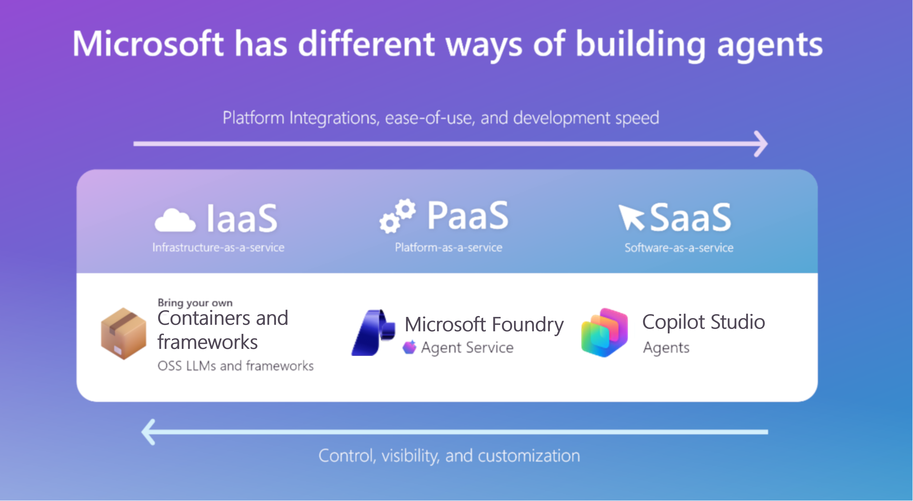

Microsoft offers three types of hosting platforms with varying levels of customization and shared responsibility: 

- Software as a Service (SaaS)
- Platform as a Service (PaaS)
- Infrastructure as a Service (IaaS)

Each platform type requires different technical skills and provides different degrees of control over AI implementation. Therefore, you must match your team's capabilities, data requirements, and customization
needs with each hosting option to find the best fit.

These are the three hosting platform types in more detail:

## Software as a Service (SaaS)

SaaS enables rapid deployment of generative AI with minimal setup and is best for enhancing individual productivity or straightforward,
domain-specific, tasks.

### SaaS AI key offerings

- **Microsoft 365 Copilot**. An AI-powered tool integrated into Microsoft 365 data and apps such as Word, Excel, Outlook, etc.
- **Role-based Copilots**. Tailored for security, sales, service, finance.
- **In-product Copilots**. Integrated into GitHub, Power BI, Dynamics 365, etc.
- **Microsoft Copilot Studio**. Build and deploy agents with an intuitive, natural language building experience.
- **Extensibility tools**. You can customize Copilot with declarative agents and connectors.
- **Skills required**. General IT or business user.
- **Data needs**. Mostly business data, often via Microsoft Graph.
- **Cost factors**. Licensing, subscriptions, or compute units (For example: Copilot for Security).

## Platform as a Service (PaaS)

PaaS allows you to develop, fine-tune, and deploy AI models and agents and is best for organizations needing control over model behavior and
data orchestration.

### PaaS AI key offerings

- **Microsoft Foundry**. Build, test, and deploy enterprise-grade AI agents and applications with integrated tools, model access, and
  production-ready infrastructure
  - **Microsoft Foundry Agent Service**. Create, deploy, and manage agents that use large language models and enterprise data to delivercontext-aware, task-oriented assistance.
  - **Microsoft Foundry Models**. Consume prebuilt models from model providers such as OpenAI, Mistral, and Cohere or fine-tune them
    within Microsoft Foundry.
  - **Azure Machine Learning**. Train and deploy ML models with custom data.
- **Microsoft Fabric**. ML and data workflows in integrated environments.
- **Microsoft Copilot Studio**. As well as being a SaaS solution, Copilot Studio is also a PaaS solution that allows you to build and
  customize agents.
- **Skills required**. Developer, data scientist, or AI engineer.
- **Data needs**. Structured and unstructured data, often requiring preprocessing.
- **Cost factors**. Compute, token usage, storage, data transfer, and endpoint consumption.

## Infrastructure as a Service (IaaS)

IaaS provides full control and customization. With IaaS, you bring your own models and manage the entire AI framework, including the Microsoft Agent Framework, and it's best for highly regulated industries or advanced AI teams needing infrastructure control.

### IaaS AI key offerings

- **Azure Virtual Machines**. Train and deploy models using CycleCloud (for High Performance Computing) or Batch.
- **Azure Container Apps**. Host and scale containerized applications and microservices, using features like built-in Dapr support and
  event-driven scaling.
- **Azure Kubernetes Service**. Managed container platform for scalable AI workloads.
- **Skills Required**. Infrastructure management, orchestration, model training.
- **Data Needs**. Domain-specific training data, often sensitive or regulated.
- **Cost Factors**. Compute nodes, managed disks, storage, Bastion, and orchestration services.
