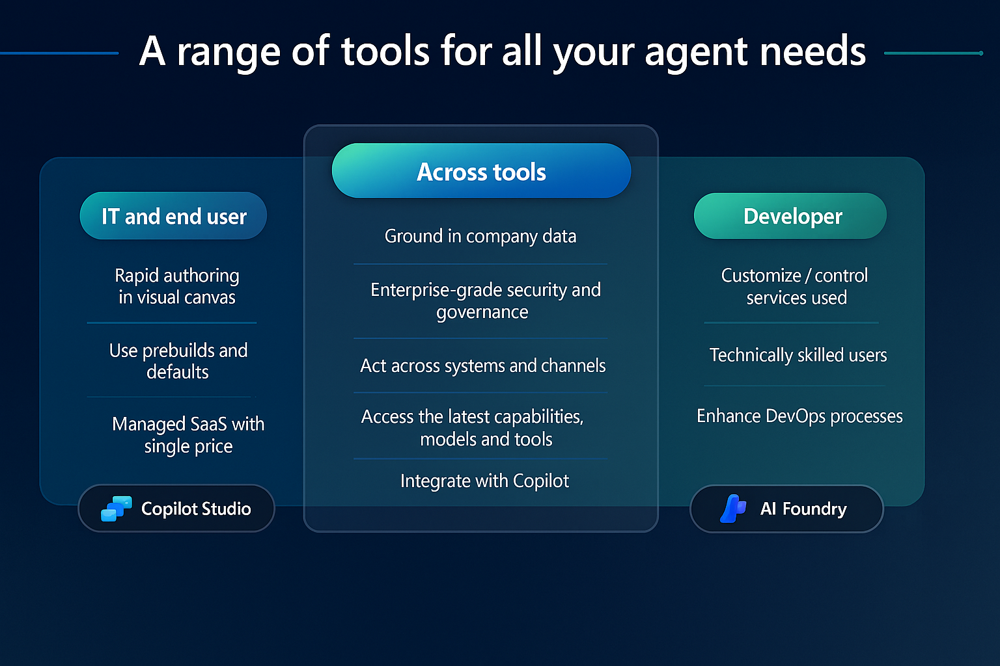
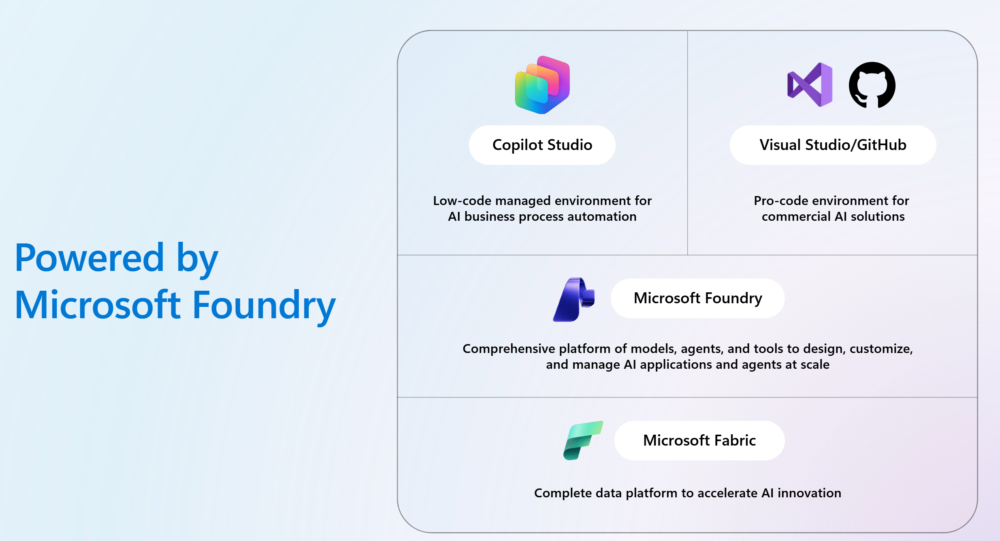
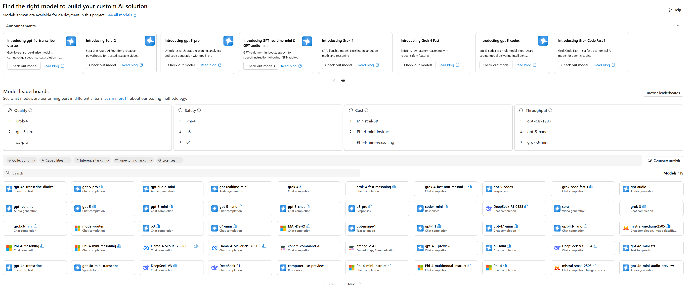

Microsoft offers a flexible developer ecosystem that empowers organizations to build AI agents tailored to their needs, whether through building simple to complex agents with Copilot Studio or using pro-code environments for professional developers. This flexibility is essential for scaling AI across departments and roles, and it directly contributes to cost efficiency by reducing development time, leveraging existing skill sets, and minimizing rework.

The tools listed in this unit aren't exclusive to each other. Many developers will code an agent in VS Code, store the code in a GitHub repository, and store and manage the agent in AI Foundry. There's native integration between the tools. For example, there's an
Azure AI Foundry extension for VS Code lets you manage models and agents directly from the editor and AI Foundry projects and agents can be versioned and managed through GitHub repositories.

## Copilot Studio: Empowering business users

### Built on Microsoft. Connected to everything

Multiply capacity by easily connecting agents to your data, tools, and systems so that they can work for you. Microsoft manages the infrastructure and optimizes AI performance behind the scenes, so you can achieve your goals faster.

### Build any agent. From simple to sophisticated

Reduce development time and costs on custom agents with an intuitive platform. Build the right agent to deliver outcomes by using natural
language and selecting from your choice of models, knowledge, tools, and channels.

### Govern every agent. Secure every action

Gain peace of mind with enterprise-grade governance, security, and visibility at every layer. From managing data access to controlling
agent sprawl, compliance, and risk---Microsoft gives you the tools to stay in control while scaling innovation.

### Strategic considerations for cost efficiency

- Lower development costs by enabling nontechnical users to build   agents without relying on engineering teams.
- Faster time-to-value through rapid iteration and deployment.
- Reduced training overhead by using familiar Microsoft environments.
- Scalable governance with built-in compliance and monitoring tools.

### How to Get Started

1. Access Copilot Studio via Microsoft 365 or Power Platform.
1. Choose a template or start from scratch.
1. Connect to your data sources (for example, SharePoint).
1. Use the visual designer to build workflows and conversational logic.
1. Test and publish your agent across Teams, websites, or apps.

### Common roles

- IT
- Makers

## Azure AI Foundry: Create smarter agents

Azure AI Foundry is a robust platform to build, test, deploy, scale, manage, and govern agents across the enterprise. It's Microsoft's
comprehensive platform for designing, customizing, and managing AI applications and agents at scale.

### What Is Azure AI Foundry?

Azure AI Foundry is a unified Azure platform-as-a-service offering for enterprise AI operations, model builders, and application development.
This foundation combines production-grade infrastructure with friendly interfaces, enabling developers to focus on building applications rather
than managing infrastructure.

Azure AI Foundry unifies agents, models, and tools under a single management grouping with built-in enterprise-readiness capabilities
including tracing, monitoring, evaluations, and customizable enterprise setup configurations. The platform provides streamlined management
through unified Role-based access control (RBAC), networking, and policies under one Azure resource provider namespace.

### Strategic considerations for cost efficiency

- Centralized management reduces operational overhead and duplication.
- Elastic scalability ensures you only pay for what you use.
- Built-in governance and compliance avoid costly risks and rework.
- Lifecycle optimization enables proactive updates and performance tuning.

### How to get started

1. Access Azure AI Foundry.
1. Choose your preferred model or bring your own.
1. Build native agents in Azure AI Foundry, either with a low-code approach (through the UI in the Foundry Portal) or with a code-first approach (by using the Azure AI Foundry SDK/Microsoft Agent Framework with Visual Studio/VS Code and GitHub). 
1. Use built-in tools to monitor performance, manage deployments, and enforce safeguards.
1. Scale across departments with centralized controls and analytics.

### Some key capabilities

- Model benchmarking, management and fine-tuning
- Agent orchestration and deployment
- Governance, compliance, and security
- Real-time monitoring and analytics

Azure AI Foundry ensures that regardless of how you build your agents, they're backed by a secure, scalable, and cost-efficient platform that supports innovation across your organization.

## Visual Studio and VS Code: Full control for developers

Visual Studio is Microsoft's flagship integrated development environment (IDE) for professional developers. It supports building complex, custom AI agents using languages like C#, Python, JavaScript, and more. Developers can integrate Azure services, APIs, and third-party tools to
create scalable and secure solutions.

Visual Studio Code (VS Code) is a lightweight, fast, and extensible cross-platform code editor ideally suited to cloud-native development with extensive GitHub integration.

Developers can use the **Microsoft 365 Agents Toolkit** and **Microsoft 365 Agents SDK** in Visual Studio to build agents that integrate seamlessly with Microsoft 365 services like Outlook, Teams, and OneDrive. The Agents Toolkit simplifies the setup process and offers templates and tools to accelerate development within the Visual Studio environment. With the Agents SDK, developers can connect agents to Microsoft Graph and use contextual data such as emails, calendars, and documents. These tools together enable the creation of custom copilots that provide personalized assistance, automate workflows, and enhance productivity across Microsoft 365 applications.

Developers can also integrate Azure AI Foundry in Visual Studio and publish agents to Microsoft 365 Copilot. Also, the **AI Toolkit for Visual Studio Code** helps to explore, compare, fine-tune generative AI models using a streamlined, code-first experience. Developers can manage
models, datasets, and prompts directly within their development workflow.

### Strategic considerations for cost efficiency

- Code reuse and modular design reduce long-term development costs.
- Advanced debugging and profiling tools help optimize performance and minimize maintenance.
- Integration with Azure DevOps enables automated testing and deployment, reducing manual effort and errors.

### How to get started

1. Download and install Visual Studio or Visual Studio Code.
1. Set up a new project using your preferred language and framework.
1. Integrate Azure SDKs and APIs for AI capabilities.
1. In case of the AI toolkit mentioned above, download the AI Toolkit for Visual Studio Code extension.
1. Use GitHub or Azure DevOps for version control and CI/CD.
1. Deploy your agent to Azure or other cloud environments.

### Common roles

- Software engineers
- Solution architects
- AI/ML developers
- IT administrators
