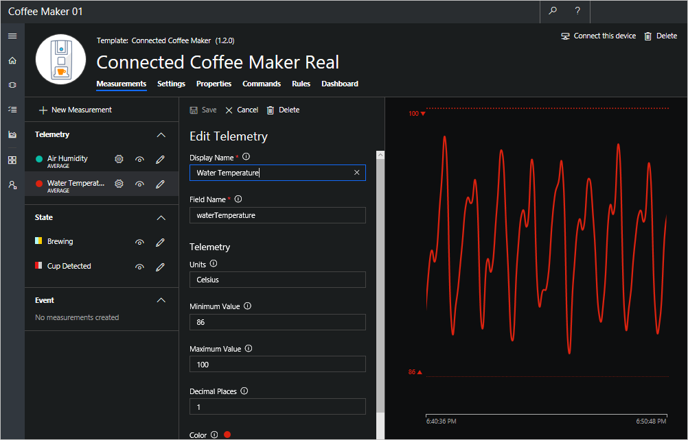

In Azure IoT Central, the data that a device can exchange with your application is specified in a device template that defines the behavior and capabilities of a device or in this case, a coffee machine. When you create a device template, a simulated device is generated from the template.

The simulated device generates telemetry that enables you to test the behavior of your application before a physical/real device is connected. 

In this unit, you create a device template for a coffee machine that specifies the following capabilities and behaviors:

### Measurements

Measurements are the data that comes from your device. You can add multiple measurements to your device template to match the capabilities of your device.

* **Telemetry measurements**: The numerical data points that your device collects over time. They're represented as a continuous stream. In this scenario, the telemetry measurements are air humidity and water temperature. 

* **State measurements**: The state of the device or its components over a period of time. In this scenario, you set states as Brewing/Not Brewing and Cup Detected/Cup Not Detected.

### Settings

You use settings to send configuration data to a device from your application. In this scenario, you adjust the optimal water temperature in settings and send it to the coffee machine. When the setting is updated, it is marked as pending in the UI until the device acknowledges that it has responded to the setting change.

### Properties

The device metadata that's associated with the device. There are two types of properties.

* You use *application properties* to record information about your device in your application. In this scenario, you use application properties to set the ideal water temperature range of the coffee machine. Application properties are stored in the application and do not synchronize with the device. 

* You use *device properties* to enable a device to send property values to your application. These properties can only be changed by the device. In this scenario, you configure the device property called Device Warranty Expired in IoT Central. The Device Warranty Expired field remains empty until the coffee machine is connected to IoT Central. Once connected, the coffee machine sends the warranty status to the application. 

### Commands

You use commands to remotely manage your device from your application. You can directly run commands on the device from the cloud to control the device. In this scenario, you run the commands on your coffee machine to set it to maintenance or start brewing. 

## Create a device template for the coffee maker
A device template defines the behavior and capabilities of a device or in this case, a coffee maker.

1. Navigate to the **Home** page of your application in Azure IoT Central portal and choose **Create Device Templates**.

> [!TIP]
> You can reach the homepage by clicking on the home icon on the menu on the left.

1. Enter *Connected Coffee Maker* for your custom device template. 
 
1. Select **Create**. You’ve created a blank device template for the coffee maker where you define the behavior and capabilities of the machine. 

## Define telemetry measurements of temperature and humidity
1. In the **Connected Coffee Maker** device template, make sure you are on the **Measurements** page where you define the telemetry. 

1. To add the temperature telemetry measurement, choose **Edit Template**, and then **+ New Measurement**. Then choose **Telemetry** as the measurement type.

1. Each type of telemetry you define for a device template includes configuration options such as:
    * Display options
    * Details of the telemetry
    * Simulation parameters

    To configure your temperature and humidity telemetry, use the information in the following table. When creating telemetry items, you need to add a new measurement by choosing **+ New Measurement** for each item in the table.
    
    |Display name|Field name|Units|Min|Max|Decimal places|
    |---|---|---|---|---|---|
    |Water Temperature|waterTemperature|Celsius|86|100|1|
    |Air Humidity|airHumidity|%|20|100|0|
   
    You can also choose a color for the telemetry display. To save the telemetry definition, choose **Save**. As you create more definitions for measurements, settings, properties, and commands in the remaining unit, remember to save whenever you're finished.  

    > [!NOTE]
    > Enter field names exactly as shown in the table in the device template. If the field names do not match the property names in the corresponding device code, the telemetry cannot be displayed in the application. Do the same when you enter settings and properties information.

    

## Define state measurement for brewing/not brewing and cup detected/cup not detected
Add the following states in the **Measurements** page by choosing **Edit Template**, and then choosing **+ New Measurement**. Then choose **State** as the measurement type:

On the **State** > **Brewing** page, you add the value as true. Add the other value as false with the optional display name as Not Brewing by clicking **+** next to **Values**. Make sure to select **Save** to save your edits.

   |Display Name|Field Name|Value 1|Display Name 1|Value 2|Display Name 2|
   |---|---|---|---|---|---|
   |Brewing|stateBrewing|true|Brewing|false|Not Brewing|
   |Cup Detected|stateCupDetected|true|Cup Detected|false|Cup Not Detected|

> [!NOTE]
> After you define telemetry and state, you see the simulated data generated from the device template on the device screen. The simulated data enables you to test the behavior of your application before you connect a physical device to IoT Central. 

## Set the optimal temperature of the coffee machine
Navigate to the **Settings** page, the tab next to **Measurements**. Click **Edit Template**. Add the following **Number** setting under **Library** on the **Settings** page:

|Display name|Field name|Units|Decimals|Min|Max|Initial|
|---|---|---|---|---|---|---|---|
|Optimal Temperature|setTemperature|Celsius|1|86|100|95|

## Use properties to store warranty info and water temperature range

Add the following **Number** properties on the **Properties** page by choosing **Edit Template**:

|Display name|Field name|Units|Decimal places|Min|Max|Initial
|---|---|---|---|---|---|---|
|Coffee Maker's Min Temperature|propertyMinTemperature|Celsius|1|88|92|90|
|Coffee Maker's Max Temperature|propertyMaxTemperature|Celsius|1|96|99|98| 

Add the following **Device Property** on the **Properties** page:

   |Display name|Field name|Data type|
   |---|---|---|
   |Device Warranty Expired|propertyWarrantyExpired|number|

> [!NOTE]
> The device property is sent by your device, in this case, your coffee machine. Once you connect the coffee machine to Azure IoT Central, the device property warranty is then sent to the application and displayed in the Device Warranty Expired field. 

## Use commands to set maintenance mode and start brewing

Add the following commands on the **Commands** page by choosing **Edit Template**.

|Display name|Field name|Default timeout|Data type|
|---|---|---|---|---|---|---|
|Set Maintenance Mode|cmdSetMaintenance|30|text| 
|Start Brewing|cmdStartBrewing|30|text|