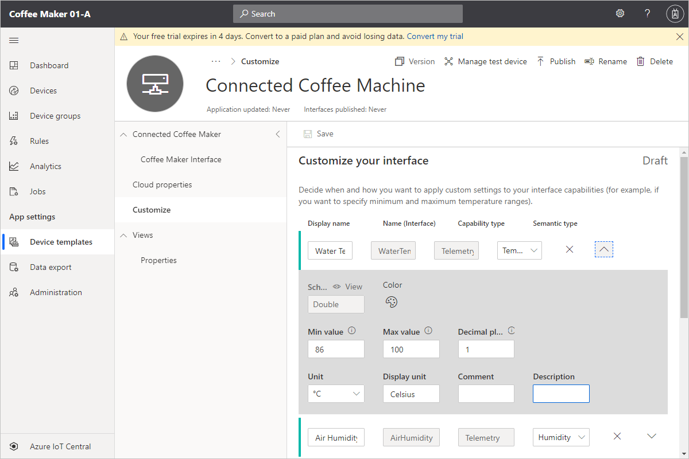

In Azure IoT Central, the data that a device exchanges with your application is specified in a device template. The template defines the behavior and capabilities of a device such as a coffee machine.

After you create a device template, you can create a simulated device. The simulated device generates telemetry for you to test the behavior of your application before connecting a real device.

In this unit, you create a device template for a coffee machine that specifies its capabilities and behaviors. Telemetry, property, and command definitions are grouped together in interfaces. In this scenario, you only define a single interface for the coffee machine device that includes telemetry, property, and command definitions:

### Telemetry

Telemetry is the data that streams from your device. You can add multiple telemetry types to your device template to match the capabilities of your device. The coffee machine sends air humidity and water temperature values from its sensors. It also sends state information about whether it's currently brewing and whether a cup is detected.

### Properties

Use properties to share configuration data between a device and your application.

In this scenario, you use a _writeable_ property to set the optimal water temperature and send it to the coffee machine. When the writeable property is updated in IoT Central, it's marked as pending in the UI until the device acknowledges that it has responded to the update.

You can use _read-only_ properties to enable a device to send values to your application. Read-only properties can only be changed by the device. In this scenario, you define a device property called **Device Warranty Expired** in the device template. The **Device Warranty Expired** field remains empty until the coffee machine is connected to IoT Central. Once connected, the coffee machine sends the warranty status to the application.

### Commands

Use commands to remotely manage your device from your application. You can directly run commands on the device from the cloud to control the device. In this scenario, you run commands on your coffee machine to set it to maintenance mode or to start brewing.

### Cloud properties

_Cloud properties_ are device metadata that's associated with the device. Use cloud properties to record information about your device in your IoT Central application. In this scenario, you use cloud properties to record the ideal water temperature range of the coffee machine. Cloud properties are stored in the IoT Central application and don't synchronize with the device. Cloud properties are not part of an interface definition.

### Customizations

You can customize how IoT Central uses the items defined in an interface, for example by specifying maximum and minimum temperature values and customizing how IoT Central displays values. In this scenario, you customize the temperature and air humidity telemetry types, and the optimal temperature and device warranty property types.

### Views

You can customize the UI that IoT Central displays for managing and monitoring devices associated with the device template. In this scenario, you create a view to plot the telemetry values sent from the device, and create a form to manage the device properties.

## Device capability models

A device capability model is the part of the device template that defines the telemetry, properties, and commands that a device supports. You can store a device capability model in a JSON file and import it into IoT Central. The following JSON is the device capability model for the connected coffee machine. Copy the JSON and save it on your local machine in a file called `CoffeeMaker.json`:

```json
{
  "@context": "dtmi:dtdl:context;2",
  "displayName": "Connected Coffee Maker",
  "@id": "dtmi:com:example:ConnectedCoffeeMaker;1",
  "@type": "Interface",
  "contents": [
    {
      "@type": [
        "Telemetry",
        "Temperature"
      ],
      "displayName": "Water Temperature",
      "name": "WaterTemperature",
      "displayUnit": "Celsius",
      "schema": "double",
      "unit": "degreeCelsius"
    },
    {
      "@type": [
        "Telemetry",
        "Humidity"
      ],
      "displayName": "Air Humidity",
      "name": "AirHumidity",
      "displayUnit": "%",
      "schema": "integer",
      "unit": "percent"
    },
    {
      "@type": [
        "Telemetry",
        "State"
      ],
      "displayName":"Brewing",
      "name": "Brewing",
      "schema": {
        "@type": "Enum",
        "valueSchema": "string",
        "enumValues": [
          {
            "@type": "EnumValue",
            "displayName": "Brewing",
            "enumValue": "brewing",
            "name": "Brewing"
          },
          {
            "@type": "EnumValue",
            "displayName": "Not Brewing",
            "enumValue": "notbrewing",
            "name": "NotBrewing"
          }
        ]
      }
    },
    {
      "@type": [
        "Telemetry",
        "State"
      ],
      "displayName": "Cup Detected",
      "name": "CupDetected",
      "schema": {
        "@type": "Enum",
        "valueSchema": "string",
        "enumValues": [
          {
            "@type": "EnumValue",
            "displayName": "Detected",
            "enumValue": "detected",
            "name": "Detected"
          },
          {
            "@type": "EnumValue",
            "displayName": "Not Detected",
            "enumValue": "notdetected",
            "name": "NotDetected"
          }
        ]
      }
    },
    {
      "@type": [
        "Property",
        "Temperature"
      ],
      "displayName": "Optimal Temperature",
      "name": "OptimalTemperature",
      "writable": true,
      "schema": "double",
      "unit": "degreeCelsius"
    },
    {
      "@type": "Property",
      "displayName": "Device Warranty Expired",
      "name": "DeviceWarrantyExpired",
      "schema": "boolean"
    },
    {
      "@type": "Command",
      "commandType": "synchronous",
      "displayName": "Set Maintenance Mode",
      "name": "SetMaintenanceMode"
    },
    {
      "@type": "Command",
      "commandType": "synchronous",
      "displayName": "Start Brewing",
      "name": "StartBrewing"
    }
  ]
}
```

## Create a device template

To create a device template, you can either build it from scratch in the IoT Central UI, or get started by importing a device capability model. You already have a device capability model for the coffee machine defined in a JSON file, so you'll use that.

1. Navigate to the **Device templates** page of your Azure IoT Central application in Azure IoT Central and select **+ New**.

1. On the **Select template type** page, select the **IoT device** tile, and then select **Next: Customize**.

1. On the **Customize** page, enter _Connected Coffee Machine_ as the device template name. Then select **Next: Review**. Then select **Create**.

1. Enter _Connected Coffee Machine_ as the device template name, and then press **Enter**.

1. On the **Create a model** page, select the **Import a model** tile. Then browse to and select the **CoffeeMaker.json** file you created previously, and select **Open**.

IoT Central displays the **Connected Coffee Maker** capability model that defines the telemetry, properties, and commands that the device supports.


## Add cloud properties

To add the cloud properties that store the ideal water temperature range for coffee machine:

1. Navigate to the **Connected Coffee Machine** device template you created, and select **Cloud properties**.

1. Add two cloud properties to the device template using the information in the following table:

    | Display name | Name | Semantic type | Schema | Min value | Max value | Decimal places | Unit |
    | ------------ | ---- | ------------- | ------ | --------- | --------- | -------------- | ---- |
    | Coffee Maker Min Temperature | CoffeeMakerMinTemperature | Temperature | Double | 88 | 92 | 1 | Degree celsius |
    | Coffee Maker Max Temperature | CoffeeMakerMaxTemperature | Temperature | Double | 96 | 99 | 1 | Degree celsius |

1. Save your changes.

    

## Customize your template

To add the customizations that control how IoT Central displays information about a coffee machine:

1. Navigate to the **Connected Coffee Machine** device template you created, and select **Customize**.

1. Use the information in the following table to customize the **Water Temperature** and **Air Humidity** telemetry types, and the **Optimal Temperature** property type:

    | Display name | Min value | Max value | Decimal places | Initial value |
    | ------------ | --------- | --------- | -------------- | ------------- |
    | Water Temperature | 86   | 100       | 1              | |
    | Air Humidity      | 20   | 100       | 0              | |
    | Optimal Temperature | 86 | 100       | 1              | 96            |

1. Save your changes.

    

## Add views to your template

To create a view that lets you visualize the telemetry from your coffee machine:

1. Navigate to the **Connected Coffee Machine** device template you created, and select **Views**.

1. Add a new **Visualizing the device** view called _Telemetry_.

1. Select **Start with devices**. Add a 2x1 tile called **Cup Detected** to show the last known value of the **Cup Detected** telemetry value.

1. Add a 2x1 tile called **Brewing** to show the last known value of the **Brewing** telemetry value.

1. Add a 3x3 tile called **Telemetry** that uses a line chart to plot the average values of **Water Temperature** and **Air Humidity** for the past 30 minutes.

1. Add a 1x1 tile called **Water Temperature (Min)** that displays the minimum water temperature over the past 12 hours as a KPI.

1. Add a 1x1 tile called **Air Humidity (avg)** that displays the maximum air humidity over the past 12 hours as a KPI.

1. Save your changes.

    

To create a view that lets you manage the properties of your coffee machine:

1. Navigate to the **Connected Coffee Machine** device template you created, and select **Views**.

1. Add a new **Editing device and cloud data** form called _Properties_.

1. Add a section that includes both the **Optimal Temperature** and **Device Warranty Expired** properties and the **Coffee Maker Min Temperature** and **Coffee Maker Max Temperature** cloud properties.

1. Save your changes.

    

## Publish the Coffee Machine template

Before you can connect a coffee machine device to your IoT Central application, you need to publish the **Connected Coffee Machine** device template:

1. Navigate to the **Connected Coffee Machine** device template you created, and select **Publish**.

1. The **Publish this device template to the application** shows you the changes that you're publishing. Select **Publish**.

To verify that the device template was published and is ready to use:

1. Navigate to the **Devices** page in your Azure IoT Central application.

1. Check that the **Connected Coffee Machine** device is in the list of available device types:

    
