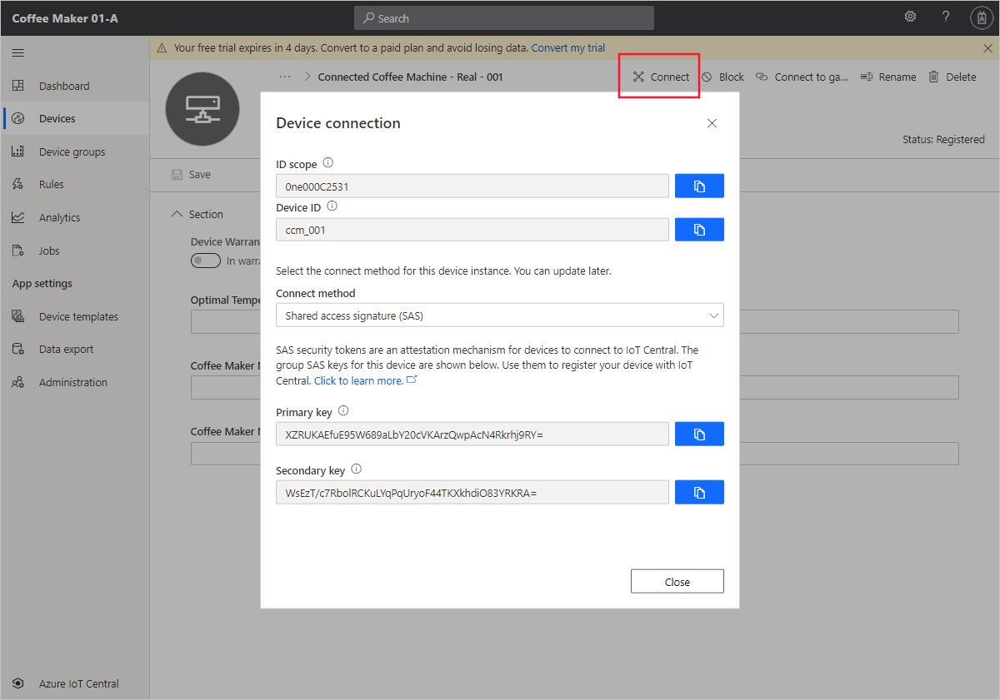

In practice, you will connect Azure IoT Central to a physical device, such as an IoT enabled coffee machine. Here, you'll simulate a device with a Node.js application and connect it to the Azure IoT Central application. Telemetry measurements from the simulated coffee machine are sent to IoT Central for monitoring and analysis.


## Add the coffee machine in IoT Central

To add your coffee machine to your application, you use the **Connected Coffee Machine** device template you created in the previous unit.

1. To add a new device, first navigate to the **Devices** page in your Azure IoT Central application.

1. Select **Connected Coffee Machine**, and then **+ New**.

1. On the **Create a new device** form, change the device ID to _ccm-001_, and the device name to _Connected Coffee Machine - Real - 001_. Make sure that **Simulate this device** is **No**, and then select **Create**.

The **Connected Coffee Machine - Real - 001** device now shows in the list of **Connected Coffee Machine** devices with a status of **Registered**.

## Find the connection details

Your real device needs some connection information to connect securely to your IoT Central application:

1. Click on **Connected Coffee Machine - Real - 001** in the list of devices to view the device details.

1. Select **Connect** to open the **Device connection groups** panel.

1. Either keep this page open, or make a note of the **ID scope**, **Device ID**, and **Primary key** values. You need these values later:

    

## Create a Node.js application

The following steps show you how to create a client application that implements the coffee machine you added to the application.

> [!TIP]
> In this exercise, you create the Node.js app in the Azure Cloud Shell so that you don't have to install anything on your local machine.

1. Execute the following command in the Azure Cloud Shell to create a `coffee-maker` folder and navigate to it:

    ```azurecli
    mkdir ~/coffee-maker
    cd ~/coffee-maker
    ```

1. Execute the following command in the Cloud Shell to initialize a Node.js project in your `coffee-maker` folder:

    ```azurecli
    npm init
    ```

    > [!NOTE]
    > The init script prompts you to enter project properties. For this exercise, press ENTER to accept all the default values.

1. To install the necessary packages, run the following command in the `coffee-maker` folder:

    ```azurecli
    npm install azure-iot-device azure-iot-device-mqtt azure-iot-provisioning-device-mqtt azure-iot-security-symmetric-key --save
    ```

1. Create and open a file called _coffeeMaker.js_ in the integrated Cloud Shell code editor by executing the following command:

     ```azurecli
    code coffeeMaker.js
    ```

1. Copy and paste the following code into the empty editor window:

    ```js
    "use strict";

    // Use the Azure IoT device SDK for devices that connect to Azure IoT Central.
    var iotHubTransport = require('azure-iot-device-mqtt').Mqtt;
    var Client = require('azure-iot-device').Client;
    var Message = require('azure-iot-device').Message;
    var ProvisioningTransport = require('azure-iot-provisioning-device-mqtt').Mqtt;
    var SymmetricKeySecurityClient = require('azure-iot-security-symmetric-key').SymmetricKeySecurityClient;
    var ProvisioningDeviceClient = require('azure-iot-provisioning-device').ProvisioningDeviceClient;

    var provisioningHost = 'global.azure-devices-provisioning.net';
    var idScope = '{ID scope}';
    var registrationId = '{Device ID}';
    var symmetricKey = '{Primary key}';
    var provisioningSecurityClient = new SymmetricKeySecurityClient(registrationId, symmetricKey);
    var provisioningClient = ProvisioningDeviceClient.create(provisioningHost, idScope, new ProvisioningTransport(), provisioningSecurityClient);
    var centralClient;

    // Global variables
    var optimalTemperature = 96;
    var cupState = 'detected';
    var brewingState = 'notbrewing';
    var cupTimer = 20;
    var brewingTimer = 0;
    var maintenanceState = false;
    var warrantyState = Math.random() < 0.5?true:false;

    // Helper function to produce nice numbers (##.#)
    function niceNumber(value) 
    {
        var number = (Math.round(value * 10.0)).toString();
        return number.substr(0, 2) + '.' + number.substr(2, 1);
    }
    
    // Send device simulated telemetry measurements
    function sendTelemetry() 
    {
        // Simulate the telemetry values
        var temperature = optimalTemperature + (Math.random() * 4) - 2;
        var humidity = 20 + (Math.random() * 80);
    
        // Cup timer - every 20 seconds randomly decide if the cup is present or not
        cupTimer--;
    
        if (cupTimer == 0)
        {
            cupTimer = 20;
            cupState = Math.random() < 0.5?'detected':'notdetected';
        }
    
        // Brewing timer
        if (brewingTimer > 0)
        {
            brewingTimer--;
    
            // Finished brewing
            if (brewingTimer == 0)
            {
                brewingState = 'notbrewing';
            }
        }
    
        // Create the data JSON package
        var data = JSON.stringify(
        { 
            WaterTemperature: temperature, 
            AirHumidity: humidity, 
            CupDetected: cupState,
            Brewing: brewingState
        });
    
        // Create the message with the above defined data
        var message = new Message(data);
    
        // Show the information in console
        var infoTemperature = niceNumber(temperature);
        var infoHumidity = niceNumber(humidity);
        var infoCup = (cupState == 'detected') ? 'Y' :'N';
        var infoBrewing = (brewingState == 'brewing') ? 'Y':'N';
        var infoMaintenance = maintenanceState ? 'Y':'N';
    
        console.log('Telemetry send: Temperature: ' + infoTemperature + 
                    ' Humidity: ' + infoHumidity + '%' + 
                    ' Cup Detected: ' + infoCup + 
                    ' Brewing: ' + infoBrewing + 
                    ' Maintenance Mode: ' + infoMaintenance);
    
        // Send the message
        centralClient.sendEvent(message, function (errorMessage) 
        {
            // Error
            if (errorMessage) 
            {
                console.log('Failed to send message to Azure IoT Hub: ${err.toString()}');
            }
        });
    }
    
    // Send device properties
    function sendDeviceProperties(deviceTwin) 
    {
        var properties = 
        {
            DeviceWarrantyExpired: warrantyState
        };
    
        console.log(' * Property - Warranty State: ' + warrantyState.toString());
    
        deviceTwin.properties.reported.update(properties, (errorMessage) => 
            console.log(` * Sent device properties ` + (errorMessage ? `Error: ${errorMessage.toString()}` : `(success)`)));
    }
    
    // Optimal temperature setting
    var settings = 
    {
        'OptimalTemperature': (newValue, callback) => 
        {
            setTimeout(() => 
            {
                optimalTemperature = newValue;
                callback(optimalTemperature, 200, "Successfully updated OptimalTemperature");
            }, 1000);
        }
    };
    
    // Handle settings changes that come from Azure IoT Central via the device twin.
    function handleSettings(deviceTwin) 
    {
        deviceTwin.on('properties.desired', function (desiredChange) 
        {
            // Iterate all settings looking for the defined one
            for (let setting in desiredChange) 
            {
                // Setting we defined
                if (settings[setting]) 
                {
                    // Console info
                    console.log(` * Received setting: ${setting}: ${desiredChange[setting]}`);
    
                    // Update 
                    settings[setting](desiredChange[setting], (newValue, status, message) => 
                    {
                        var patch = 
                        {
                            [setting]: 
                            {
                                value: newValue,
                                ac: status,
                                av: desiredChange.$version,
                                ad: message
                            }
                        }
                        deviceTwin.properties.reported.update(patch, (err) => console.log(` * Sent setting update for ${setting} ` +
                        (err ? `error: ${err.toString()}` : `(success)`)));
                    });
                }
            }
        });
    }
    
    // Maintenance mode command
    function onCommandMaintenance(request, response) 
    {
        // Display console info
        console.log(' * Maintenance command received');
    
        // Console warning
        if (maintenanceState)
        {
            console.log(' - Warning: The device is already in the maintenance mode.');
        }
    
        // Set state
        maintenanceState = true;
    
        // Respond
        response.send(200, 'Success', function (errorMessage) 
        {
            // Failure
            if (errorMessage) 
            {
                console.error('[IoT hub Client] Failed sending a method response:\n' + errorMessage.message);
            }
        });
    }
    
    function onCommandStartBrewing(request, response) 
    {
        // Display console info
        console.log(' * Brewing command received');
    
        // Console warning
        if (brewingState == 'brewing')
        {
            console.log(' - Warning: The device is already brewing.');
        }
    
        if (cupState == 'notdetected')
        {
            console.log(' - Warning: The cup has not been detected.');
        }
    
        if (maintenanceState == true)
        {
            console.log(' - Warning: The device is in maintenance state.');
        }
    
        // Set state - brew for 30 seconds
        if ((cupState == 'detected') && (brewingState == 'notbrewing') && (maintenanceState == false))
        {
            brewingState = 'brewing';
            brewingTimer = 30;
        }
    
        // Respond
        response.send(200, 'Success', function (errorMessage) 
        {
            // Failure
            if (errorMessage) 
            {
                console.error('[IoT hub Client] Failed sending a method response:\n' + errorMessage.message);
            }
        });
    }
    
    // Handle device connection to Azure IoT Central
    var connectCallback = (errorMessage) => 
    {
        // Connection error
        if (errorMessage) 
        {
            console.log(`Device could not connect to Azure IoT Central: ${errorMessage.toString()}`);
        } 
        // Successfully connected
        else 
        {
            // Notify the user
            console.log('Device successfully connected to Azure IoT Central');
    
            // Send telemetry measurements to Azure IoT Central every 1 second.
            setInterval(sendTelemetry, 1000);
    
            // Set up device command callbacks
            centralClient.onDeviceMethod('SetMaintenanceMode', onCommandMaintenance);
            centralClient.onDeviceMethod('StartBrewing', onCommandStartBrewing);
    
            // Get device twin from Azure IoT Central
            centralClient.getTwin((errorMessage, deviceTwin) => 
            {
                // Failed to retrieve device twin
                if (errorMessage) 
                {
                    console.log(`Error getting device twin: ${errorMessage.toString()}`);
                } 
                // Success
                else 
                {
                    // Notify the user
                    console.log('Device Twin successfully retrieved from Azure IoT Central');
    
                    // Send device properties once on device startup
                    sendDeviceProperties(deviceTwin);
    
                    // Apply device settings and handle changes to device settings
                    handleSettings(deviceTwin);
                }
            });
        }
    };
    
    // Start the device (register and connect to Azure IoT Central).
    provisioningClient.register((err, result) => {
      if (err) {
        console.log('Error registering device: ' + err);
      } else {
        console.log('Registration succeeded');
        console.log('Assigned hub=' + result.assignedHub);
        console.log('DeviceId=' + result.deviceId);
        var connectionString = 'HostName=' + result.assignedHub + ';DeviceId=' + result.deviceId + ';SharedAccessKey=' + symmetricKey;
        centralClient = Client.fromConnectionString(connectionString, iotHubTransport);
    
        centralClient.open(connectCallback);
      }
    });
    ```

    The coffee machine is written in Node.js. It first connects to Azure IoT Central. Then the app sends initial properties to Azure IoT Central, synchronizes properties, registers two command handlers for maintenance and brewing, and finally starts the timer for sending the telemetry information every second.

1. Update the placeholders `{ID scope}`, `{Device ID}`, and `{Primary key}` at the top of this code with the connection information you made a note of previously.

1. Select the three dots `...` to the top right of the editor to expand the editor menu. Then select **Save** to save the edits you made to `coffeeMaker.js`

1. Execute the following command in the Cloud Shell to start the app:

    ```azurecli
    node coffeeMaker.js
    ```

1. Verify that the app starts in the Cloud Shell window with the message *Device successfully connected to Azure IoT Central* along with *Telemetry send:* messages. Congratulations! Your app is up and running and communicating with IoT Central!
