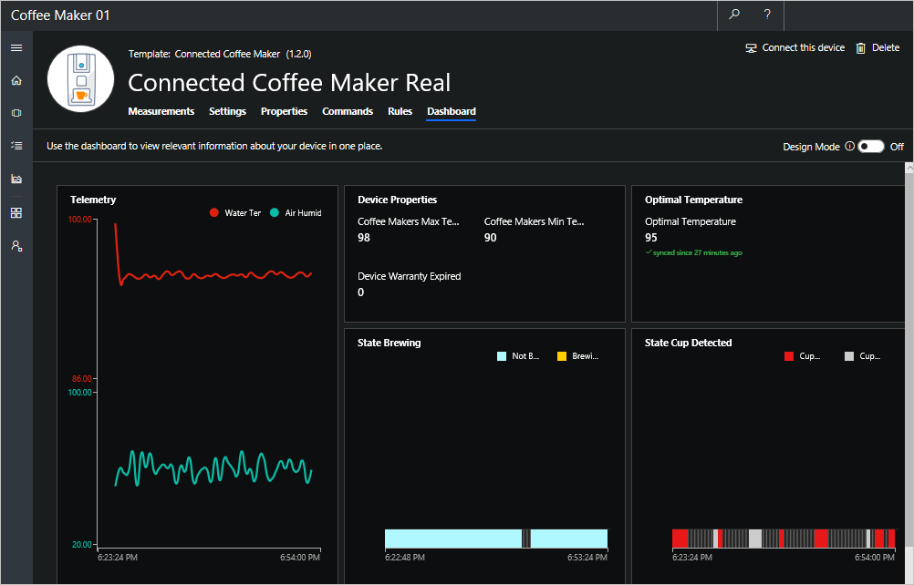

You’ve now worked with the Azure IoT Central application and connected the coffee machine to Azure IoT Central. You are well on your way to begin to monitor and manage your remote coffee machine. In this unit, you take a moment to validate your setup and connection by using the Connected Coffee Maker template that you defined earlier. You update the optimal temperature in settings, run commands to check for the state of your machine, and view your connected coffee machine in the dashboard. 

## Update settings to sync your application with the coffee machine

On the **Settings** page, you send configuration data to the coffee machine from your application. 

In this scenario, change the optimal temperature and choose **Update**. 
 When the setting is changed, the setting is marked as pending in the UI until the coffee machine acknowledges that it has responded to the setting change. 

> [!NOTE]
> Successful updates in the setting indicate data flow and validate your  connection. The telemetry measurements will respond to the update in optimal temperature. You can observe the change on the **Measurements** page. 

## Run commands on the coffee machine 
Navigate to the **Commands** page for the following exercise. To validate the commands setup, you remotely run commands on the coffee machine from IoT Central. If the commands are successful, confirmation messages are sent from the coffee machine.

1. Start brewing remotely by choosing **Run**. 
    
    The coffee machine will start if these three conditions are satisfied:
    - Cup detected
    - Not in maintenance
    - Not brewing already  

    > [!NOTE]
    > When you've successfully started brewing, the state of the machine changes to yellow as indicated in **Measurements** > **State**. 
    
    Look for confirmation messages in the console log on the node.js simulated coffee machine. 

    

1. Set maintenance mode by choosing **Run**. The coffee machine will set to maintenance if it's *not* already in maintenance.
    
    Look for confirmation messages in the console log on the coffee machine. 

    > [!NOTE]
    > As in real life, when the technician takes the machine offline to perform necessary repairs before switching it back online, the coffee machine continues to stay in the maintenance mode until you reboot the client code.

    

> [!IMPORTANT]
> It's recommended that you run the Node.js application no more than 60 minutes or so to prevent the application from sending you unwanted notifications/emails. Stopping the application when you're not working on the module also prevents you from exhausting the daily message quota.

## View the coffee machine in the dashboard

1. Navigate to the **Dashboard** tab.

1. Select **Edit Template** to edit the dashboard.

1. Choose **Line Chart** from the side menu.

1. In **Configure Chart**  enter `Telemetry` in the **Title** field. We'll view our telemetry data with this chart. 

1. Select **Past 30 minutes** for **Time Range**. 

1. In the **Measures** area, select the visibility icon to the right of each measurement to make that measurement visible for our chart. 

1. Select **Save** to save our configuration and display the line chart. 

    

1. Choose **Settings and Properties** in the left-hand menu to open the **Configure Device Details** panel. 

1. Enter `Device properties` in the **Title** filed.

1. In **Add/Remove**, choose **Coffee Makers Max Temperature**, **Coffee Makers Min Temperature**, **Device Warranty Expired** and then select **OK** to complete the selection.

1. Select **Save** to create a new *Device properties* panel in our dashboard. 

1. Choose **Settings and Properties** again,  and enter `Optimal Temperature` as the title. In **Add/Remove**, choose **Optimal  Temperature**.

1. Select **Save** to save your work and display a new pane in our dashboard. 

1. Select **Done** to exit edit mode and display the new dashboard. 