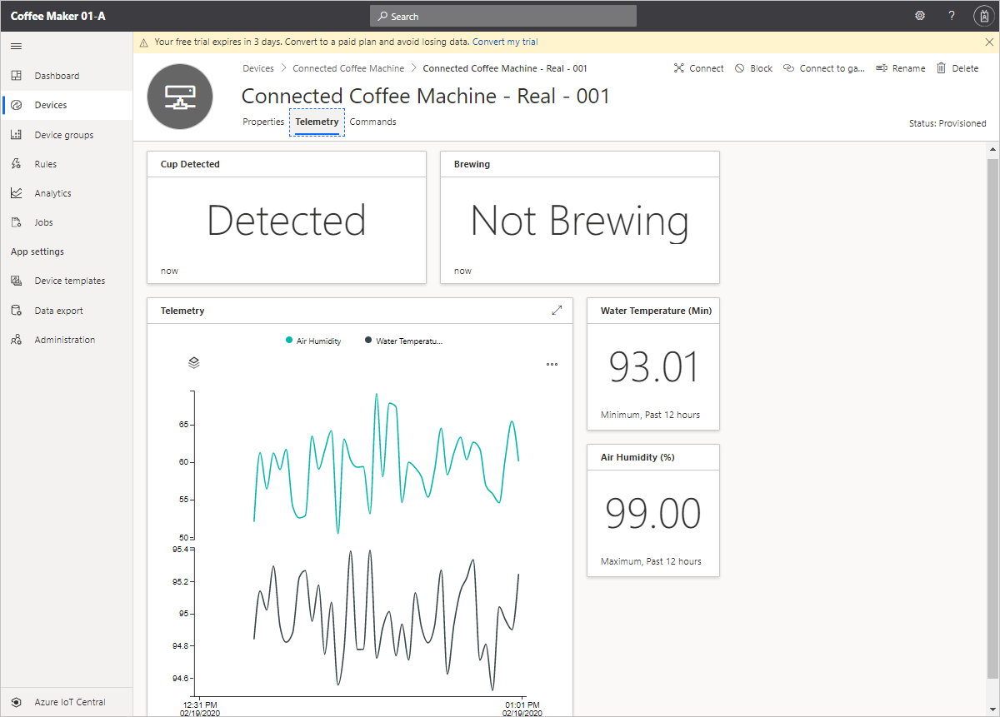

You've now worked with the Azure IoT Central application and connected the coffee machine to Azure IoT Central. You are well on your way to begin to monitor and manage your remote coffee machine. In this unit, you take a moment to validate your setup and connection by using the **Connected Coffee Machine** template that you defined earlier. You update the optimal temperature on the **Properties** form, run commands to update the state of your machine, and view your connected coffee machine telemetry.

## Update properties to sync your application with the coffee machine

Use the **Properties** form you defined in the device template to send configuration data to the coffee machine from your application.

1. Navigate to the **Devices** page in your Azure IoT Central application.

1. Click on **Connected Coffee Machine - Real - 001** in the list of devices to view the device details.

1. Select **Properties** to view the form.

1. Enter _95_ as the optimal temperature. Then select **Save**.

When the property is changed, the property is marked as **Pending: now** in the UI until the coffee machine acknowledges the setting change. The property is then marked as **Accepted: now**.

> [!NOTE]
> Successful updates in the setting indicate data flow and validate your connection. The telemetry measurements will respond to the update in optimal temperature.

## Update cloud properties

Use the **Properties** form you defined in the device template to update configuration data for the coffee machine.

1. Navigate to the **Devices** page in your Azure IoT Central application.

1. Click on **Connected Coffee Machine - Real - 001** in the list of devices to view the device details.

1. Select **Properties** to view the form.

1. Enter _92_ as the **Coffee Maker Min Temperature (&deg;C)** and _99_ as the **Coffee Maker Max Temperature (&deg;C)**. Then select **Save**.

Cloud properties are not synced with the device, they only exist in the IoT Central application.

## Run commands on the coffee machine

Navigate to the **Commands** page for your device for the following exercise. To validate the commands setup, you remotely run commands on the coffee machine from IoT Central. If the commands are successful, confirmation messages are sent back from the coffee machine.

1. Start brewing remotely by selecting **Run**.

    The coffee machine will start if these three conditions are satisfied:
    - Cup detected
    - Not in maintenance
    - Not brewing already  

    > [!NOTE]
    > When you've successfully started brewing, the state of the machine changes to **Brewing** as indicated on the **Telemetry** page.

    Look for confirmation messages in the console log of the simulated coffee machine.

    ```
    Device successfully connected to Azure IoT Central
    Device Twin successfully retrieved from Azure IoT Central
     * Property - Warranty State: false
     * Received setting: OptimalTemperature: 95
     * Sent device properties (success)
    Telemetry send: Temperature: 96.1 Humidity: 75.9% Cup Detected: Y Brewing: N Maintenance Mode: N
     * Sent setting update for OptimalTemperature (success)
    Telemetry send: Temperature: 93.7 Humidity: 20.8% Cup Detected: Y Brewing: N Maintenance Mode: N
    Telemetry send: Temperature: 93.9 Humidity: 51.1% Cup Detected: Y Brewing: N Maintenance Mode: N
    Telemetry send: Temperature: 95.3 Humidity: 28.1% Cup Detected: Y Brewing: N Maintenance Mode: N
    Telemetry send: Temperature: 95.2 Humidity: 49.6% Cup Detected: Y Brewing: N Maintenance Mode: N
    Telemetry send: Temperature: 96.2 Humidity: 74.9% Cup Detected: Y Brewing: N Maintenance Mode: N
     * Brewing command received
    Telemetry send: Temperature: 95.2 Humidity: 85.8% Cup Detected: Y Brewing: Y Maintenance Mode: N
    Telemetry send: Temperature: 97.0 Humidity: 29.3% Cup Detected: Y Brewing: Y Maintenance Mode: N
    ```

1. Set maintenance mode by choosing **Run** on the **Commands** page. The coffee machine will set to maintenance if it's *not* already in maintenance.

    Look for confirmation messages in the console log on the coffee machine.

    > [!NOTE]
    > As in real life, when the technician takes the machine offline to perform necessary repairs before switching it back online, the coffee machine continues to stay in the maintenance mode until you reboot the client code.

    ```
    Device successfully connected to Azure IoT Central
    Device Twin successfully retrieved from Azure IoT Central
     * Property - Warranty State: true
     * Received setting: OptimalTemperature: 95
     * Sent device properties (success)
    Telemetry send: Temperature: 94.9 Humidity: 49.2% Cup Detected: Y Brewing: N Maintenance Mode: N
     * Sent setting update for OptimalTemperature (success)
    Telemetry send: Temperature: 96.7 Humidity: 64.4% Cup Detected: Y Brewing: N Maintenance Mode: N
    Telemetry send: Temperature: 95.7 Humidity: 32.4% Cup Detected: Y Brewing: N Maintenance Mode: N
    Telemetry send: Temperature: 94.7 Humidity: 98.6% Cup Detected: Y Brewing: N Maintenance Mode: N
     * Maintenance command received
    Telemetry send: Temperature: 93.2 Humidity: 61.5% Cup Detected: Y Brewing: N Maintenance Mode: Y
    Telemetry send: Temperature: 93.8 Humidity: 64.4% Cup Detected: Y Brewing: N Maintenance Mode: Y
    ```

> [!IMPORTANT]
> It's recommended that you run the Node.js application no more than 60 minutes or so to prevent the application from sending you unwanted notifications/emails. Stopping the application when you're not working on the module also prevents you from exhausting the daily message quota.

## View the coffee machine telemetry

Navigate to the **Telemetry** page for the coffee machine. You defined this page when you created the device template:


