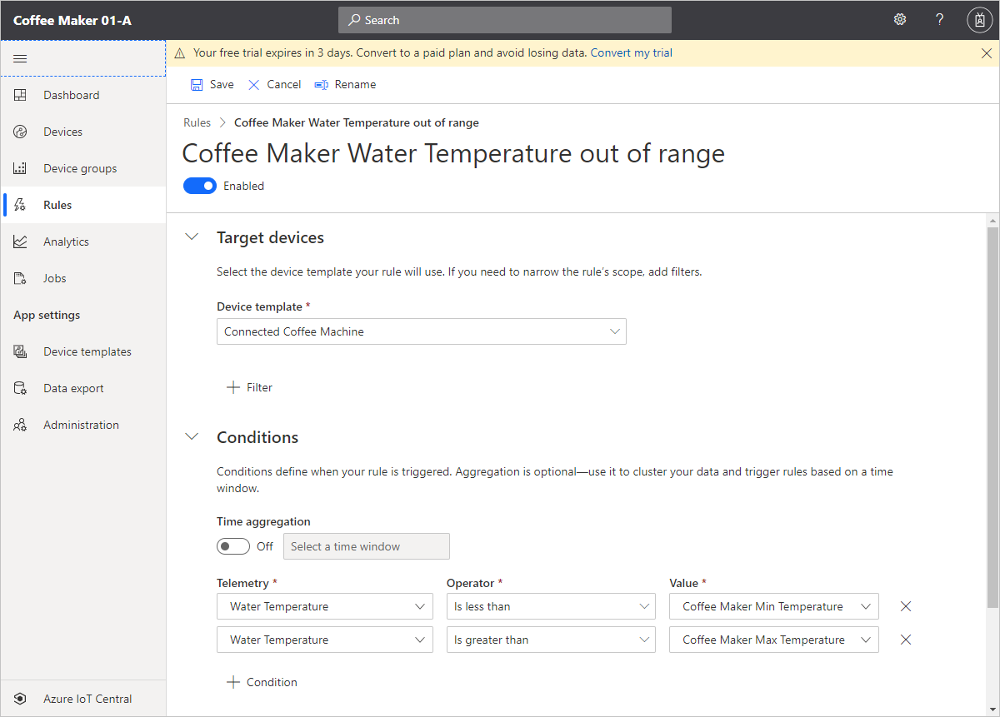

So far, you've connected your coffee machine to the Azure IoT Central application, enabling the exchange of data that allows you to monitor and manage your coffee machine. In this unit, you create rules that trigger actions when the water temperature of the coffee machine is outside the normal range.

## Create rules in IoT Central with email as the action

Azure IoT Central can use email to send notifications. In this scenario, if the coffee machine is outside the optimal temperature range, IoT Central sends an email to the client's maintenance department.

1. Navigate to the **Rules** page of your Azure IoT Central application in Azure IoT Central and select **+ New**.

1. Enter the rule name `Coffee Machine water temperature out of range`.

1. In **Target devices**, select the **Connected Coffee Machine** device template.

1. In **Conditions**, select to trigger the rule if *any of the conditions are true*.

1. Add the condition **Water Temperature** is less than **Coffee Maker Min Temperature** to the rule.

1. Add the condition **Water Temperature** is greater than **Coffee Maker Max Temperature** to the rule.

    

1. Scroll down on the **Coffee Maker Water Temperature out of range** rule page and choose **+ Email** in the **Actions** section.

1. Enter _Temperature out of range_ as the display name.

1. Enter the email address that you used to sign in to the IoT Central application and add the note _Coffee maker's water temperature is out of range. Maintenance is required._

1. Select **Done**. Then select **Save**. Your rule is listed on the **Rules** page.

To trigger the rule, set the optimal temperature on the **Properties** page for your device to _92_. Once you're done with the validation, turn off the rules to avoid flooding your inbox with emails.
