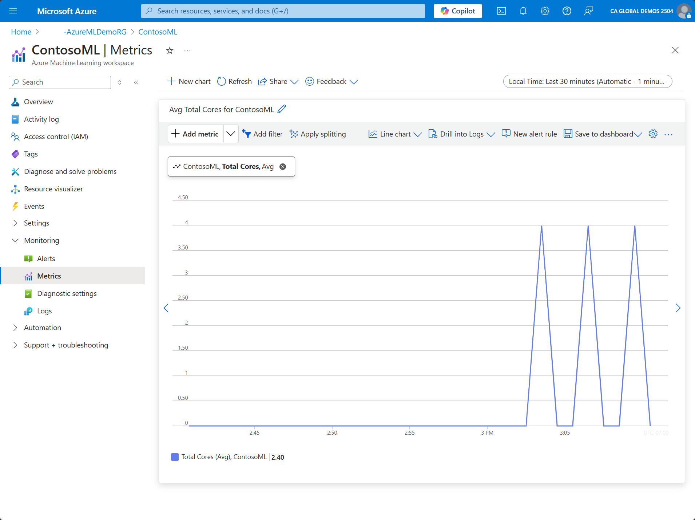

Azure Monitor collects and aggregates metrics from every component of Azure Machine Learning by default. Azure Monitor platform metrics provide a view of availability, performance, and resilience.

Azure Monitor uses the concept of resource types to identify Azure resources. Resource types are also part of the resource IDs for every resource running in Azure. For example, one resource type for Azure Machine Learning is Microsoft.MachineLearningServices/workspaces.

Azure Monitor organizes core monitoring data into metrics on resource types, also called namespaces. Different metrics and logs are available for different resource types. The metrics categories in the "Microsoft.MachineLearningServices/workspaces" resource are **Model**, **Quota**, **Resource**, **Run**, and **Traffic**. Quota information is for Machine Learning compute only. Run provides information on training runs for the workspace.

You can use that data to analyze the performance of your Azure Machine Learning environment. For example, if you want to check how many cores a workspace is consuming:

1. On the Azure portal, open the Azure Machine Learning resource.
1. On the left-hand side menu, expand Monitoring and select Metrics.
1. On the chart, make sure the Scope is set to the Azure Machine Learning resource and Metric Namespace is set to the Namespace of the resource. (You might need to select "+ Add metric" if no options are showing up in the graph)
1. Under Metric, scroll down to Quota->Total Cores:

   

1. You can adjust the details of the chart to match your needs, such as time range, time granularity, aggregation, etc. You can also add additional metrics to the same chart for correlation.
