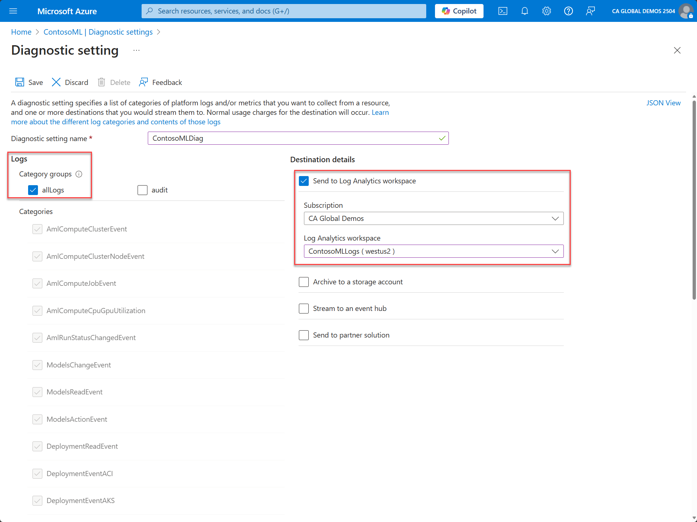
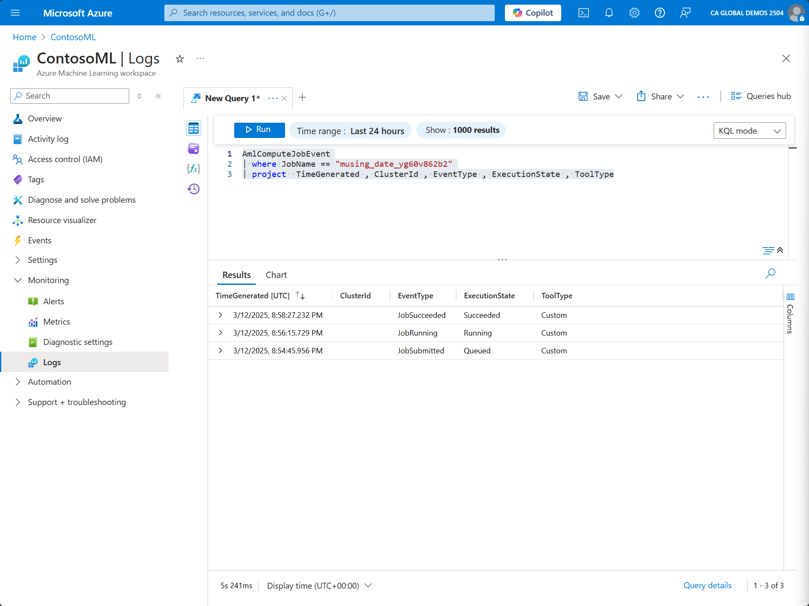

Resource logs provide insight into operations that an Azure resource completed, such as Azure Machine Learning. Logs are generated automatically, but you must route them to Log Analytics or a different service to save or query them.

To route Azure Machine Learning logs to Log Analytics, perform the following steps:

1. In the Azure portal, open the Azure Machine Learning resource.

1. On the left menu, expand **Monitoring** and select **Diagnostic settings**.

1. Select **Add diagnostic setting**.

1. On the **Diagnostic setting** pane, provide a name for the diagnostic setting.

1. Under **Logs**, select the log categories that you want to export. You can also select metrics to be exported.

1. Under **Destination details**, select **Send to Log Analytics workspace**.

1. Select the subscription and Log Analytics workspace that you want to export this data to.

   

1. Select **Save** to save and close the export configuration.

1. Back on the **Diagnostic settings** page, you should now be able to see the configuration. If necessary, you can change the settings for this export by selecting **Edit setting**.

After you configure the diagnostic setting, you can query the logs in Log Analytics:

1. In the Azure portal, open the Azure Machine Learning resource.

1. On the left menu, expand **Monitoring** and select **Logs**.

1. If **Queries Hub** opens, you can close it.

   **Queries Hub** provides a sample of queries that you can use. The queries have the context of the resource type that you're looking into. It's an easy way to get started with Log Analytics.

1. On the **New Query 1*** tab, select the dropdown menu on the right side to change **Simple mode** to **KQL**. (KQL stands for Kusto Query Language.)

1. In the KQL query editor, you can enter the query that you want to perform. For the example in this module, we check for records for a specific job name:

   ```kusto
   _AmlComputeJobEvent_
   *| where JobName == "musing_date_yg60v862b2"*
   _| project  TimeGenerated , ClusterId , EventType , ExecutionState , ToolType_
   ```

1. Select **Run** to run the query.



After you run the query, you can analyze the results on the **Results** pane.
