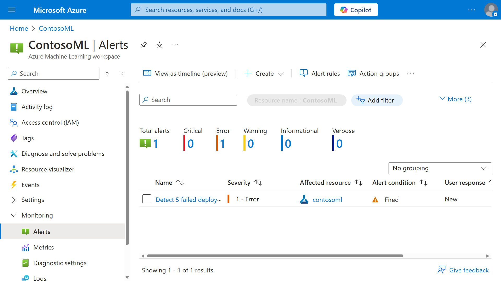
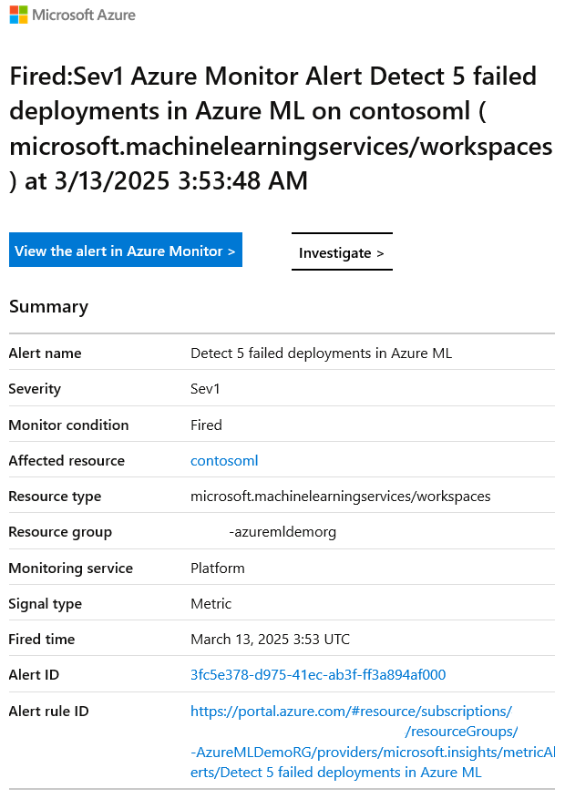

Azure Monitor can proactively notify you when it finds specific conditions in your monitoring data. You can create an alert based on any metric or log data source in the Azure Monitor data platform.

There are various types of alerts:

- *Metric alerts* evaluate resource metrics at regular intervals. Metrics can be platform metrics, custom metrics, logs from Azure Monitor converted to metrics, or Application Insights metrics. Metric alerts can also apply multiple conditions and dynamic thresholds.
- *Log alerts* enable users to use a Log Analytics query to evaluate resource logs at a predefined frequency.
- *Activity log alerts* are triggered when a new activity log event matches defined conditions. For example, activity log alerts can report on service health and resource health.

When you're monitoring an Azure Machine Learning workspace, you might want to get an alert when a model deployment fails, when quota utilization exceeds a threshold, or when nodes are unusable.

To create an alert:

1. In the Azure portal, open the Azure Machine Learning resource.

1. On the left menu, expand **Monitoring** and select **Alerts**.

1. On the **Create** dropdown menu, select **Alert rule**.

1. Notice that the wizard starts on the second tab, **Condition**. The reason that the scope is already set to an Azure Machine Learning resource.

1. For **Signal name**, select **See all signals**.

   Notice that you can look for a range of signals, including **Custom log search**, **Metrics**, and **Activity log**.

1. Under **Metrics**, select **Failed Runs**.

1. For **Alert logic**, you can provide thresholds for when the condition is met to trigger the alert. For **Threshold**, enter **5**. This value means that more than five failed deployments trigger this alert. You can change the variables to meet your needs. When you finish, select **Next**.

1. On the **Actions** tab, make sure that **Use quick actions** is selected, and provide the details on the right pane. Then select **Save** > **Next**.

1. On the **Details** tab, confirm the subscription and resource group to use. Select the appropriate severity level. For **Alert rule name**, provide the name of the alert and a description. Then select **Review + Create**.

The **Alerts** dashboard shows information if the alert is triggered.

If you configure an alert to send an email, you should receive a notification like the following example.

