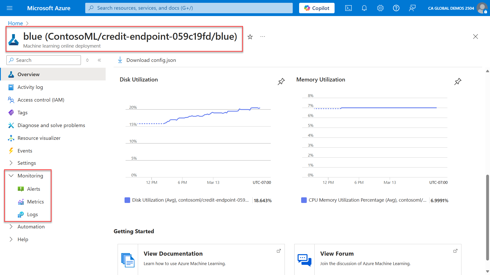

In Azure Machine Learning, inferencing is performed by using endpoints. An endpoint is a stable and durable URL that can be used to request or invoke a model. Azure Machine Learning uses integration with Azure Monitor to track and monitor metrics and logs for online endpoints.

Like workspace monitoring, you can view Metrics and Logs for online endpoints directly from the Azure portal. Since online endpoints are separate resources in Azure, you need to open those resources directly from the Azure portal within the Resource Group on which they're contained.

The image displays Disk Utilization and Memory Utilization of the endpoint.

