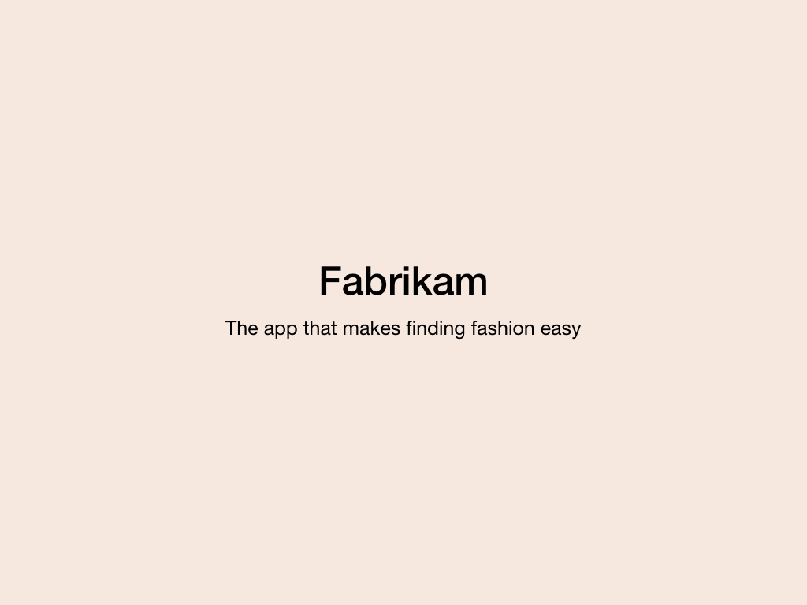

You’ve founded your first company, Fabrikam, and built a prototype for your first app. Your app uses machine learning and AI to identify the items of clothing from images and allow you to purchase them easily.

The prototype is the first pass of your solution. It's not pretty or complete, and often not tested. Frank Robinson said when he coined the MVP term:

> ... think big for the long term but small for the short term. Think big enough that the first product is a sound launching pad for it and its next generation and the road map that follows, but not so small that you leave room for a competitor to get the jump on you.

So the next step is to get your app in front of potential investors and customers to allow you to grow it into a full-fledged product. Your prototype isn’t complete yet, so you need to wrap your core concepts into a story that showcases what you have now and what your goals are for the app.

This module teaches you how to construct a pitch deck. You’ll learn how to:

* Construct a mission statement for a product prototype.
* Tailor your pitch to your audience.
* Create a pitch for a product prototype.
* Create a call to action for your audience.

By the end of this module, you’ll be able to write a compelling pitch deck, a deck that will resonate with your audience and help share the vision of your prototype.
