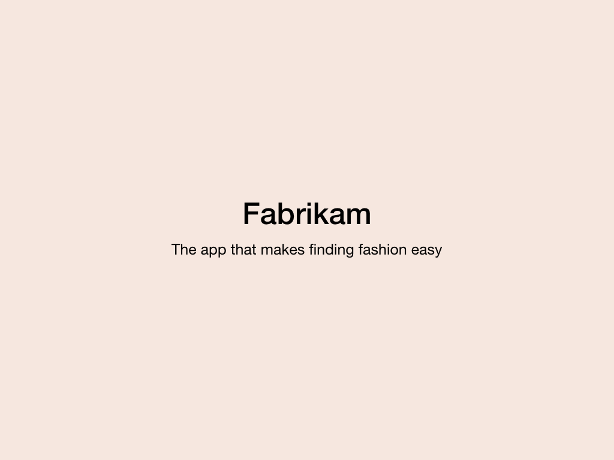

You founded your first company, Fabrikam, and built a prototype for your first app. Your app runs on Azure and uses [Azure Vision](/azure/ai-services/computer-vision/overview) to analyze fashion photos, detect visible brand logos, and use those signals to search a curated product catalog so users can find matching items more easily.

> [!NOTE]
> In a real implementation, image analysis is only one part of the flow. Brand detection uses a preset logo database, object detection doesn't identify exact products or guarantee catalog matches, and an app like Fabrikam still needs catalog data, ranking logic, testing with real images, and a plan for consent, privacy, and human review where needed. Azure Vision also has published [image requirements](/azure/ai-services/computer-vision/overview#image-requirements), and the current Image Analysis 4.0 service is deprecated and scheduled to retire on September 25, 2028, so long-term product plans should validate the service choice and migration path. For more information, see [Object detection](/azure/ai-services/computer-vision/concept-object-detection), [Brand detection](/azure/ai-services/computer-vision/concept-brand-detection), [Transparency note: Image Analysis](/azure/foundry/responsible-ai/computer-vision/image-analysis-transparency-note), and [Migrate from Azure Vision in Foundry Tools - Image Analysis](/azure/ai-services/computer-vision/migration-options).

The prototype is the first pass of your solution. It's not pretty or complete, and it might still need more testing and refinement before it's ready for broader use. Frank Robinson said when he coined the MVP term:

> ... *think big for the long term but small for the short term. Think big enough that the first product is a sound launching pad for it and its next generation and the road map that follows, but not so small that you leave room for a competitor to get the jump on you*.

So, the next step is to get your app in front of potential investors and customers to allow you to grow it into a full-fledged product. Your prototype isn't complete yet, so you need to wrap your core concepts into a story that honestly shows what you have now, what still needs validation, which parts depend on Azure services versus your own data and integrations, and what your goals are for the app.

A technically strong prototype pitch names the user input, the Azure capability you're relying on, the application logic or data that you own, and the next proof point you still need, such as evaluation on representative images, integration testing, or a privacy review.

This module teaches you how to construct a pitch deck. You learn how to:

- Construct a mission statement for a product prototype.
- Tailor your pitch to your audience.
- Explain your solution and demonstration plan in a technically honest way.
- Create a call to action for your audience.

By the end of this module, you're able to write a compelling pitch deck that resonates with your audience, keeps technical claims credible, and helps share the vision of your prototype.
