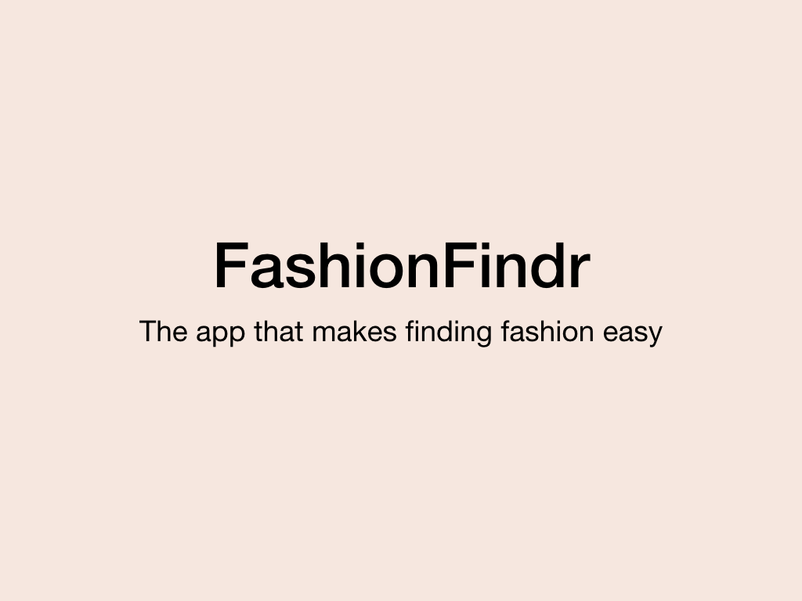
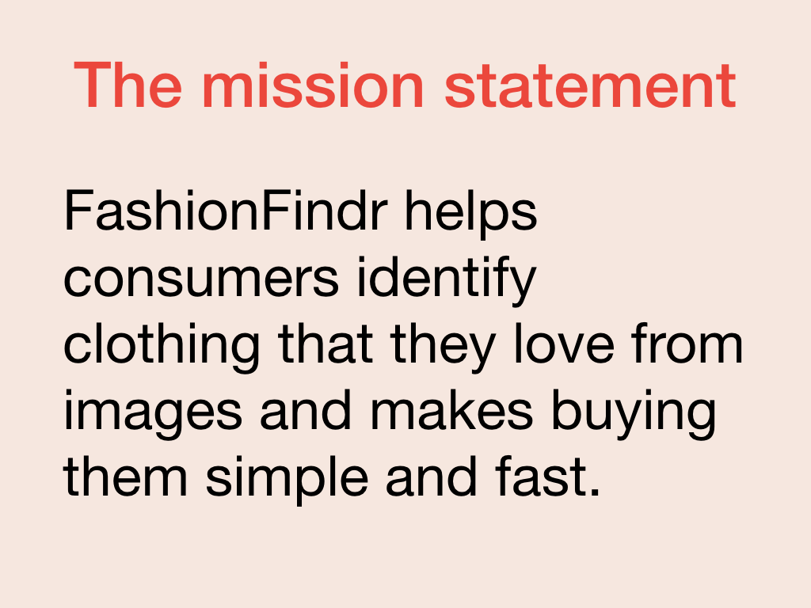

A pitch deck is the medium through which you share your prototype with investors, customers, or future employees. At the core of your pitch deck is the mission: the problem you're solving and your solution. You need to be able to articulate that mission quickly and concisely and leave a hook to engage whomever you are pitching. This is often described as your "elevator pitch": a pitch given in the time it takes you to ride an elevator.

One of the best ways to open your pitch is to use storytelling. Create a story that wraps your mission and captures why your product is worth investing in:

> Hi, I'm Jane Smith, the CEO of FashionFindr. Last year, I went to a friend's wedding, and I was really taken with one of my fellow guest's outfit. I forgot to ask her where she got the outfit at the wedding but when I got home I realized I had a photo of the outfit. I tried to use the photo to find the outfit but found the experience frustrating and ultimately unsuccessful. That inspired me to build FashionFindr, an app which uses AI to identify fashion brands from photographs and makes it easier for you to find and buy the clothes you love. Our users convert 16x times more often than traditional sales techniques. We're seeking investment, and I'd love to demo our product for you.

A prototype pitch is an extension of your elevator pitch, with the bonus of having something to show your audience beyond the story. You can turn your mission into some key opening slides for your pitch deck.

Your story is just the start, the initial hook for your audience, you also want to make clear the problem you're solving.

## What's the problem

State the problem you're trying to solve. This should be at the heart of your prototype. In our example, identifying a clothing item and brand from an image is hard.

> [!NOTE]
> A quote or statistic that demonstrates the problem is often a useful addition.

## Here's the solution

Once you've articulated the problem, you need to share the solution you've built to solve the problem. This should include any competitive advantage your product brings to the market. In our case, our app makes it easier to identify who makes the clothes you want and links you to a way to buy them. To do this, FashionFindr uses machine learning and AI to enhance the search and buying experience.

## Why are we the right people

Lastly, we need to tell the audience why you and your team are the right people to solve this problem. This could be based on experience, specialized knowledge, or empathy for the customer. If you don't have relevant experience, then articulating prior success is a good substitute.

