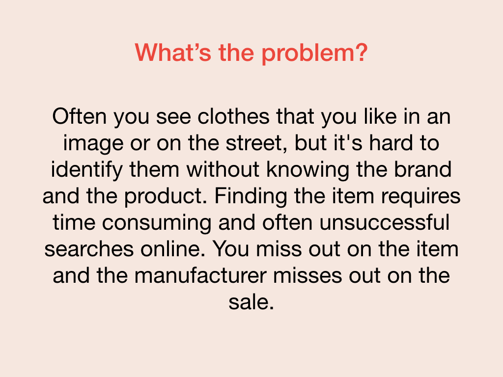
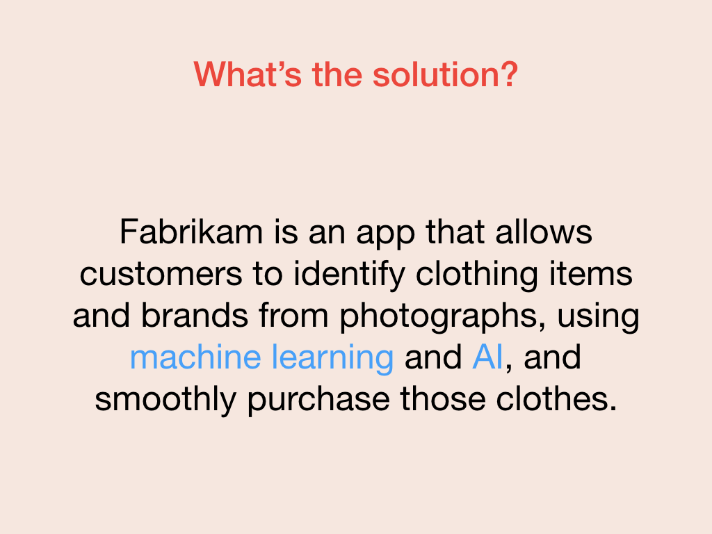
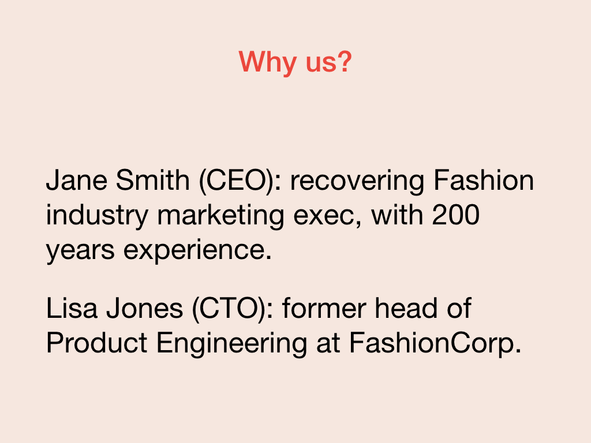

A pitch deck is the medium through which you share your prototype with investors, customers, or future employees. The core of your pitch deck includes the mission: the problem you're solving and your solution. You need to be able to articulate that mission quickly and concisely and leave a hook to engage whomever you are pitching. This articulation is often described as your "elevator pitch": a pitch given in the time it takes you to ride an elevator.

One of the best ways to open your pitch is to use storytelling. Create a story that wraps your mission and captures the reason your product is worth investing in:

> *Hi, I'm Jane Smith, the CEO of Fabrikam. Last year, I went to a friend's wedding, and I was really taken with the outfit of one of my fellow guests'. I forgot to ask her at the wedding where she got the outfit, but when I got home, I realized I had a photo of the outfit. I tried to use the picture to find the outfit, but found the experience frustrating and ultimately unsuccessful. That inspired me to build Fabrikam, an app which uses machine learning and AI to identify fashion brands from photographs and makes it easier for you to find and buy the clothes you love. Our users convert 16 times more often than traditional sales techniques. We're seeking investment, and I'd love to demo our product for you*.

A prototype pitch is an extension of your elevator pitch, with the bonus of having something to show your audience beyond the story in your elevator pitch. You can turn your mission into some key opening slides for your pitch deck.

Because you hopefully have slightly longer than an elevator ride to explain your product, your story is just the start, the initial hook for your audience.

A good pitch is composed of four major parts:

- The story
- The problem
- The solution
- The reason we're the right people

Try to get at least 30 minutes in front of an audience. That gives you lots of time to talk through your whole pitch and answer any questions.

Let's look at these other parts of your pitch.

## What's the problem?

State the problem you're trying to solve. Addressing this problem should be at the heart of your prototype. In our example, identifying a clothing item and its brand from an image is difficult and time-consuming. Even if you can, it's often a challenge to track the item down to a store to buy it.

## Here's the solution

After you articulate the problem, you need to share the solution you built to solve the problem. Include any unique properties or competitive advantages your product brings to the problem. In our case, our Fabrikam app uses machine learning and AI to make it easier to identify who makes the clothes you want, then lets you buy those clothes without leaving the app.

## Why are we the right people?

Lastly, we need to tell the audience why you and your team are the right people to solve this problem. The reasons could be based on experience, specialized knowledge, or empathy for the customer. If you don't have relevant experience, then articulating prior success is a good substitute.

Lastly, here are some important tips to make sure you deliver the best possible pitch.

## Practice does make perfect

Have your pitch down cold. Repetition makes you comfortable and helps you appear confident. Pitching is a stressful process, and knowing your material inside and out is one way to reduce the overall stress of the situation.

## Be authentic and honest

If you don't know the answer to a question or you get asked something you aren't prepared for, don't wing it. Instead, explain that you don't have the answer right now and that you can get back to them. This approach is better than answering a question unprepared or disingenuously.

## Be passionate

Remember to be passionate in your pitch. A sense of genuine enthusiasm and passion for your mission and your product becomes apparent to your audience and sends the message that you're committed.
