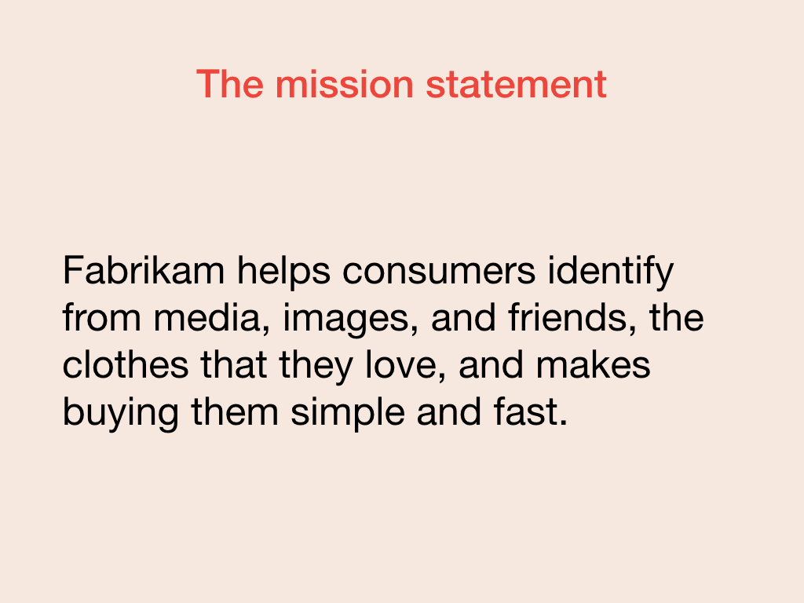
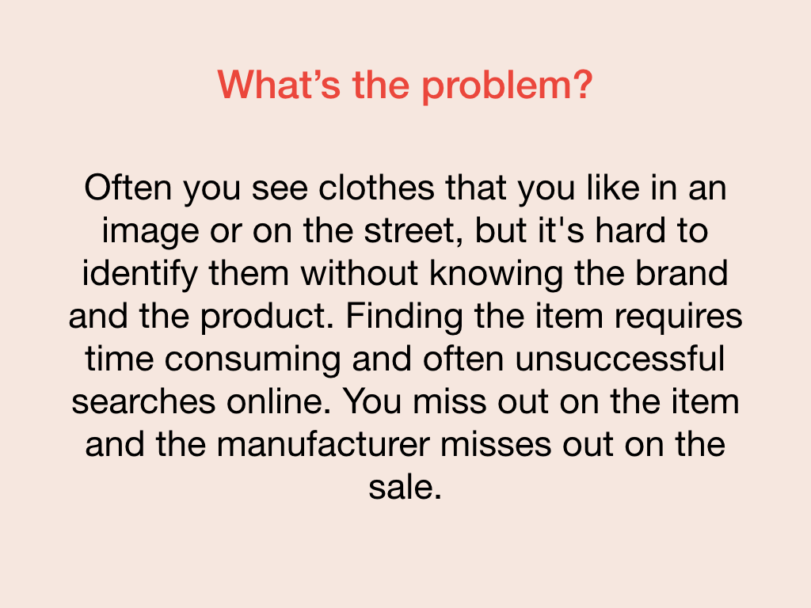
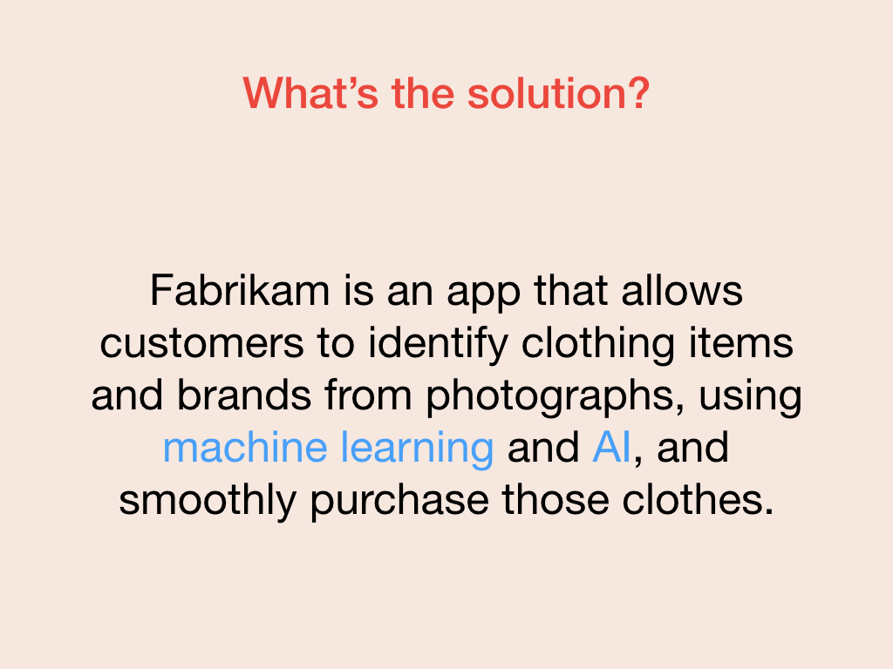
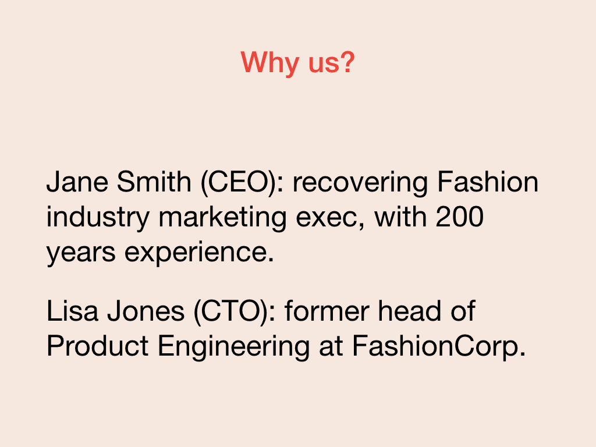

A pitch deck is the medium through which you share your prototype with investors, customers, or future employees. The core of your pitch deck includes the mission: the problem you're solving and your solution. You need to be able to articulate that mission quickly and concisely and leave a hook to engage whomever you are pitching. This articulation is often described as your "elevator pitch": a pitch given in the time it takes you to ride an elevator.

One of the best ways to open your pitch is to use storytelling. Create a story that wraps your mission and captures the reason your product is worth investing in:

> *Hi, I'm Jane Smith, the CEO of Fabrikam. Last year, I went to a friend's wedding, and I was really taken with the outfit of one of my fellow guests. I forgot to ask her at the wedding where she got the outfit, but when I got home, I realized I had a photo of the outfit. I tried to use the picture to find the outfit, but found the experience frustrating and ultimately unsuccessful. That inspired me to build Fabrikam, an app on Azure that uses Azure Vision to analyze fashion photos, detect visible brand logos, and search a curated catalog so people can find and buy similar clothes more easily. We're seeking investment, and I'd love to demo our product for you*.

A prototype pitch is an extension of your elevator pitch, with the bonus of having something to show your audience beyond the story in your elevator pitch. You can turn your mission into some key opening slides for your pitch deck. When AI is part of the story, describe the workflow precisely enough that the audience can tell which Azure capability you're using, what your own data or integrations add, what inputs or constraints matter, and what still needs validation.

If you include metrics, traction, or customer growth in your pitch, make sure you can support those claims with data. Use the same discipline for technical claims: separate what Azure services do out of the box from what depends on your own catalog, business logic, or future roadmap.

Because you hopefully have slightly longer than an elevator ride to explain your product, your story is just the start, the initial hook for your audience.

A good pitch is composed of four major parts:

- The story
- The problem
- The solution
- The reason we're the right people

Before you turn those parts into slides, write down four technical facts that keep the pitch honest:

- What input the user gives the system.
- Which Azure capability processes that input.
- What your own data, ranking logic, or partner integration contributes.
- What happens when the AI output is low confidence, incomplete, or a no-match.

Aim for enough time to cover your story, your product, and audience questions. In some settings, that might be five to 10 minutes. In others, you might have 30 minutes or more.

Let's look at these other parts of your pitch.

## What's the problem?

State the problem you're trying to solve. Addressing this problem should be at the heart of your prototype. In our example, identifying a clothing item, matching it to a brand, and finding where to buy it from an image is difficult and time-consuming. Even if you identify it correctly, it's often still a challenge to track the item down and complete the purchase.

## Here's the solution

After you articulate the problem, you need to share the solution you built to solve the problem. Include any unique properties or competitive advantages your product brings to the problem. In our case, our Fabrikam app runs on Azure and uses [Azure Vision](/azure/ai-services/computer-vision/overview) to analyze a shopper's photo, detect visible brand logos, and extract visual signals that the app can use to search a curated catalog for likely matches before handing the customer into a purchase flow.

That explanation is stronger than claiming perfect item recognition because it makes the architecture and current scope clear. [Brand detection](/azure/ai-services/computer-vision/concept-brand-detection) uses a preset logo database, object detection doesn't identify exact products or SKUs, and catalog matching depends on your own data and ranking logic. If your pitch depends on niche or region-specific brand recognition, say whether that requires more specialized model customization or another post-migration design instead of implying the base service already covers it. If you want to claim exact item recognition or a specific match rate, explain how you tested that claim on representative images, what confidence threshold you use, and what the product does when it can't make a trustworthy match. Because Image Analysis 4.0 is deprecated, a long-term roadmap should also acknowledge that the production implementation might evolve. For more information, see [Transparency note: Image Analysis](/azure/foundry/responsible-ai/computer-vision/image-analysis-transparency-note) and [Migrate from Azure Vision in Foundry Tools - Image Analysis](/azure/ai-services/computer-vision/migration-options).

## Why are we the right people?

Lastly, we need to tell the audience why you and your team are the right people to solve this problem. The reasons could be based on experience, specialized knowledge, or empathy for the customer. If you don't have relevant experience, then articulating prior success is a good substitute.

Here are some additional tips to help you deliver the best possible pitch.

## Practice does make perfect

Have your pitch down cold. Repetition makes you comfortable and helps you appear confident. Pitching is a stressful process, and knowing your material inside and out is one way to reduce the overall stress of the situation.

## Be authentic and honest

If you don't know the answer to a question or you get asked something you aren't prepared for, don't wing it. Instead, explain that you don't have the answer right now and that you can get back to them. This approach is better than answering a question unprepared or disingenuously.

## Be passionate

Remember to be passionate in your pitch. A sense of genuine enthusiasm and passion for your mission and your product becomes apparent to your audience and sends the message that you're committed.
