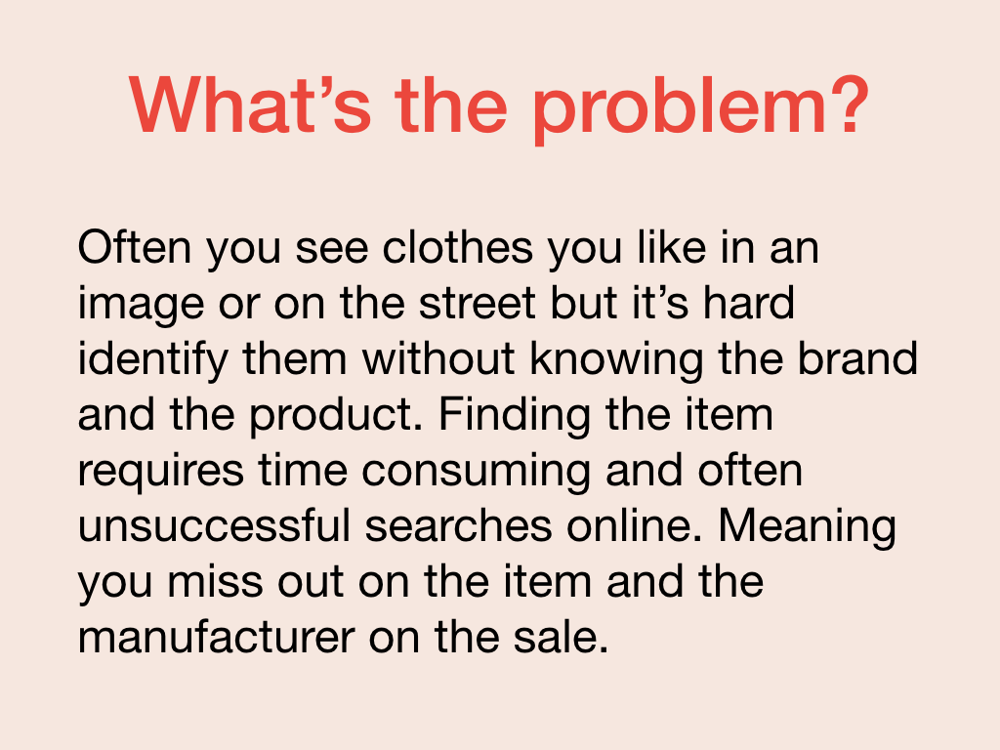

Now FashionFindr has a prototype, your team wants to pitch that prototype to a potential investor. When you're pitching to a specific person or group of people, investors, potential new customers, a conference or event audience, you need to tailor your message to that audience. 

Every audience has a different focus, let's look at the two audiences you'll likely most frequently pitch to: investors and customers.

## Investors

Investors are focussed on your product, plans, and your potential to make money. They want to be sure the money they invest with you gives them a return.

When pitching to investors it is crucial to research them and what they are interested in. For an investor, you would review their prior work history, their other investments, and their interests.

Pay special attention to those prior investments and their investment thesis. Have they invested in other companies like you?

## Customers

Customers are focussed on your product and how it helps them. They want to ensure choosing your product is the right solution that will deliver them benefits like cost savings, productivity increases, or other benefits.

XXX

## Setting the stage

You'll need this information to set the stage. A good initial approach is to explain the scope or scale of the opportunity, your competition (if any), and the model with which you’re going to approach that opportunity.

For FashionFindr, it’ll be key to find an entry point: a resonance that allows the investor to see the problem in light of their own experiences, empathize with the customer or engages their economic interests. This entry point enables us to share, to a more receptive audience, why our solution solves the problem. 

Once they understand our solution, we can also explain our business model and highlight what our audience will get out of using, buying, or investing in our product.

•	Explain different types of audiences
•	Identify your target audience
•	Identify an entry point that resonates with your target audience
•	Connect with the audience and ready them for your ask.
