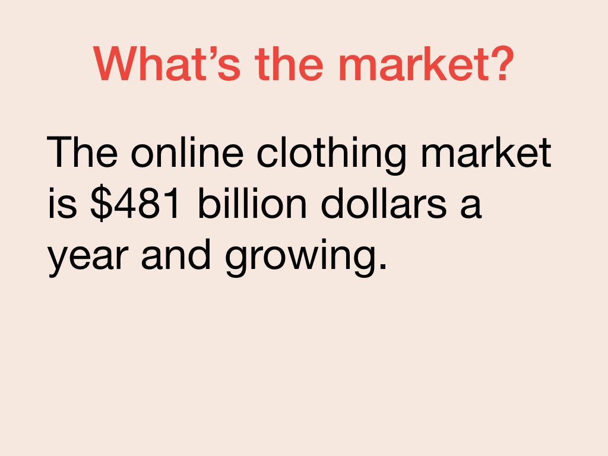
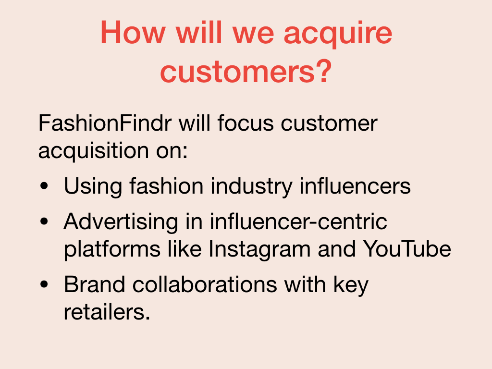
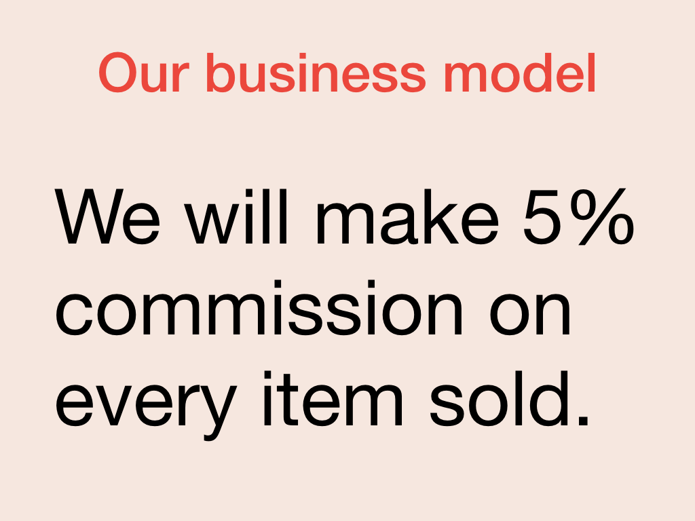

Once you have articulated your extended elevator pitch and identified what your audience wants to be addressed, then you can share the operational details of your business.

The most brilliant, beautiful, or useful product is only as good as the go-to-market strategy you adopt. If no one uses your product, then you've failed. A go-to-market strategy, the story of how you'll acquire users and generally how you'll make money, is crucial to demonstrate to your audience

## Explain how you will get customers

You need to explain your go-to-market plan, starting with the size of the market opportunity.

Then explain how you will acquire customers. This should include the channels you plan to use, for example, advertising, influencer outreach, content, or the like. If there are unique or specific marketing techniques or channels that make your go-to-market stand out this is the place to highlight them.

As well as any techniques planned, you should indicate your targets for customer acquisition and the time frame over which you intend to acquire them.

## Explain your revenue model

The other side of your go-to-market plan is how you plan to make money: your business model or monetization strategy. Some investors are open to a strategy of building a product and growing its customer base and monetizing later, but even those investors are usually interested in your future plans to make money.

For a pitch, you generally don't need to go deep into numbers, although you should have that data available because you're going to be asked if the investment proceeds. You should identify the specific revenue model, for example, subscriptions, per unit, and your rough expectations on revenue.
