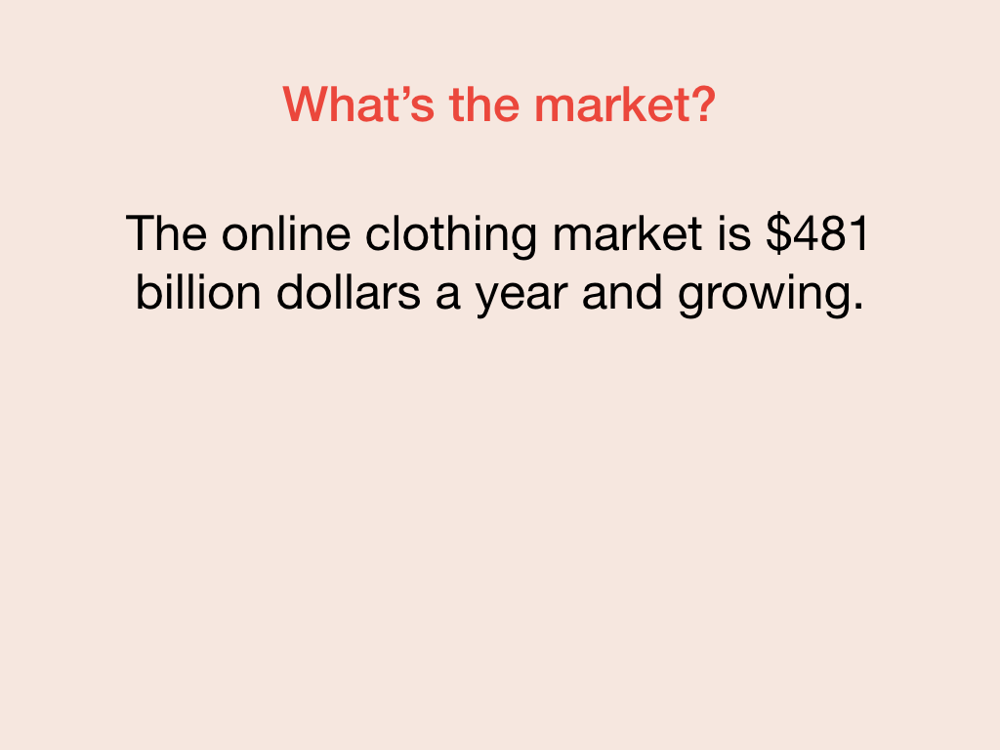
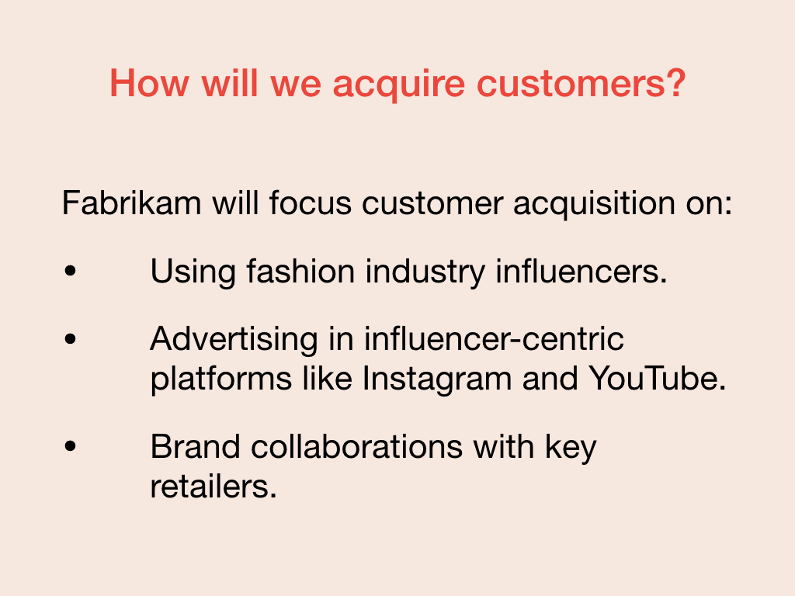
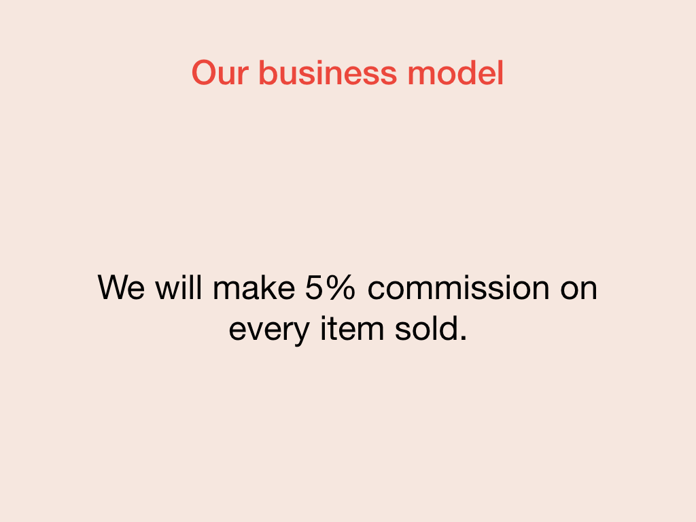

After you articulate your extended elevator pitch and identify your audience's concerns, you can share the operational details of your business.

The most brilliant, beautiful, or useful product is only as good as the go-to-market strategy you adopt. If no one uses your product, then you failed. It's important to demonstrate to your audience a go-to-market strategy, which is the story of how you acquire users and generally how you make money.

## Explain how you get customers

Explain your go-to-market plan, starting with the size of the market opportunity.

Explain how you acquire customers. Your explanation should include the channels you plan to use, such as advertising, influencer outreach, content, or the like. If there are unique or specific marketing techniques or channels that make your go-to-market stand out, now is the time to highlight them. If your discovery flow relies on search, explain how product data becomes searchable and how users refine results, not just that "AI finds the answer."

You should also explain the operational path from discovery to transaction. For a prototype like Fabrikam, that usually means describing:

- How product data enters the catalog or search index.
- How often inventory, prices, and availability are refreshed.
- How users narrow results through filters, facets, or other controls.
- Where checkout, payment, and fulfillment actually happen.

Along with any techniques planned, you should indicate your targets for customer acquisition and the time frame over which you intend to acquire them. Be explicit about the boundaries of the system you're pitching. For Fabrikam, the image analysis step produces visual signals, the catalog, or search layer turns those signals into likely matches, and the retailer or payment integration completes the transaction.

> [!NOTE]
> Keep the service boundaries clear in your pitch. Azure Vision handles image analysis, but catalog matching and commerce fulfillment usually depend on your own data and partner systems. [Azure AI Search](/azure/search/search-what-is-azure-search) can power indexed catalog search, relevance tuning, filters, and facets, but you still need a clean schema, index refresh strategy, and ranking logic. If you want to show brand, category, or price refinements, remember that facets are returned from query results and the underlying fields need to be configured for that experience in the search index. For more detail, see [Add faceted navigation to search results](/azure/search/search-faceted-navigation) and [AI architecture design](/azure/architecture/ai-ml/).

## Explain your revenue model

The other side of your go-to-market plan is how you plan to make money, such as your business model or monetization strategy. Some investors are open to a strategy of building a product and growing its customer base and monetizing later. But even those investors are interested in your future plans to make money.

For a pitch, you generally don't need to go deep into numbers, although you should have that data available because your audience is likely to ask follow-up questions. Investors might want to validate the business case before committing funds, and customers or partners might want to understand the commercial impact of working with you. Identify the specific revenue model, such as subscriptions or per unit, and label any early numbers as assumptions or targets unless you can defend them with data. Don't imply that AI capability alone creates revenue; explain the dependencies such as catalog coverage, partner onboarding, conversion, and any commercial agreements that still need to be signed.
