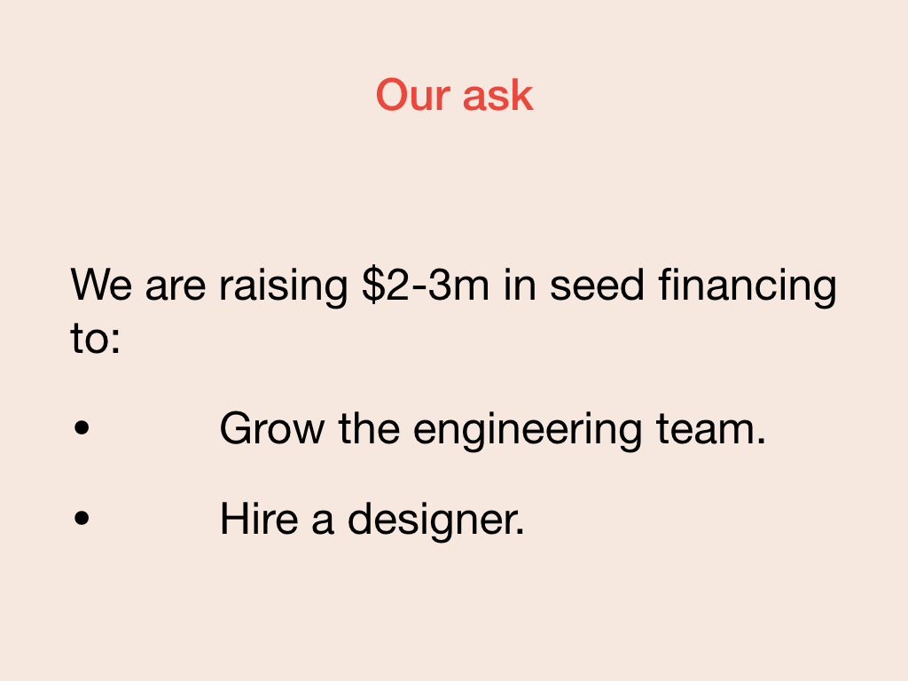

The last component of a pitch is the "ask." The "ask" might be a call to action to use the product, to buy it, or frequently, to raise money to develop the product further. For Fabrikam, you're seeking 2 million dollars in investment to develop the prototype into a fully fledged product.

In some regards, the "ask" is the easiest part of the pitch. You only need to articulate:

- What you want.
- What you're going to do with the results of that ask.

In Fabrikam's case, you're looking for 2 million dollars in seed funding.

You plan to spend it on customer acquisition and growing your team.

## Exit strategy

One way to wrap up your "ask" is to explain your proposed exit strategy if you succeed with the product. This exit might be going public, growing a private company, or being acquired.

> *With our successful seed funding, we aim to grow our customer base to 3 million users by 2024, producing 90 million dollars in revenue and thus be an attractive target for an acquisition or merger with a large retail company*.
