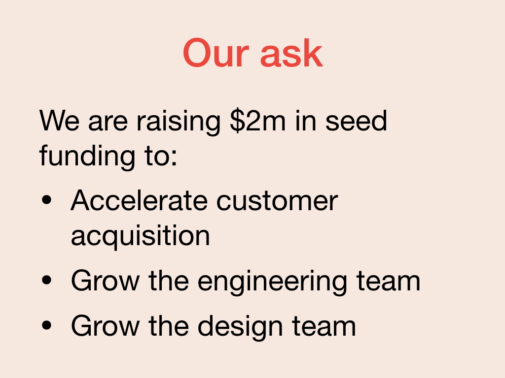

The last component of a pitch is the ask. This might be a call to action to use the product, to buy it, or frequently, to raise money to develop the product further. For FashionFindr, they are seeking 2 million dollars in investment that they will use to develop the prototype into a fully-fledged product.

In some regards, the ask is the easiest part of the pitch. You only need to articulate:

* What you want.
* What you are going to do with the results of that ask.

In FashionFindr's case, they are looking for 2 million dollars in seed funding.

They are going to spend it on customer acquisition and growing their team.

## Exit strategy

One way to wrap up your ask is to explain, if you succeed with the product, what your proposed exit strategy is. This might be going public, growing a private company, or being acquired.

> With our successful seed funding we aim to grow our customer base to 3 million users by 2022, producing 90 million dollars in revenue and thus be an attractive target for an acquisition or merger with a large retail company.
