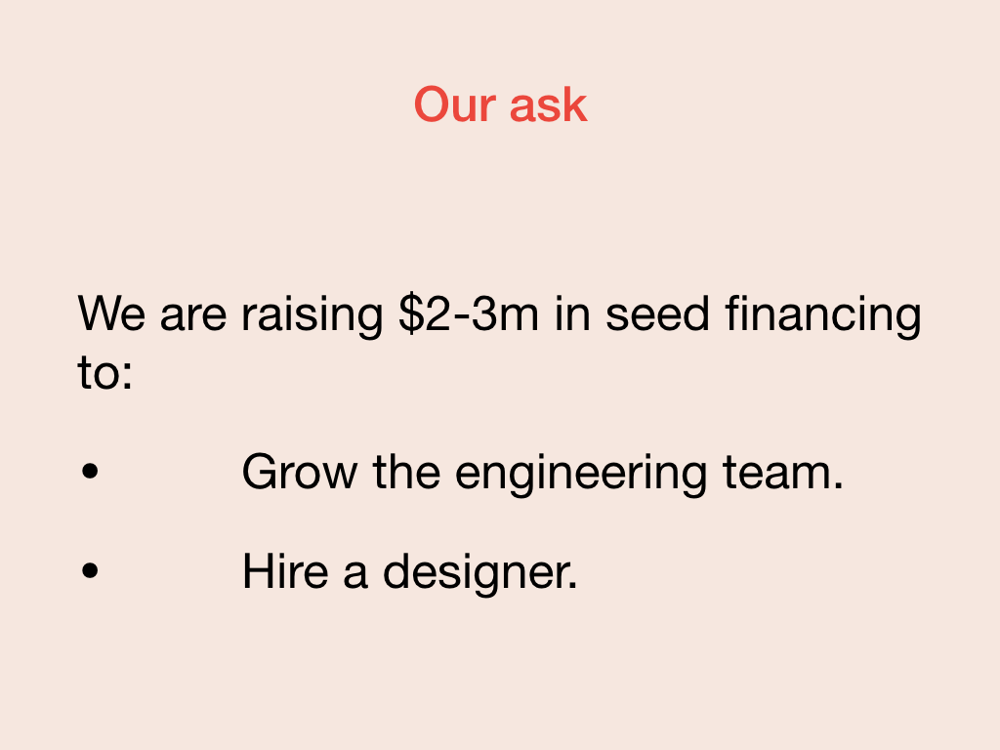

The last component of a pitch is the "ask." The ask should match the audience. It might be a call to action to use the product, a request to start a pilot, a request to partner with you, or a request for funding to develop the product further. For Fabrikam, an investor pitch might ask for 2 million dollars in funding to turn the prototype into a full-fledged product, while a customer pitch might ask for a pilot with their catalog.

In some regards, the ask is the easiest part of the pitch. You only need to articulate:

- What you want.
- Why it's the right next step for this audience.
- What you're going to do with the results of that ask.
- How success will be measured and who needs to approve the next step.

The ask should match the maturity of the prototype. If you still need technical validation, asking for a pilot or a discovery engagement is often more credible than asking for an immediate enterprise rollout. If the next step includes technical work, translate the ask into specific validation tasks such as evaluation with representative images, partner data integration, privacy review, or migration planning. Be explicit about the data, environment access, evaluation criteria, and decision point required to complete that validation.

For Fabrikam's investor pitch, you're looking for 2 million dollars in seed funding.

You plan to spend it on customer acquisition and growing your team, but the best investor asks also explain what concrete milestones that money unlocks, such as validating model performance against a representative image set, expanding catalog coverage, or securing partner integrations.

For a customer or partner pitch, define the scope of the next step: what data or integration access you need, how success is measured, what privacy or security obligations apply during the pilot, who signs off on the result, and what decision you want at the end of the pilot.

## Exit strategy for investor pitches

An exit strategy is relevant only when you're speaking to investors. It explains how investors could realize a return if the company succeeds. This exit might be going public, growing as a private company, or being acquired. If you're speaking to a customer or partner instead, focus on the business outcome of the next step, such as a pilot, integration, or commercial agreement.

> *With successful seed funding, we aim to grow our customer base to 3 million users over the next three years, produce 90 million dollars in annual revenue, and become an attractive acquisition or merger candidate for a large retail company*.

Keep long-range revenue or growth numbers clearly framed as targets or planning assumptions unless you can substantiate them with evidence.
