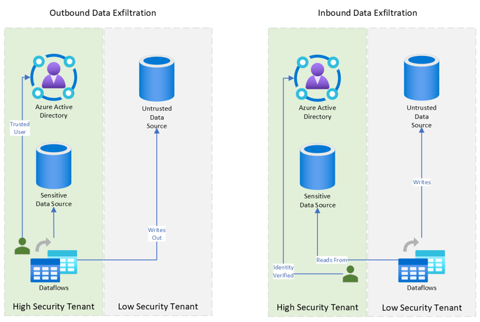

Exfiltration is a specific form of data loss where data is deliberately transferred to an external destination by a malicious actor. AI workloads, like any other workload running in the cloud, are potential avenues of data loss through exfiltration.

Exfiltration poses significant risks to organizations, including potential breaches of privacy, financial losses, and damage to reputation. Implementing robust exfiltration prevention measures is essential to protect sensitive data from leaving the secure environment.

A strategy to prevent data exfiltration involves applying security controls to all resources in an AI workload. In this module we focus specifically on the security controls and configuration you can apply to Azure AI services and Azure Machine Learning to address attempts at exfiltration.

