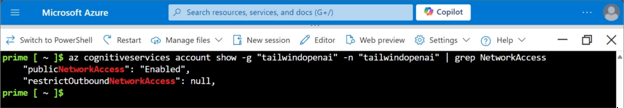
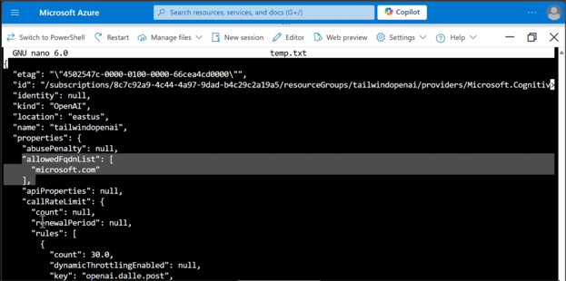

Azure AI services exfiltration prevention capabilities allow you to configure a list of outbound URLs your Azure AI services resources are permitted to access. In limiting outbound traffic to authorized URLs only, you can reduce the chance a malicious actor transmits data outside of your organization.

The following services support data loss prevention configuration:

- Azure OpenAI
- Azure AI Vision
- Content Moderator
- Custom Vision
- Face
- Document Intelligence
- Speech Service
- QnA Maker

To enable exfiltration prevention for an AI service, you need to complete two steps. The first step is to set the property restrictOutboundNetworkAccess on the AI service resource to true. You then need to provide a list of approved URLs you wish to allow the AI service to access by adding those URLs to the allowedFqdnList property. This property supports up to 1,000 URLs, including both IPv4 addresses and fully qualified domain names.

You can use Cloud Shell to configure exfiltration protection for Azure AI services by performing the following steps.

1. In the Azure portal, select the Cloud Shell icon on the top-right corner of the portal to start a session.
1. Select Bash.
1. List all cognitive service accounts using the following command:

    ```azurecli
       az cognitiveservices account list -output table
    ```

1. Find out if network access outbound is allowed on the account in use using the following command:

    ```azurecli
       az cognitiveservices account show -g "myResourceGroup" -n "Account Name" | grep Network Access
    ```

   [](../media/show-exfiltration-configuration-big.svg)

1. The result of this command informs you if public network access is enabled for the service and if any outbound restrictions are set.
1. Check to see if there's a Fully Qualified Domain Name list of allowed addresses.

    ```azurecli
       az cognitive services account show -g "myResourceGroup" -n "AccountName" | grep Fqdn
    ```

1. The next command uses the rest protocol to patch the Azure OpenAI instance so that network access will be restricted and the allowed FQDN list will be set to "microsoft.com"

    ```azurecli
       az rest -m patch -u /subscriptions/{subscription ID}/resourceGroups/{resource group}/providers/Microsoft.CognitiveServices/accounts/{account name}?api-version=2024-10-01 -b '{"properties": { "restrictOutboundNetworkAccess": true, "allowedFqdnList": [ "microsoft.com" ] }}'
    ```

1. After issuing the command, wait up to 15 minutes for settings to take effect
1. Check if outbound access is restricted using the command we used previously

    ```azurecli
       az cognitiveservices account show -g "myResourceGroup" -n "Account Name" | grep Network Access
    ```

1. Restrict Outbound Network access is now set to true
1. The next command we'll send to a text file so that we can edit the file using nano

    ```azurecli
       az cognitiveseervices account show -g "MyResourceGroup" -n "accountName' > "myfile".txt
       nano "myfile".txt
    ```

1. The output shows Microsoft.com in the allowed FQDN list

   [](../media/nano-fqdn-list-big.svg)
