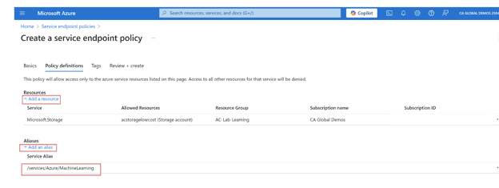
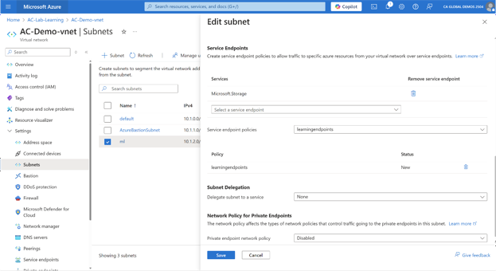

Azure Machine Learning relies on multiple inbound and outbound dependencies. Some of these dependencies can expose a data exfiltration risk by malicious agents within your organization.

If your compute instance or cluster uses a public IP address, you have an inbound on the _azuremachinelearning_ service tag (port 44224). You can control this inbound traffic by using a network security group (NSG) and service tags.

Outbound traffic is the most common route for data exfiltration. When storage outbound and Azure Front Door outbound traffic if not configured properly, it can lead to exfiltration.  However, storage outbound traffic is a requirement for compute instances and compute clusters in an Azure Machine Learning deployment.

- A malicious agent can use this outbound rule by provisioning and saving data in their own storage account. You can remove these risks by using an Azure Service Endpoint policy and Azure Batch’s simplified node communication architecture.
- Azure Front door is used by the Azure Machine Learning studio UI and AutoML. Instead of allowing outbound to the service tag (AzureFrontDoor.frontend), switch to the following fully qualified domain names (FQDN):

  - ml.azure.com
  - automlresources-prod-d0eaehh7g8andvav.b02.azurefd.net

Switching to these FQDNS removes unnecessary outbound traffic

## Service endpoint policies

Service endpoint policies let you filter virtual network traffic to specific Azure Storage accounts, limiting data exfiltration. Azure Machine Learning compute instances and clusters need access to Microsoft-managed storage for provisioning. The service endpoint policies' Azure Machine Learning alias includes these accounts to prevent data exfiltration or control destination storage accounts. To configure Service Endpoint policies:

1. **From the Azure portal, search for Service Endpoint Policy and click + Create to start.**
1. **On the Basics tab, provide the required fields and then select Next.**
1. On the Policy definitions tab, select** +Add a resource** and then provide the following information:
   - **Service**: Microsoft.Storage
   - **Scope**: Select the scope as a Single Account to limit the network traffic to one storage account.
   - **Subscription**: The Azure subscription that contains the storage account.
   - **Resource Group**: The Resource Group that contains the storage account
   - **Resource**: The default storage account of the workspace
1. Select **Add** to add the resource information.
1. Select **+Add an alias** and then select _/services/Azure/MachineLearning_ as the Server Alias value.  Select **Add** to add the alias.

    

1. Select **Review + Create, then Create**

## Inbound and outbound network traffic

When using Azure Machine Learning **compute instance** _with a public IP address_, allow inbound traffic from Azure Batch management (service tag BatchNodeManagement.\<region>). A compute instance _with no public IP_ **doesn't** require this inbound communication.

For outbound traffic, there are two options customers might be using:

- Service tag/NSG: Allow outbound traffic to the following **service tags**. Replace \<region> with the Azure region that contains your compute cluster or instance:

| **Service tag** | **Protocol** | **Port** |
|---|---|---|
| **BatchNodeManagement.\<region>** | ANY | 443 |
| **AzureMachineLearning** | TCP | 443 |
| **Storage.\<region>** | TCP | 443 |

- Firewall: Allow outbound traffic over **ANY port 443** to the following FQDNs. Replace instances of \<region> with the Azure region that contains your compute cluster or instance:

  - *.\<region>.batch.azure.com
  - *.\<region>.service.batch.azure.com

> [!NOTE]
> If you enable the service endpoint on the subnet used by your firewall, you must open outbound traffic to the following hosts over **TCP port 443**:

- *.blob.core.windows.net
- *.queue.core.windows.net
- *.table.core.windows.net

## Enable storage endpoint for the subnet

Use the following steps to enable a storage endpoint for the subnet that contains your Azure Machine Learning compute clusters and compute instances:

1. From the Azure portal, select the **Azure Virtual Network** for your Azure Machine Learning workspace.
1. From the left of the page, select **Subnets** and then select the subnet that contains your compute cluster and compute instance.
1. In the form that appears, expand the **Services** dropdown and then enable **Microsoft.Storage**. Select **Save** to save these changes.
1. Apply the service endpoint policy to your workspace subnet.

