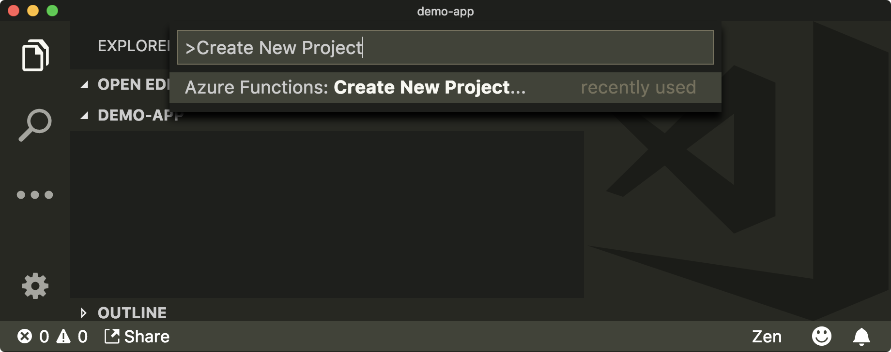
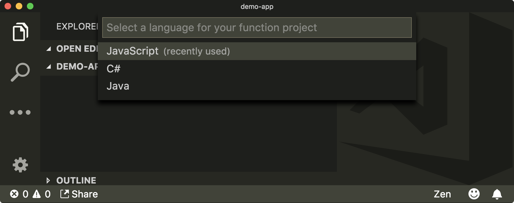
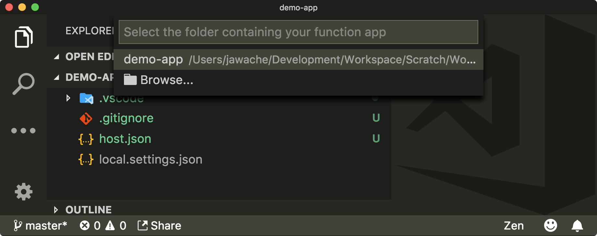
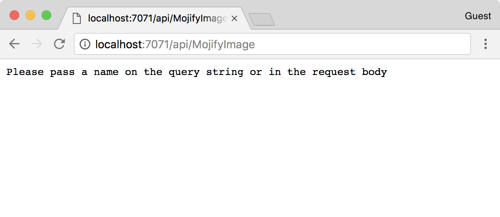
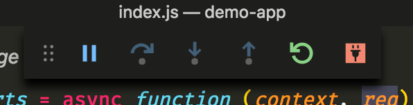

We're going to use Azure Functions to host this code. You'll create an Azure Function App and `JavaScript` HTTP triggers for each function, then locally run and debug these functions.

## Create an Azure Function project

An Azure Function is a snippet of code that is executed without you having to explicitly configure any cloud infrastructure.

An Azure Function project is a container for multiple functions. Functions are triggered in different ways; you'll be triggering your functions by making an HTTP request.

There are many ways to create Azure Functions. One of the easier ways is with Visual Studio Code and the Azure Functions extension.

1. Open Visual Studio Code.

1. In Visual Studio Code, open the cloned github source code folder.

    >[!IMPORTANT]
    > This folder is where you will develop your Azure functions. The code provided in here provides the scaffolding you need.

1. Click on **View** then **Command Palette**, then search for and select **Azure Functions: Create New Project...**.

   > [!NOTE]
   > If you're asked to overwrite files, like `.gitignore`, answer **no** to all.

   

1. Select the folder where you want to create the function app. Select the current folder (the folder that you opened in Visual Studio code)

   

1. Choose **JavaScript** as the desired language.

   

1. Choose **No** when asked to overwrite the `.gitignore` file

1. You should see the `host.json`,`proxies.json`, and `local.settings.json` files created in the project folder.

   

## Create an Azure Function

You're now going to create the Azure Function itself. This is the piece of code that responds to an HTTP request.

Again, you're going to use the Visual Studio Code Extension.

1. Click on **View** then **Command Palette**, then search for and select **Azure Functions: Create Function...**

    

1. Select the folder where you originally created the function project.

    

1. Select the **HTTP Trigger** option.

    

1. Type `MojifyImage` as the name of your function.

    

1. Choose **Anonymous** as the authentication level.

    > [!NOTE]
    > By choosing **Anonymous**, the function is open to the world and insecure. If you create other functions in the future, this isn't the recommended default behavior. Since this is a low-risk exercise with free Azure learning resources, it's not a problem for now.

    

## Run the function locally

Once these commands complete, you'll have converted the starter project to a function project with an **HTTP trigger** function called `MojifyImage`.

1. Click on **Terminal** then **New Terminal** to open a Visual Studio terminal

2. Run the function app locally, in the terminal

    ```bash
    func host start
    ```

    This starts the function's runtime locally. If it works, you should see an output printed with a local `MojifyImage` URL.

    ```output
    Http Functions:

            MojifyImage: http://localhost:7071/api/MojifyImage
    ```

    > [!TIP]
    > One of the advantages of using the local Azure Functions runtime is that it allows us to run the function using the same underlying technology that would be used to run the function in production.

3. To confirm the function is working correctly, visit the URL printed to the console.

    

## Debug the function locally

> [!Important]
> Make sure you exit the `func host start` command by typing <kbd>CTRL-C</kbd> in the terminal, before trying to debug it using Visual Studio Code.

You can run and debug the app inside Visual Studio Code.

1. Add a breakpoint to the `index.js` file, at the top of the JavaScript function.

    

1. Run the function in debug mode by clicking on the **Debug** icon .

    Select **Attach to JavaScript Functions** from the debug configuration before you select the green triangle to start the debug session.

    > [!Note]
    > The **Attach to JavaScript Functions** debug configuration is automatically added when you created the function project.

1. The `func host start` command is run for you; a terminal should open with the same output.

    ```output
    Http Functions:
    
            MojifyImage: http://localhost:7071/api/MojifyImage
    ```

1. The debug menu bar should appear since you're debugging.

    

Now when you visit the URL, it breaks at your specified breakpoint, and you can step through through the function.
