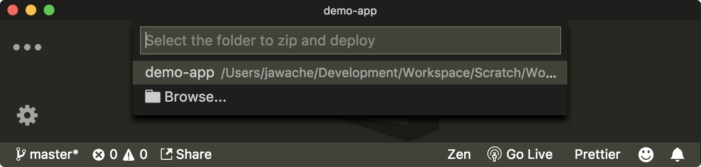
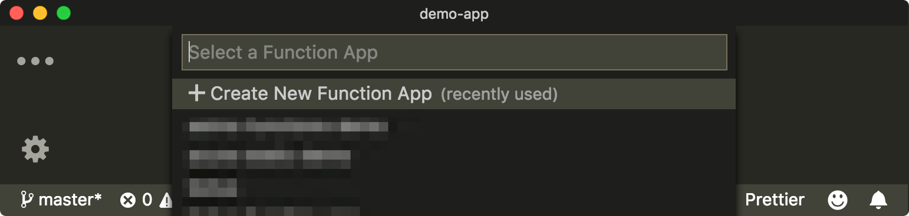
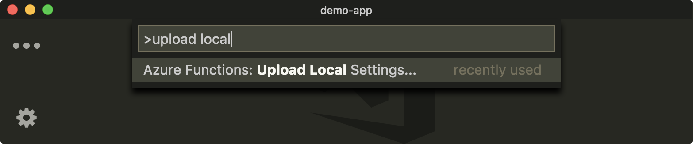
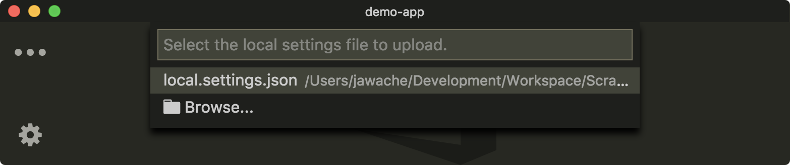

You've developed two Azure functions locally. Let's now get your local functions running in the cloud so that you can call them from Slack.

## Create an Azure Function App on Azure

You're going to start by creating the Azure Function App using Visual Studio Code, and the Azure Functions extension.

1. Click on **View** then **Command Palette** and select **Azure Function: Deploy to Function App**.

   

2. Confirm that you want to upload the current project.

   

3. Choose the **Concierge Subscription** sandbox subscription.

4. Choose **+Create New Function App**.

   

5. Name your app. Select a globally unique name. We'll use **mojifier-slack-function-app**.

   

6. Select your resource group. The Azure sandbox has created a _resource group_ into which can place your resources. The resource group name is **<rgn>[sandbox resource group name]</rgn>**.

7. Choose the storage account associated with the sandbox.

8. Once the upload completes, the output window should show a URL.

    ```output
    Deployment to "mojifier-slack-function-app" completed.
    HTTP Trigger Urls:
      MojifyImage: https://mojifier-slack-function-app.azurewebsites.net/api/MojifyImage
      RespondToSlackCommand: https://mojifier-slack-function-app.azurewebsites.net/api/ResponsToSlackCommand
    ```

## Try it out

You should expect the `RespondToSlackCommand` function to work since it doesn't rely on any other dependencies.

Visit

```bash
<deployed-app-name>.azurewebsites.net/api/RespondToSlackCommand
```

You should see some json returned.

```json
{
  "response_type": "in_channel",
  "text": "You must provide an image to mojify",
  "attachments": [
    {
      "image_url": "https://mojifier-slack.azurewebsites.net/api/MojifyImage?imageUrl=undefined"
    }
  ]
}
```

## Upload settings

Remember, you have some settings we put in `local.settings.json`. These settings were the keys and URL for Azure AI services. Since `local.settings.json` is local, it's never copied to production when you deploy.

Usually, you would need to open the Azure portal and manually add the settings in the UI, or use `func` in the Azure CLI. Since you're using Visual Studio Code, you can use the Azure Function extension and the command palette to upload your local settings!

1. Click on **View** then **Command Palette** and select **Azure Functions: Upload Local Settings**.

    

2. Choose `local.settings.json`.

    

3. Choose the subscription that's associated with your function.

4. Select the function app that you want to upload settings to. In the example, it's called **mojifier-slack-function-app**.

## Try it out

If everything is working as expected, the MojifyImage endpoint should be working. Visit:

```bash
https:<deployed-app-name>.azurewebsites.net/api/MojifyImage?imageUrl=<image-url>
```

and you should see the mojified image in the window.
