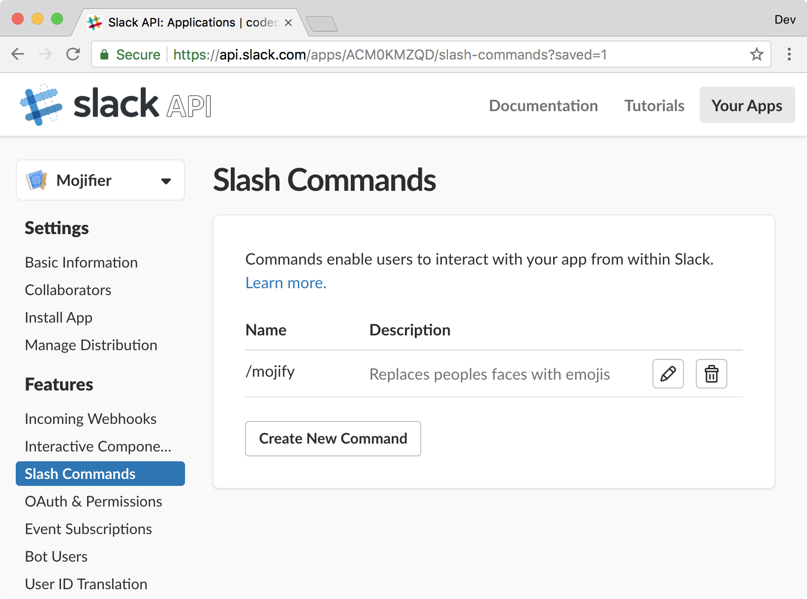
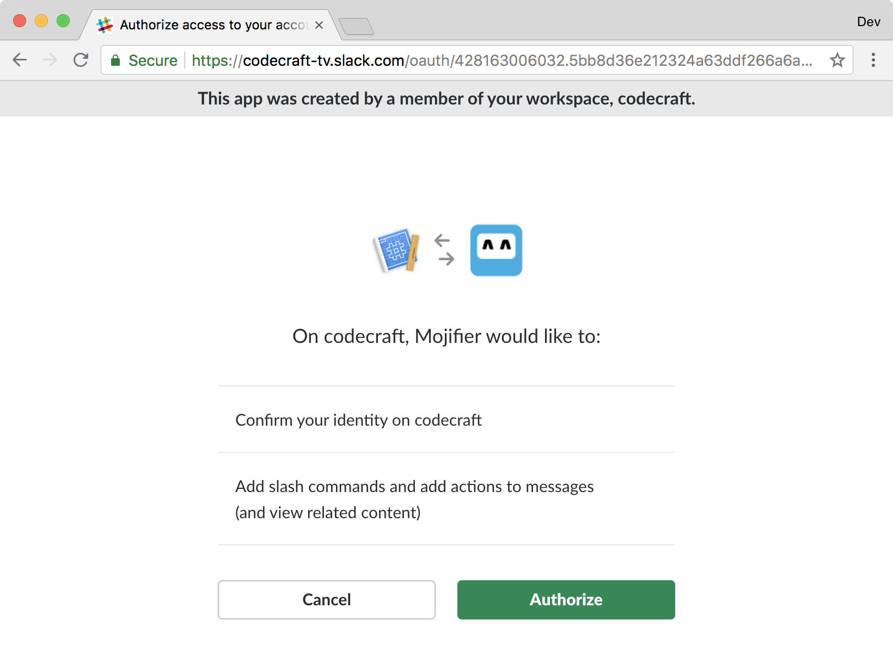

You've created all the required Azure Functions, and deployed them! Let's connect the Azure Functions with Slack and create a Slack slash command to calls the Azure Function and displays the resulting mojified image in the Slack window. 

## Create a Slack app

A slash command exists as part of a Slack app, also known as a Slack bot. 

1. [Create a Slack app](https://api.slack.com/apps/new?azure-portal=true).
2. Choose an **App Name** and associate it with the **Workspace** you created at the start of this module, then select **Create App**.

    

3. Go to your Slack app and create a slash command. Select on the `slash Commands` menu item.

    

4. Select **Create New Command**.

    - Provide whatever name you want for your slash command in the **command** field.
    - Enter the Azure function app public URL into the **Request URL** field. For our `mojifier-slack-function-app` used in the previous unit, our function app public URL would be `https://mojifier-slack-function-app.azurewebsites.net`. Append `/api/RespondToSlackCommand` to the URL.
    - Add a **Short Description** and **Usage Hint**.

    Select **Save**.

    

5. If successful, you should see the slash command appear in your list of **Slash Commands**.

    

6. To get this working, you need to install the Slack app in the workspace. Select **Basic Information** in the menu.

7. Expand **Install your app to your workspace** and select **Install app to workspace**.

   

8. If asked, **Authorize** your app.

   

## Try it out

You've created and connected your slash command to your deployed Azure Functions. Now, you can test it.

1. Open your Slack workspace.
2. Open a chat window and type `/mojify`. If you named the app something else, enter that command instead.
3. If everything has worked correctly, you should see `mojify` as an option.

   

4. Enter `/mojify` and add an image URL.

   
