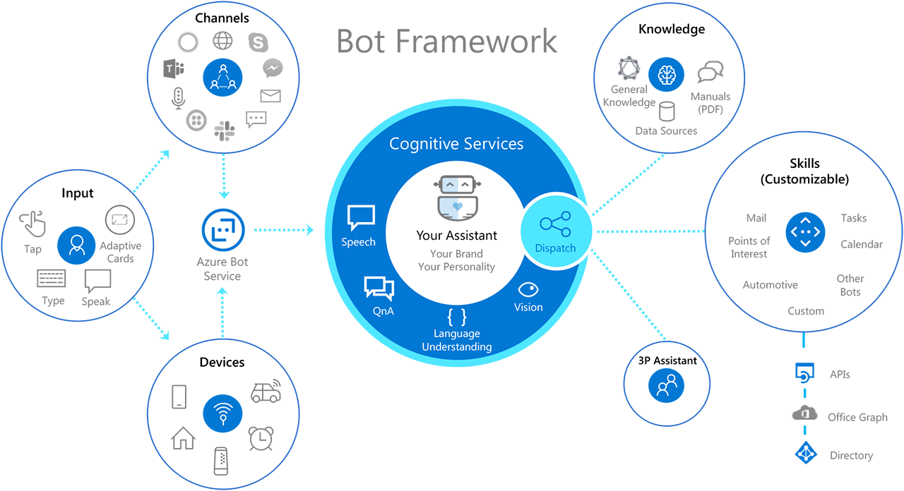
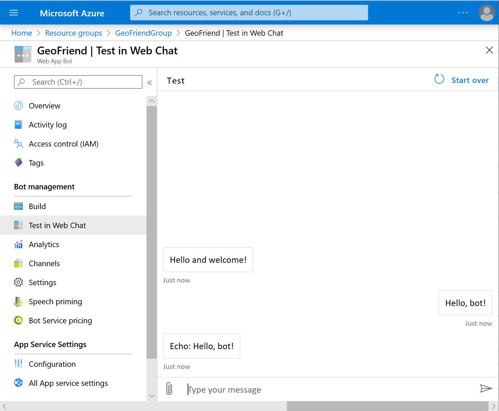

Before we start to build our **GeoFriend** bot, let's quickly review the basics of what bots do.

## Review basic bot operations

A conversational experience involves two basic actions:

- A user sends messages to the bot.
- The bot responds to the user.

The conversation can happen in different _channels_:

- A chat bot on a web site.
- A messenger application like Facebook Messenger or Telegram.

Each _messaging platform_ has its own principles and APIs for creating chat bots. To build a bot for Facebook, you use different skills than to create a web chat.

Microsoft supports the tasks for bot operation in the [Bot Framework][BotFW]. The framework provides a set of core libraries that standardize bot development. You can develop a bot as a web API function that can be called over the internet. The user provides the input, and the Bot Framework figures out the necessary output for the bot.

To connect a web API function to the communication channels, we'll use the [Azure Bot Service][BotService]. This service allows you to define connections to those channels through a web interface on the Azure portal. After you develop your bot, you can connect the same code to multiple channels to provide an **inclusive omnichannel experience**.

The Bot Framework also helps structure bot logic by offering useful developer abstractions. Complex conversations are difficult to program as a simple request-response pattern. The Bot Framework provides abstractions like dialogs, form filling, and more. You can use the abstractions to support complex conversational behavior from the simple building blocks.

## Use Azure Cognitive Services

To make bots intelligent, we'll need to use some AI techniques. **Natural language understanding** can help us figure out what a user wants without requiring them to enter an exact phrase. We can handle intelligent tasks with [Azure Cognitive Services][CoServ] that offer a set of pre-trained, neural network models for the cloud.

To build our bot, we'll use Azure [Language Understanding][LUIS] (LUIS). LUIS can be trained on a set of phrases by specifying input phrases and their _intent_ or meaning. The service tries to figure out the best intent for each user's input phrase. We'll also use Azure [QnA Maker Service][QnAMaker] to add question-answering functionality and general chat support.

## Create the bot

Let's start to create our **GeoFriend** assistant chat bot. The easiest way to start is with a new Azure Bot Service.

1. Go to the [Azure portal][azure-portal] and sign in to your Azure account.

    

1. Select **Create a Resource** (or use the plus (+) symbol). Enter **Bot** in the search box, and then choose **Web App Bot**.

    

    On the new page, select **Create**.

1. Fill in the bot parameters.

    - **Bot Handle**: Enter the name for your bot. We will use **GeoFriend**, but you need to pick a unique name in Azure.
    - **Resource group**: Select **Create New** and enter a name for the resource group.
    - **Location**: Select the data center location closest to you.
    - **Pricing Tier**: Select **F0**, which is the free tier.
    - **App Name**: Keep the default value.

    

1. Select the **Bot Template** box, and then select a template.

    For our bot, we'll use the **C#** SDK language and the **Echo Bot** template.

    

    Here are the template options:

    - **Programming language**: Choose **C#**. The templates support the **C#** or **Node.js** language.
    - **Echo Bot**: Choose this option. The Echo Bot template supports simple bot operations. The bot echoes back any message typed by the user. We'll start with this option for our bot because it's the easiest to build.
    - **Basic Bot**: Ignore this option. The Basic Bot template supports traditional bot operations, such as the language understanding service and bot analytics.
    - **Virtual Assistant**: Ignore this option. The Virtual Assistant bot template supports complex enterprise-level bot operations. The operations integrate different skills and provide integration with many different services.
    - **Language Understanding Bot**: Ignore this option. The Language Understanding Bot template supports connecting to an existing LUIS language model.
    - **QnA Maker Bot**: Ignore this option. The QnA Maker Bot template answers simple questions based on a questions and answers table.

1. Now create an **App Service Plan**.

    1. Select **App Service Plan/Location**.

    1. Select **Create New**.

    1. Enter a name for your App Service plan. This plan determines how much compute resources are given to your bot.

        

    > [!TIP]
    > The **S1** plan level is the default. This plan level isn't free, so you might want to change your plan later. For details, see [Manage an App Service plan in Azure][AdjustServicePlan].

1. Fine-tune the settings for **Azure Application Insights**.

    This service is useful for monitoring the behavior of your bot.
    For now, you can turn off Application Insights, or specify the Azure datacenter location closest to you.

1. After you enter all required values, select **Create**.

    It can take some time to create all the bot resources. After the deployment is complete, look at the resource group to see what's there.

## View the bot in the Azure portal

We can see information about our bot in the Azure portal, and also complete development tasks.

1. On the Azure portal start page, select **Resource Groups**, and select the resource group for your bot.

    

1. Under your **resource group**, look for these important components:

    - **Your Bot**: A web app bot (with the name you gave it) that connects your bot code to the different communication channels. This resource also gives you access to bot code and lets you test the bot in web chat.
    - **Your App Service**: An application service that contains the code for your bot. We'll choose this service later, when we deploy the bot code from Visual Studio.

    You should also see the Application Insights instance and the bot App Service plan. You might need to adjust the plan to scale the bot to handle more requests, or move the bot onto a free plan.

1. Select your bot's link. You'll see the bot page in the Azure portal.

    

    The bot page in the Azure portal is the main starting point for configuring our bot. Under **Overview**, we see the sequence of steps for completing the bot. The first step is the idea or **Plan**. The second step is to **Build**, which is where we are now. We'll discuss how to build our bot in the next unit.

## Run the bot

From the bot page in the Azure portal, we can try our new bot in action.

1. On the left, select **Test in Web Chat**.

    You'll see a chat box that you can use to converse with the bot.

    

1. Try entering some text into the web chat box, and see how the bot responds.

In the next unit, we'll learn how to change the behavior for our bot.

<!-- links -->

[BotFW]: https://dev.botframework.com/
[BotService]: https://azure.microsoft.com/services/bot-service/
[CoServ]: https://microsoft.com/cognitive
[azure-portal]: https://portal.azure.com?azure-portal=true
[AdjustServicePlan]: https://docs.microsoft.com/azure/app-service/app-service-plan-manage
[LUIS]: https://docs.microsoft.com/azure/cognitive-services/luis/
[QnAMaker]: https://docs.microsoft.com/azure/cognitive-services/qnamaker/
