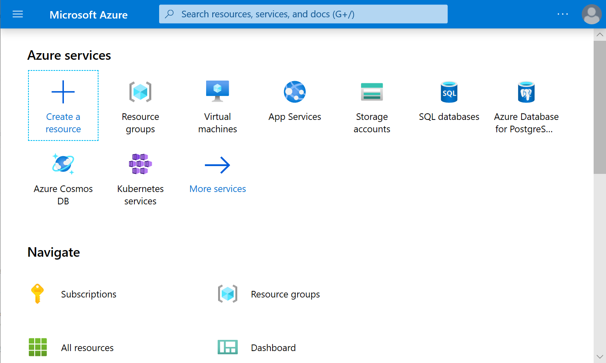
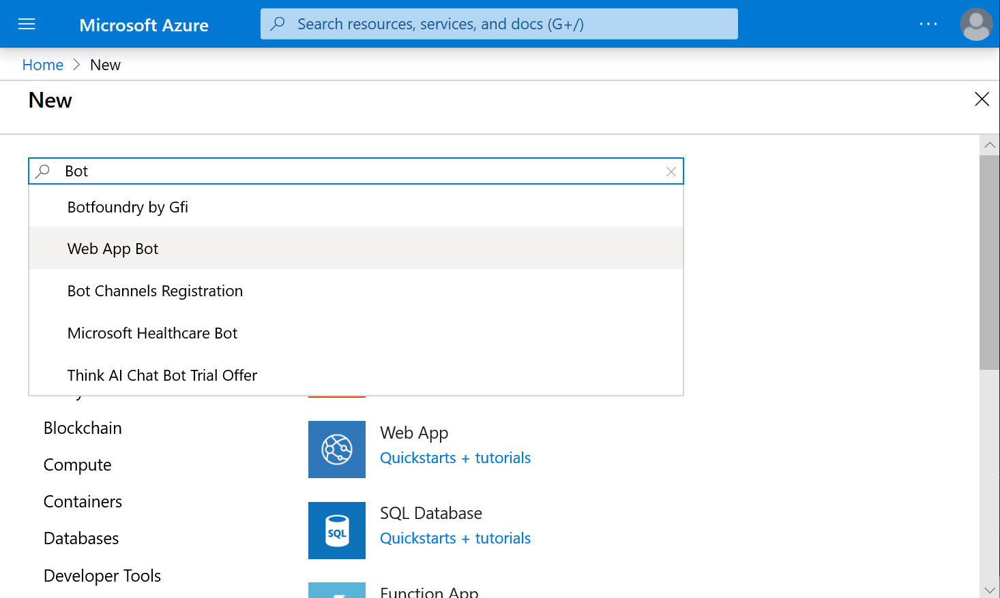
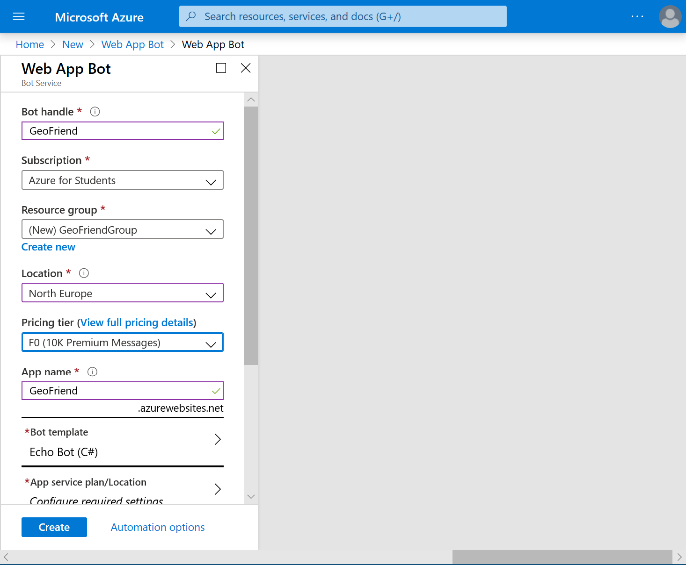
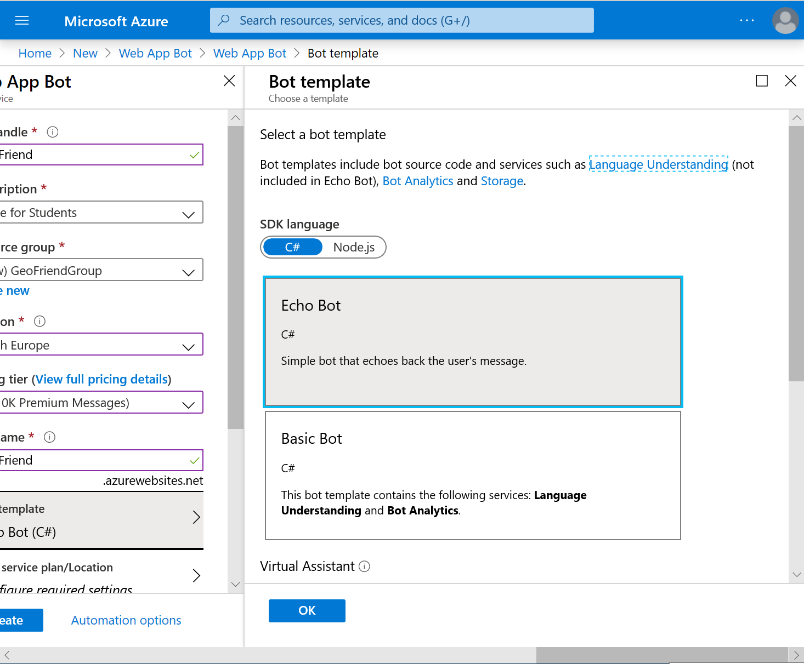
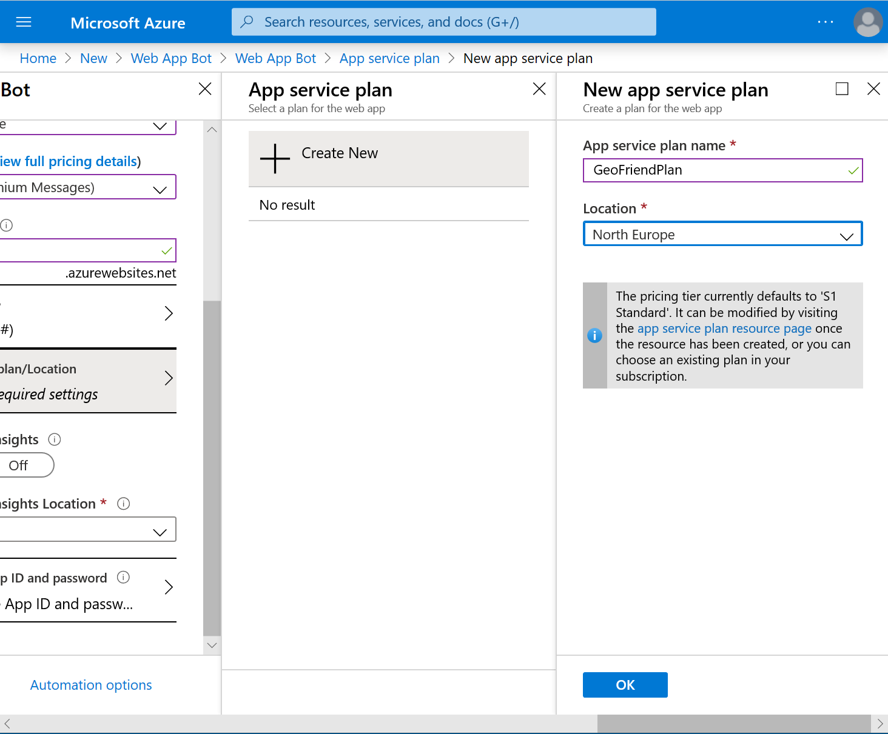
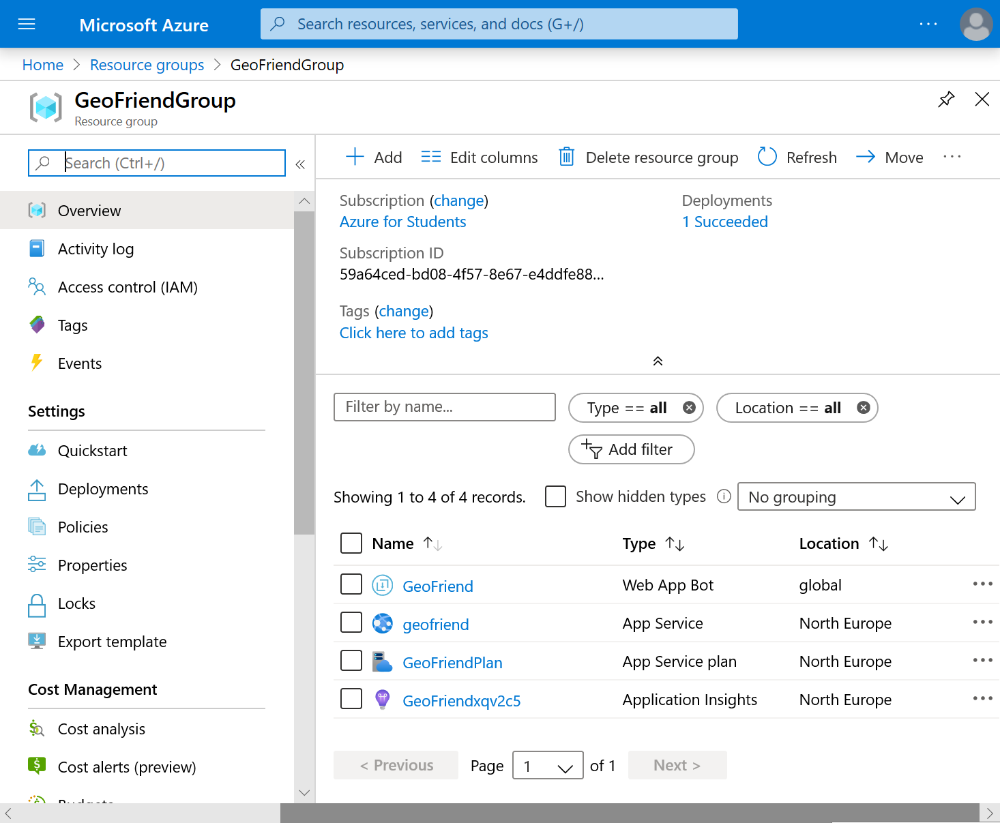
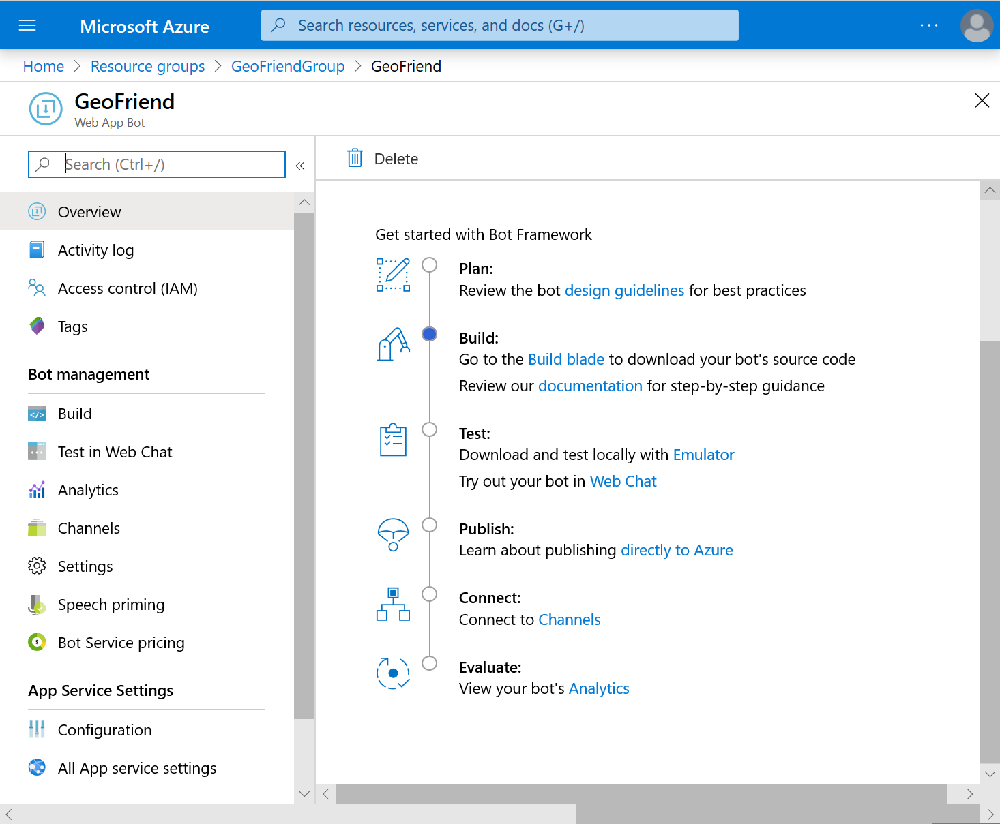
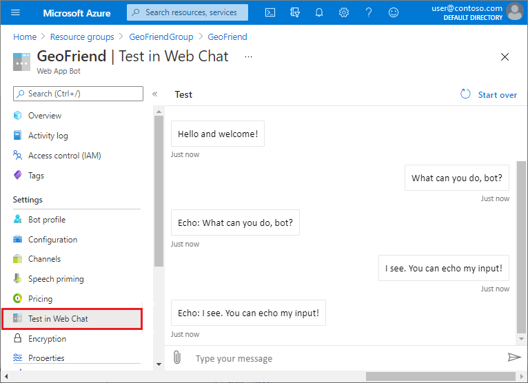

Before we start to build our **GeoFriend** bot, let's quickly review the basics of how bots work.

## Review basic bot operation

A conversational experience involves two basic actions:

- A user sends messages to the bot.
- The bot responds to the user.

The conversation can happen in different _channels_:

- A chat bot on a web site.
- A messenger application like Facebook Messenger or Telegram.

Each _messaging platform_ has its own principles and APIs for creating chat bots. To build a bot for Facebook, you use different skills than to create a web chat.

Microsoft supports the tasks for bot operation in the [Bot Framework][BotFW]. The framework provides a set of core libraries that standardize bot development. You can develop a bot as a web API function that can be called over the internet. The user provides the input, and the Bot Framework figures out the necessary output for the bot.

To connect a web API function to the communication channels, we'll use [Azure Bot Services][BotServices]. This service allows you to define connections to those channels through a web interface on the Azure portal. After you develop your bot, you can connect the same code to multiple channels to provide an **inclusive omnichannel experience**.

The Bot Framework also helps structure bot logic by offering useful developer abstractions. Complex conversations are difficult to program as a simple request-response pattern. The Bot Framework provides abstractions like dialogs, form filling, and more. You can use the abstractions to support complex conversational behavior from the simple building blocks.

:::image type="content" source="../media/bot-framework-diagram.png" alt-text="Diagram of the Bot Framework." lightbox="../media/bot-framework-diagram.png":::

## Use Azure Cognitive Services

To make bots intelligent, we'll need to use some AI techniques. **Natural language understanding** can help us figure out what a user wants without requiring them to enter an exact phrase. We can handle intelligent tasks with [Azure Cognitive Services][CogServ] that offer a set of pre-trained, neural network models for the cloud.

To build our bot, we'll use Azure [Language Understanding (LUIS)][LUIS]. LUIS can be trained on a set of phrases by specifying input phrases and their _intent_ or meaning. The service tries to figure out the best intent for each user's input phrase. We'll also use Azure [QnA Maker Service][QnAMaker] to add question-answering functionality and general chat support.

## Create your bot

Let's start to create our **GeoFriend** assistant chat bot. The easiest way to start is with a new Azure Bot service.

1. Go to the [Azure portal][azure-portal] and sign in to your Azure account.

1. After you sign in, select **Create a resource** (the plus + symbol).

   

1. In the search box, enter **Bot**, and then choose **Web App Bot**.

   After the new page is displayed, select **Create**.

   

1. Configure these bot parameters:

   - **Bot handle**: Enter the name for your bot. We'll use **GeoFriend**, but you need to pick a unique name in Azure.
   - **Location**: Select the data center location closest to you.
   - **Pricing tier**: Select **F0**, which is the free tier.
   - **App name**: Keep the default value.
   - Under **Resource group**, select **Create new**. 
   In the popup dialog, enter a **Name** for the resource group, and then select **OK**.

   

1. Select the **Bot Template** box, and then select a template.

   

   Configure these template options:

   - **Programming language**: Choose **C#**. The templates support the **C#** or **Node.js** languages.
   - **Echo Bot**: Choose this option. The Echo Bot template supports simple bot operations. The bot echoes back any message typed by the user. We'll start with this option for our bot because it's the easiest to build.
   
   You can ignore the other options for this bot. After you configure the template options, select **OK**.

1. Create an **App Service Plan**. Select **App Service Plan/Location**, and then select **Create New**.
   
   On the **New app service plan** page, enter a **Name** and **Location** for your App Service plan.

   

   The plan determines how much compute resources are given to your bot. The **S1** plan level is the default, but this plan level isn't free. You might want to change your plan later. For details, see [Manage an App Service plan in Azure][AdjustServicePlan].

   After you configure the plan parameters, select **OK**.

1. Fine-tune the settings for **Azure Application Insights**.

   This service is useful for monitoring the behavior of your bot.
   For now, you can turn off **Application Insights**, or specify the Azure datacenter location closest to you.

1. After you enter all required values, select **Create**.

   It can take some time to create all the bot resources. After the deployment is complete, look at the resource group to see what's there.

## View your bot in the Azure portal

We can see information about our bot in the Azure portal, and also complete development tasks.

1. On the Azure portal start page, select **Resource Groups**, and then select the resource group for your bot.

   

   The **Overview** page for your resource group shows a list of components on the right:

   - Your **Web App Bot**: A web app bot (with the name you gave it) that connects your bot code to the different communication channels. This resource also gives you access to bot code and lets you test the bot in web chat.
   - Your **App Service**: An application service that contains the code for your bot. We'll choose this service later, when we deploy the bot code from Visual Studio.
   - Your **App Service plan**: You might need to adjust the App Service plan to scale the bot to handle more requests, or move the bot onto a free plan.
   - An **Application Insights instance** for your bot, if you have this monitoring feature enabled.

1. Select the link for your **GeoFriend** bot. The **Overview** page for your bot opens.

   

   The **Overview** page provides a starting point for configuring your bot and completing various development tasks. You can follow the links to write your bot code, test and debug your code, and publish your bot. We'll take a closer look at these tasks in later units.
   

## Run your bot

We'll start by testing your bot online by using Web Chat.

1. On your bot **Overview** page, under **Settings**, select **Test in Web Chat**.

   A chat box opens so you can talk with your bot.

   

1. Try entering some text into the web chat box, and see how the bot responds.

In the next unit, we'll learn how to change the behavior for your bot.

<!-- links -->

[azure-portal]: https://portal.azure.com?azure-portal=true
[AdjustServicePlan]: https://docs.microsoft.com/azure/app-service/app-service-plan-manage?azure-portal=true
[BotFW]: https://dev.botframework.com/?azure-portal=true
[BotServices]: https://azure.microsoft.com/services/bot-service/?azure-portal=true
[CogServ]: https://microsoft.com/cognitive?azure-portal=true
[LUIS]: https://docs.microsoft.com/azure/cognitive-services/luis/?azure-portal=true
[QnAMaker]: https://docs.microsoft.com/azure/cognitive-services/qnamaker/?azure-portal=true
