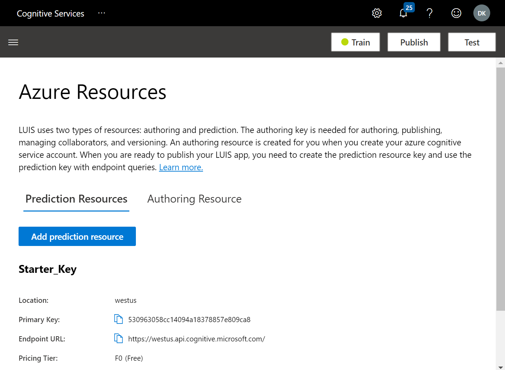

# Adding Language Understanding

We have already developed one of the features of our bot - to tell capital cities from country names. However, now we need to make the bot more "human" by teaching it how to understand simple natural language. This is done using a cognitive service called **[LUIS][LUIS]** (short for *Language Understanding Intelligent Service*).

LUIS does two important natural language understanding tasks:
* **Intent Classification** allows us to classify each input sentence (so-called **utterance**) with it's **intent**, thus figuring out the overall meaning of a phrase.
* **Named Entity Recognition** also extracts some known entities from the phrase, such as city names, or dates.

For example, the phrase *What is the capital of France?* can be classified as `get_capital` intent, and *France* would be extracted as geographical entity. The same intent can be verbalized differently, eg. *What is France capital city?*, but the extracted entity and intent would be the same, leading ot the same result.

# Designing Intents

Now we should come back to one of the principles of responsible conversational AI: the bot should have a clear goal. This goal defines the set of intents that our bot would be able to handle.

The goal of our **GeoFriend** bot would be to help student study geography, and act as an assistant. For this, we will implement the following functionality:

* Being able to give capital cities given a country name
* Giving country name given a capital city
* Give a population of a city / country
* Displaying some help on bot's usage

For simplicity, we will limit ourselves to those cases, but ideally the bot should include more intents, and support more learning cases.

# Training LUIS Model

To train the LUIS Model, we should give it a number of sample phrases for each intent. For example:

| Intent | Phrase |
|---|---|
|`get_capital` | What is the capital of *United States*? |
|`get_capital` | I need to know *France's* capital city |
|`get_country` | Whose capital is *Paris*? |
|`play_game` | I want to play! |
|`play_game` | Let's start capital quiz! |
|`get_population` | What is the population of *Moscow*? |
|`get_population` | How many people live in *Seoul*? |

To set up LUIS service, let's go to the [LUIS Portal](http://luis.ai). 

>[!NOTE]
> In this course, we are using preview version of LUIS portal located at http://preview.luis.ai. 

At first sign in, you will be asked to specify your country and accept terms of use:


After that, you need to **link your Azure account**. Specify **Continue using an Azure Resource**, and then **Create New Authoring Resource** button:


In the dialog box, select you subscription, fill in suitable name for the service and select resource group you have previously used for the bot:


Once this is done, you are taken to LUIS portal again, where you can create new application:


Click on **Create a LUIS App Now**, and you are taken to the main LUIS Portal:


Make sure your **subscription** and **Authoring resource** are selected. If you do not see your authoring resource, check that you are using portal for the correct region.

>[!NOTE]
>LUIS supports three locations for authoring: US, Europe and Asia. There are different portals for each location, and authoring resources from different region would not be visible.

>[!TIP]
In case your LUIS training resource is not visible, you can go to Azure portal to make sure it has been created. You can also create it manually from the Azure Portal.

Select **New app for conversation**, and specify an application name and description. I will use `GeoFriend` as an application name.

>[!NOTE]
>If you do not want to train the model "by hand" by providing sample phrases, you can train it from the saved data file. In this case, you should chose to create the model from file, and use [this file][LUISCodeFile] from the GitHub repository.

After skipping through some information screens, you will end up at the main application dashboard:


First thing we need to do is to add pre-build entity for geographical locations:
* Click on the menu on the left, and select **Entities**.
* On the **Entities** screen, select **Add pre-build entity**
* From the list, select **Geography V2**
You should see the entity added in the screen below:


Now Let's create our first intent: `get_capital`:
* Using the menu, navigate to **Intents** screen.
* Select **Create** and type in intent's name: `get_capital`
* You will be offered to type in a sample utterance. Type something like *What is the capital of United States?*


You can see that LUIS automatically detects geographical entities!

Using the same procedure, enter a few more sentences for `get_capital` intent, and create other intents listed in the table above.

One you have done creating intents, click on the **Train** button to train the model. After training, use the **Test** button to see how well the model performs on some input sentences:


If you see some phrases classified incorrectly - you can click on **Inspect** to get the details and add the utterances to the training data to improve the model.

In this example, you can see that each utterance has some associated probability. If the phrase is not recognized well, the probability will be low, as in the example above with the *main city* phrase. In the application, we can set some probability threshold, and consider only phrases that are recognized well.

# Integrating LUIS into the Bot

To use the LUIS model from our bot, first we need to publish the model. Click on **Publish** button, select **Production Slot**, and the press **Done**. You will get the screen with prediction endpoint URL and key:



>[!TIP]
> Right now the model is deployed on some starter resources, and to deploy it in production you should **Add prediction resource**. Once you do that, you will have another set of prediction keys / endpoint URL that you can freely control through your subscription.

Now we need to add LUIS model to our bot code. Open our Visual Studio project we have been working on in last unit.

>[!TIP]
>The code that I describe below is available [here on GitHub][CodeLUIS]. If you decide the take code from there, you would still need to make changes to the `appsetting.json` file to provide your keys for the LUIS service.

First thing you need to do is to add `Microsoft.Bot.Builder.AI.Luis` nuget package:
- Right-click on the project **EchoBot**
- Select **Manage nuget packages**
- Switch to **Browse** tab
- Type `Luis`, chose `Microsoft.Bot.Builder.AI.Luis` and click **Install**


To add the LUIS Recognized to our bot, we need to add corresponding code to `ConfigureServices` function in `Startup.cs`. Open the file, and insert the following code after the first line of `ConfigureServices` function:
```csharp
    var luisApplication = new LuisApplication(
        Configuration["LuisAppId"],
        Configuration["LuisAPIKey"],
        Configuration["LuisEndpointUrl"]);
    services.AddSingleton(new LuisRecognizer(luisApplication));
```
>[!NOTE]
> The code above requires some `using` statement to make `LuisRecognizer` and `LuisApplication` classes visible. The easiest way to figure out the correct `using` statement is to click on the bulb icon next to the undefined class, and let Visual Studio automatically fix it. In this case, it will add the following line to the file: `using Microsoft.Bot.Builder.AI.Luis;`

This code takes the LUIS service parameters from config file, so you also need to add the following to the `appsettings.json`:
```json
  "LuisAppId": "<your app id here>",
  "LuisAPIKey": "<your app key here>",
  "LuisEndpointUrl": "<your endpoint url here>"
```

This data is taken from the LUIS prediction screen we have seen in our previous step. The only tricky thing is to get App Id. In the prediction screen you would see the **Example query** which looks similar to this:
```json
https://langrecognizer.cognitiveservices.azure.com/luis/prediction/v3.0/apps/5c9d81a8-2d13-448a-9f7c-df4ec1b5cdb4/slots/...
```
Application Id is the sequence of numbers after `/apps/` and before `/slots` portion of this URL.

Once we have registered `LuisRecognizer` as a singleton, we will be able to automatically receive its instance as a parameter to `EchoBot` constructor. Open `Bots\EchoBot.cs` file, and add recognizer field and a constructor to the `EchoBot` class:
```csharp
LuisRecognizer rec;

public EchoBot(LuisRecognizer rec)
{
    this.rec = rec;
}
```

To make sure that recognizer works, let's change the code for `OnMessageAcitivityAsync` to the following:
```csharp
protected override async Task OnMessageActivityAsync(ITurnContext<IMessageActivity> turnContext, CancellationToken cancellationToken)
{
    var res = await rec.RecognizeAsync(turnContext, cancellationToken);
    await turnContext.SendActivityAsync(res.GetTopScoringIntent().ToString());
    await turnContext.SendActivityAsync(res.Entities.ToString());
}
```
This function will call LUIS recognizer and display the top event and associated entities. You can run the bot in the emulator and observe the results:

|Input utterance|Result|
|---|---|
|*What is the capital of France?*|`(get_capital,0.86)`<br/>`{"geographyV2": [{"location": "France","type": "countryRegion"}]`|
|*What is the capital of Paris?*|`(get_capital,0.86)`<br/>`{"geographyV2": [{"location": "Paris","type": "city"}]`|

You can see that entities are extracted correctly, and that LUIS can also distinguish between cities and countries automatically.

Now let's add the processing logic to the bot. In the `OnMessageActivityAsync` function we will check if the recognition result is good enough and call corresponding function to process LUIS results:
```csharp
protected override async Task OnMessageActivityAsync(ITurnContext<IMessageActivity> turnContext, CancellationToken cancellationToken)
{
    var res = await rec.RecognizeAsync(turnContext, cancellationToken);
    var (intent, score) = res.GetTopScoringIntent();
    if (score>0.3)
    {
        await ProcessLuisResult(turnContext, intent, res.Entities);
    }
    else
    {
        await turnContext.SendActivityAsync("I am not sure I understand you fully");
    }
}
```
All intent processing happens inside `ProcessLuisResults` function (parts of the code are omitted for clarity): 
```csharp
protected async Task ProcessLuisResult(ITurnContext<IMessageActivity> turnContext, string intent, JObject entities)
{
    if (intent=="hel")
    {
        await turnContext.SendActivityAsync("This feature is not yet implemented");
        return;
    }
    var geo = entities["geographyV2"];
    if (geo==null || geo.Count()!=1)
    {
        await turnContext.SendActivityAsync("I am not sure which location you mean");
        return;
    }
    var loc = geo[0]["location"].ToString();
    switch (intent)
    {
        case "get_capital":
            var cap = CData.GetCapital(loc);
            await turnContext.SendActivityAsync(cap==null
                    ? $"I do not know the capital of {loc}"
                    : $"The capital of {loc} is {cap}");
            break;
        ...
        default:
            await turnContext.SendActivityAsync("I do not know that one");
            break;
    }
}
```

The logic of this function is the following: 
* We first check if the intent is `play_game`, which does not require a location. We handle this request - at the moment just displaying a message that the game is not implemented.
* All other intents require exactly one location, so if not locations or more than one location is specified - we display an error message.
* When exactly one location is found - we use `switch` to handle each intent separately according to the logic.

We also need to add some more functions to `CountryData` class to figure out the population of a city from city name and country name from it's capital.

>[!TIP]
> You can find the complete code for this stage of bot development [in this repository][CodeLuis] 

Once we implement those changes, we can start the bot and have a little conversation:


# Conclusion

Now the bot seems to be much more intelligent, but it ignores some of the responsible AI principles, such as making goal of the bot clear. In the next unit, we will implement some of the responsible functionality, as well as terms dictionary.

[LUIS]: https://docs.microsoft.com/azure/cognitive-services/luis/
[LUISPortal]: http://preview.luis.ai
[CodeLuis]: https://github.com/MicrosoftDocs/learn-responsible-bots/tree/t2-luisrec
[LUISCodeFile]: https://github.com/MicrosoftDocs/learn-responsible-bots/blob/master/models/GeoFriend.json
