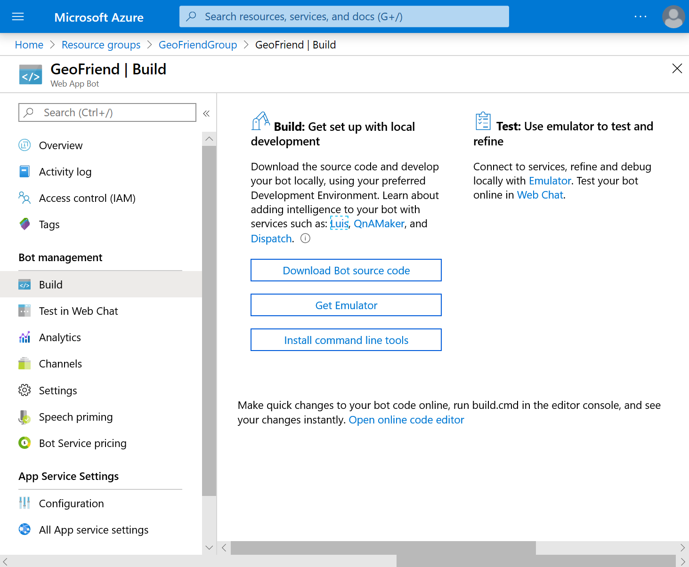
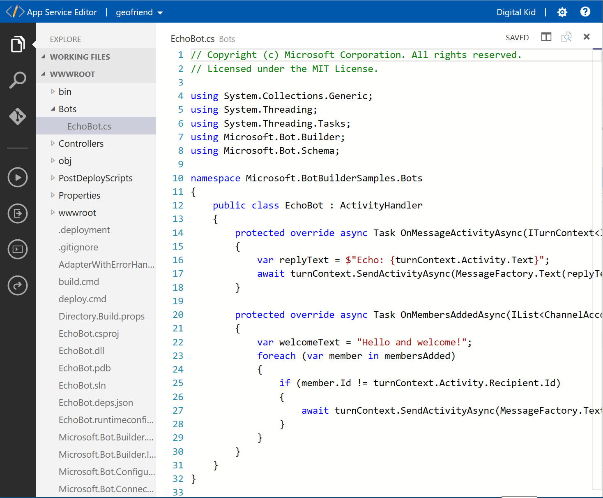
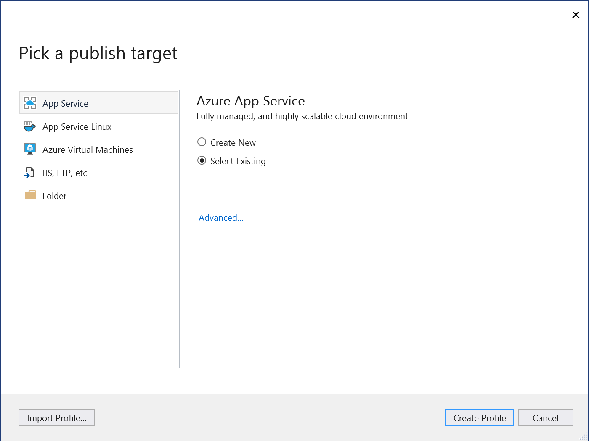
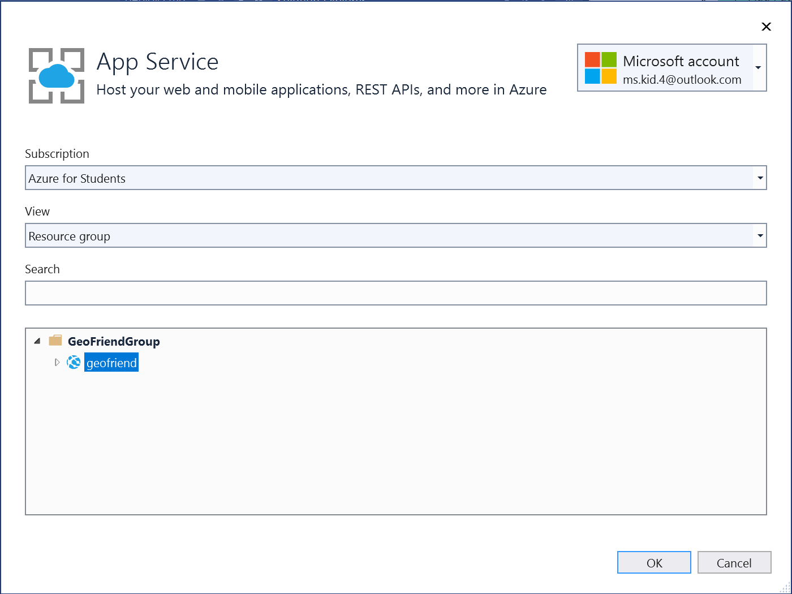
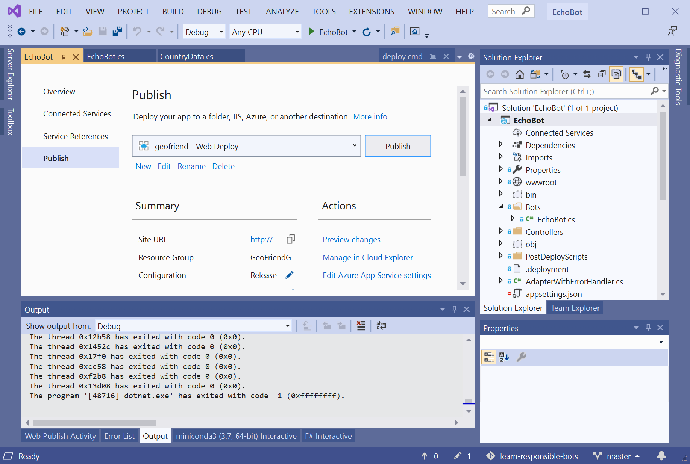

In the previous unit, we created an echo bot from a template. This bot simply echoes back anything that the user types. Now let's take a look at the bot code and change its behavior.

Open the bot page on the [Azure portal](https://portal.azure.com?azure-portal=true):

> [!div class="mx-imgBorder"]
> 

The bot creation flow in the right pane shows that we're at the **Build** stage. It suggests  you go to **Build blade** to download the source code for the bot. Go ahead and select the **Build blade** link:

> [!div class="mx-imgBorder"]
> 

From here, you have two main options:

- Use **Visual Studio** installed on your local computer for your code development. To do that, you select **Download Bot source code**. We recommend this option. It's a more complete and powerful development platform and can make the whole process easier.
- Use the **online editor** in your browser. For this option, select the small **Open online code editor** link. The online editor is especially useful for making small changes to your bot.

## Explore your bot's code in the online editor

Let's first try the online editor option. Select the **Open online code editor** link to view the bot code.

> [!div class="mx-imgBorder"]
> 

The left pane shows a list of files. Look in the `Bots` directory, and select `EchoBot.cs`.

If you're familiar with ASP.NET web development, you might recognize what looks like code for an ASP.NET website. In fact, the Azure Bot Service bot is a web application that defines the `/api/messages` endpoint. It's called by Bot Connector.

If that explanation seems too complicated, don't worry. The main thing you need to know is that the `EchoBot.cs` file  contains your bot's functionality. In this file, the primary function is `OnMessageActivityAsync`, which is called each time the bot receives a message from the user.

Here's the code that creates the echo message:

```csharp
protected override async Task OnMessageActivityAsync(ITurnContext<IMessageActivity> turnContext, CancellationToken cancellationToken)
{
    var replyText = $"Echo: {turnContext.Activity.Text}";
    await turnContext.SendActivityAsync(MessageFactory.Text(replyText, replyText), cancellationToken);
}
```

The `turnContext.Activity` function contains all the information related to input messages, including message text, `turnContext.Activity.Text`. It also contains other information such as attachments, sender address, and so on. To send the reply to the user, we use the `SendActivityAsync` function.

Another useful function here is `OnMembersAddedAsync`. It's called whenever a new person enters the chat. We use it to display the initial welcome message to the user.

## Use the online editor to change the code

Let's change bot's behavior in a small way to make it greet a user by name. When the user types in their name, the bot will respond with *Hello, name!*.

To do that, we change the `OnMessageActivityAsync` function slightly. Let's also simplify the code a bit for the sake of clarity:

```csharp
protected override async Task OnMessageActivityAsync(ITurnContext<IMessageActivity> turnContext, CancellationToken cancellationToken)
{
    var name = turnContext.Activity.Text;
    var replyText = $"Hello, {name}!";
    await turnContext.SendActivityAsync(replyText);
}
```

Whenever we change the code, we need to build the application to incorporate the changes. Locate the `build.cmd` script among the files in the left pane. Right-click on the file, and then select **Run from console**. This command runs the script in the online editor that rebuilds the site.

> [!div class="mx-imgBorder"]
> 

To see if the bot works, go to the bot portal page. Select **Test in Web Chat** and try talking to the bot.

> [!div class="mx-imgBorder"]
> 

You should see that the bot greets you in response to your name.

## Use Visual Studio

To make more extensive changes to the bot, it's easier to use Visual Studio on your local machine. It offers these advantages:

- Visual Studio is a flexible editor with autocomplete and many useful features.
- You can start and debug the code locally on your machine, which is faster than rebuilding in the cloud. After you're happy with how the bot is working locally, you deploy to the cloud.

> [!TIP]
> If you're going to do serious development, you should [install Visual Studio][InstallVS].

> [!NOTE]
> You can complete the exercises in this module without installing Visual Studio. If you prefer using the online editor, you just need to make some slight adjustments when following the instructions:
>
> - Use **web chat** to test the bot instead of the emulator.
> - Execute the **build** script after changes to the code.

To work with the bot code in Visual Studio:

1. From the **Build** pane on the bot's portal page, select **Download Bot's Source Code**.
1. Answer **Yes** when you're asked if you want to include the `appSetting.json` file in the project. This file contains some sensitive keys that are used to communicate with the bot application. Don't distribute this file to third parties when you create production bots.
1. After it downloads, unzip this file in an appropriate folder such as `c:\demo`.
1. Start the `EchoBot.sln` file. Visual Studio 2019 will launch and display the same bot code that we saw earlier in the online editor.

> [!div class="mx-imgBorder"]
> 

## Create a dictionary of capital cities

Let's try to make our bot do something useful. Consider the problem of learning the capital cities of different countries. Our first exercise is to turn our bot into a "capital dictionary", which will return the capital city of any given country.

> [!TIP]
> During this module, we'll describe a series of steps that add some functionality to the bot and provide pieces of code. We recommend that you try and develop the bot yourself alongside the instructions.
>
> You can, however, get the code for the bot at different stages in the [mslearn-responsible-bots GitHub repository][GithubSample]. You can even grab the complete code from there. The only additional step you have to take is to copy the `appsettings.json` file from your project into the root directory.

If you take a look [list of national capitals](https://en.wikipedia.org/wiki/List_of_national_capitals) on Wikipedia, you can see that there's an important fairness and data complexity problem. Some countries, like Switzerland, might not have a *de jure* capital at all. Also, in some other countries, like Israel, the capital is not officially recognized.

There's no easy way to solve this problem. For this module, we'll choose the simplest solution - to cite the source of data. If we wanted a more complex approach, however, there are a some options we could consider:

- Enable the bot to return different results based on the user's language.
- Make use of another technological mechanism to accommodate for this issue.

Another important issue to note: capitals and countries change. We'll need to update our bot periodically so that users maintain trust in the bot. Maybe we can display a "last updated" date to make it clear how recent the data is.

As a starting point for our data, lets use the [Basic City list from SimpleMaps.com](https://simplemaps.com/data/world-cities). Download the basic database [from this page](https://simplemaps.com/data/world-cities) and extract the `worldcities.csv` file into the root of the bot project directory.

Lines in `worldcities.csv` look like this:

```
"city","city_ascii","lat","lng","country","iso2","iso3","admin_name","capital","population","id"
"Tokyo","Tokyo","35.6850","139.7514","Japan","JP","JPN","Tōkyō","primary","35676000","1392685764"
"New York","New York","40.6943","-73.9249","United States","US","USA","New York","","19354922.0","1840034016"
...
```

To handle the data, let's create a new class called `CountryData` in the root of our project. In Visual Studio, you can right-click on the **EchoBot** project, and then select **Add** -> **Class**.

> [!IMPORTANT]
> To make the project compile correctly, you'll need to change the namespace name from `EchoBot` to the namespace used in other project files: `Microsoft.BotBuilderSamples`.

To represent country data, we create the `Country` class:

```csharp
public class Country
{
    public Country(string s)
    {
        var t = s.Split(',');
        Capital = t[0].Trim('"');
        Name = t[4].Trim('"');
        float res;
        Population =
            float.TryParse(t[9].Trim('"'), out res) ? (int)res : 0;
    }

    public string Name { get; set; }
    public string Capital { get; set; }
    public int Population { get; set; }
}
```

The constructor of this class takes one line from `worldcities.csv` table and parses the data into corresponding fields.

For simplicity, we can put this class definition into the same `CountryData.cs` file.

To load the whole table, let's use the `CountryData` class:

```csharp
public class CountryData
{
    protected Country[] Countries { get; set; }

    public CountryData(string fn)
    {
        var data = File.ReadAllLines(fn);
        Countries = (from z in data.Skip(1)
                     select new Country(z)).ToArray();
    }
}
```

Here, we use a **LINQ** expression to go through each line of the data file, convert it to `Country` objects, and then store them as an array.

Finally, to get the capital for a given country, let's create the `GetCapital` function:

```csharp
    public string GetCapital(string country)
    {
        return Countries.FirstOrDefault(
            c => c.Name.ToLower() == country.ToLower())?.Capital;
    }
```

This function returns `null` if the country isn't found in the list.

> [!NOTE]
> In this code, we're not too worried about performance. Instead we're focusing on simplicity. In a proper implementation, we'd get faster access by using a hash table structure to store the dictionary of countries and capitals.

Now we'll implement the bot logic. Open the `Bots\EchoBot.cs` file and change the code inside `OnMessageActivityAsync` function:

```csharp
    var name = turnContext.Activity.Text;
    var f = System.IO.Path.Combine(Environment.CurrentDirectory, @"worldcities.csv");
    var cd = new CountryData(f);
    var cap = cd.GetCapital(name);
    var replyText = cap == null 
        ? "I do not know this country" 
        : $"The capital of {name} is {cap}!" ;
    await turnContext.SendActivityAsync(replyText);
```

> [!TIP]
> If you're not sure you've made all changes correctly, you can refer to the complete version of the bot code [on GitHub][GitHubSampleStage1]. To make it work with the bot you have recently created, you'll need to place your `appsettings.json` file into the root of the GitHub project.

## Testing the bot locally

After you've made changes to the bot, you can test it on our local machine. To do that, you need to install the [Bot Framework Emulator][BotEmulator].

To test the bot:

1. Copy the `Application Id` and the `Application Secret` from `appsetting.json` file.
1. Run the project in Visual Studio. If the bot code compiles correctly, a browser window will open.
1. Start the Bot Framework Emulator and select **Open Bot**.
1. Provide the endpoint address, which usually looks like this: `https://localhost:3978/api/messages`. You can verify the site address and port number in the browser window opened in the previous step.
1. Paste the `Application Id` and the `Application Password` into the corresponding fields and select **Connect**.
1. Start chatting with your bot!

> [!div class="mx-imgBorder"]
> 

## Deploy the bot to Azure

To deploy the bot back to the cloud, the easiest way is to use Visual Studio:

1. In Visual Studio, right-click on the **EchoBot** project and select **Publish**.
1. In the **Pick a publish target** window, select **App Service** in the left pane.
1. Choose **Select Existing** in the App Service pane.
1. In the **App Service** window, check that the correct App Service is selected as deployment target.

    | 
   ---|---
   
   > [!TIP]
   > You might have to sign in to your Azure account at this step. If you don't see the correct App Service listed, check the top right to see if you're signed in to your Azure account.

1. After a successful publish, Visual Studio saves a deployment profile. For future deployments, you can just select the **Publish** button.

  > [!div class="mx-imgBorder"]
  > 

After deployment, you can open your bot page on the Azure portal. Use the **Test in Web Chat** function to talk to your bot.

## Conclusion

In this unit, we've developed our bot into a useful tool. It still doesn't follow any of the responsible conversational UI principles. It's also not usable without specific instructions.

Next, we'll enable the bot to understand human language, and we'll apply some of the principles of responsible UI.

<!-- Links -->
[BotEmulator]: https://aka.ms/abs/build/emulatordownload
[GitHubSample]: https://github.com/MicrosoftDocs/learn-responsible-bots
[GitHubSampleStage1]: https://github.com/MicrosoftDocs/learn-responsible-bots/tree/t1-capdict
[InstallVS]: https://docs.microsoft.com/visualstudio/install/install-visual-studio?view=vs-2019
