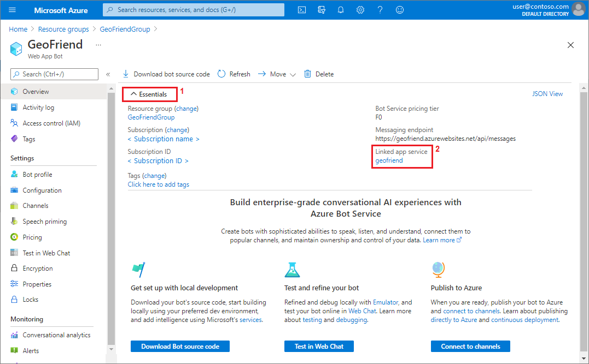
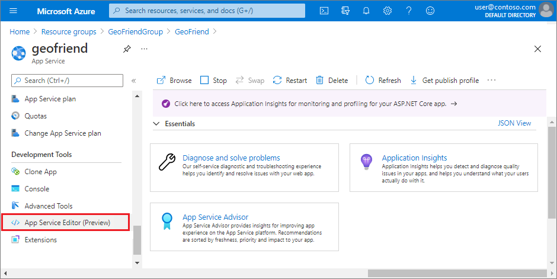
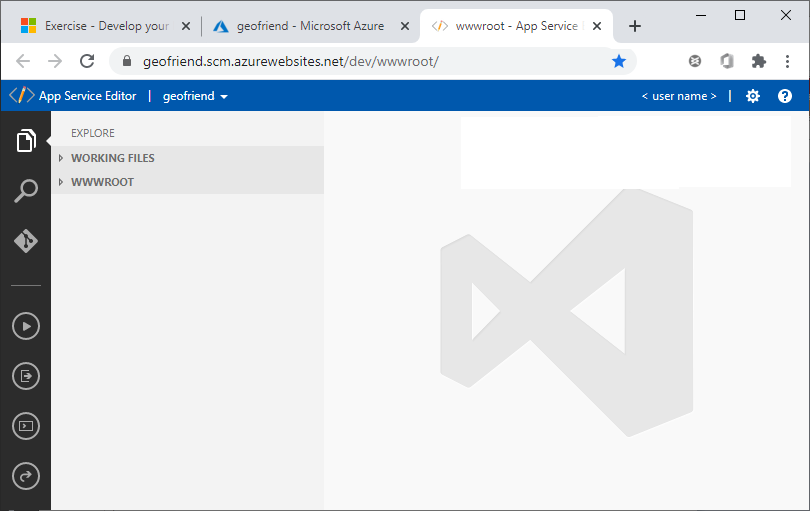
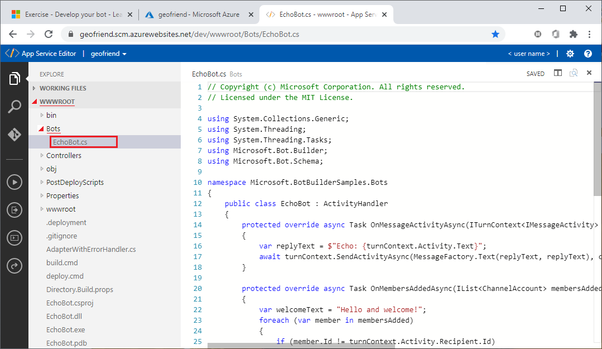
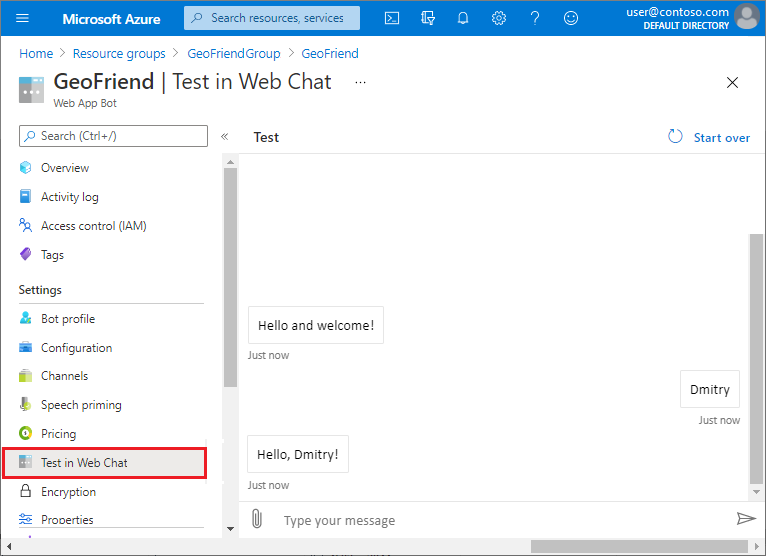

In the previous unit, we created an echo bot from a template. This bot simply echoes back anything that the user types.
Now let's take a look at the bot code and change its behavior.

You have two main options to work with your bot code:

- **Visual Studio**: (Recommended) You can use Visual Studio installed on your local computer for your code development. It's a more complete and powerful development platform and can make the whole process easier.
- **Online editor**: You can use the App Service online editor in your browser. The online editor is especially useful for making small changes to your bot. 

We'll start with the online editor. In the next unit, we'll do more in-depth bot development by using Visual Studio.


## Open the App Service online editor

Return to the **Overview** page for your bot in the Azure portal.


1. On the **Overview** page for your bot, expand the **Essentials** section at the top.

   Under **Essentials**, select the link for the **App Service** that's linked to your bot.

   

1. On the left, under **Development Tools**, select **App Service Editor (Preview)**.

   

1. On the right, select **Go &#129058;**.

   


## Explore your bot code

The App Service online editor runs in a separate window:



The left **EXPLORE** pane shows a list of files. To view your bot code, expand **WWWROOT**, expand the *Bots* directory, and then select your bot code file, *EchoBot.cs*:



If you're familiar with ASP.NET web development, you might recognize what looks like code for an ASP.NET website. In fact, the Azure Bot Service bot is a web application that defines the `/api/messages` endpoint. The endpoint is called by Bot Connector.

If that explanation seems too complicated, don't worry. The main thing you need to know is that the *EchoBot.cs* file  contains your bot's functionality. In this file, the primary function is `OnMessageActivityAsync`. This function is called each time the bot receives a message from the user.

Here's the code that creates the echo message:

```csharp
protected override async Task OnMessageActivityAsync(ITurnContext<IMessageActivity> turnContext, CancellationToken cancellationToken)
{
    var replyText = $"Echo: {turnContext.Activity.Text}";
    await turnContext.SendActivityAsync(MessageFactory.Text(replyText, replyText), cancellationToken);
}
```

The `turnContext.Activity` function contains all the information related to input messages, including message text, `turnContext.Activity.Text`. The function also contains other information like attachments, the sender address, and so on. To send the reply to the user, we use the `SendActivityAsync` function.

Another useful function is `OnMembersAddedAsync`. This function is called when a new user enters the chat. We use this function to display the initial welcome message to the user.


## Update your bot code

Let's change our bot behavior in a small way to make it greet a user by name. When the user types their *name*, we want our bot to respond with *Hello, name*! To add this feature, we'll make a slight change to the `OnMessageActivityAsync` function. We'll also simplify the code a bit for the sake of clarity.

1. In the code editor, locate the `OnMessageActivityAsync` function on line 14.

1. Replace the existing code with the following statements:

   ```csharp
   protected override async Task OnMessageActivityAsync(ITurnContext<IMessageActivity> turnContext, CancellationToken cancellationToken)
   {
       var name = turnContext.Activity.Text;
       var replyText = $"Hello, {name}!";
       await turnContext.SendActivityAsync(replyText);
   }
   ```

   Notice that the editor automatically saves your changes to the file. You can see the state of your file (Dirty, Saved) at the top right.


## Rebuild your modified bot code

After you change the code, you need to rebuild your bot app to incorporate the changes.

Locate the *build.cmd* script in the **EXPLORE** pane. Right-click the script file, and then select **Run from console**. 


This command opens a console in the online editor and runs the script, which rebuilds the site. You should see output similar to this example:


> [!Note]
> If the command returns an error message about the Kudu Sync installation, you can try the following steps to resolve the issue:
> 
> *Installing Kudu Sync.*<br>
> *An error has occurred during web site deployment.*
>
> - Close and reopen the online editor, and restart the build process.
> - Make sure you're signed into your Azure account. 
> - Check the status of your App Service plan.
> - Complete the exercises in this unit and the previous unit in the same session.
>


## Test your bot

To see if your bot works, return to your bot **Overview** page in the Azure portal.

Select **Test in Web Chat** and try *talking* to the bot.



When you type a name, your bot now responds with a greeting that includes your name.
