In the previous unit, we worked with the App Service online editor to develop our bot.
Now we'll do more advanced development with Visual Studio.

> [!NOTE]
> You can complete the exercises in this module without installing Visual Studio.
> If you prefer to continue to use the online editor, you'll need to make some slight adjustments as you follow the instructions in this unit:
>
> - After you change your code, execute the *build* script with the **Run from console** option. The build needs to complete successfully before you can test your bot.
> - Use the **Test in Web Chat** feature from your bot **Overview** page in the portal to test the code, rather than the Bot Framework Emulator.

To make more extensive changes to the bot, it's easier to use Visual Studio on your local machine. Developing your bot with Visual Studio offers these advantages:

- Visual Studio is a flexible editor with autocomplete and many useful features.
- You can start and debug the code locally on your machine, which is faster than rebuilding in the cloud. After you're happy with how the bot is working locally, you deploy to the cloud.

> [!TIP]
> If you're going to do serious development, you should [install Visual Studio][InstallVS].


## Get the bot source code

Follow these steps to start working with the bot source code in Visual Studio. If you plan to use the online editor to update your code, skip this section.

1. On the **Overview** page for your bot in the portal, select **Download bot source code**.

   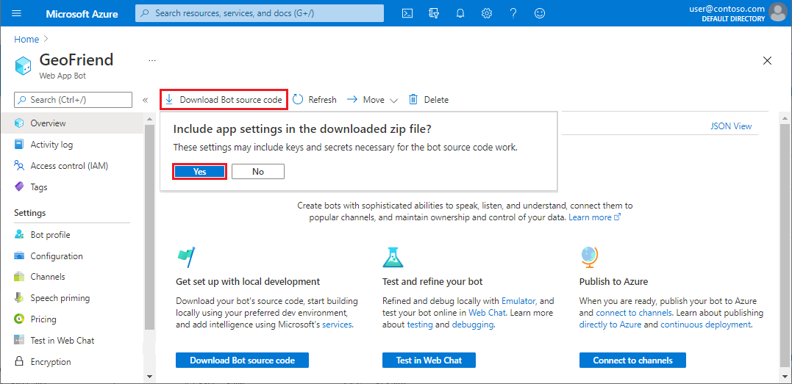

1. When you're asked if you want to include the *appSetting.json* file in the project, select **Yes**.

   > [!Caution]
   > The *appSetting.json* file contains sensitive keys that are used to communicate with the bot application.
   > Don't distribute this file to third parties when you create production bots.

1. The system prepares the ZIP file of your source code. When the download URI is ready, select **Download bot source code**.

1. After the download completes, unzip the file to folder that you'll use as your bot project directory, such as *C:\bot-code*.


## Open the bot project in Visual Studio

In your bot project directory, double-click the Visual Studio Solution (SLN) file, *EchoBot.sln*. Visual Studio launches and the source code for your bot project is loaded into the editor. This source code is the same code that we saw earlier, when we learned how to use the App Service online editor.

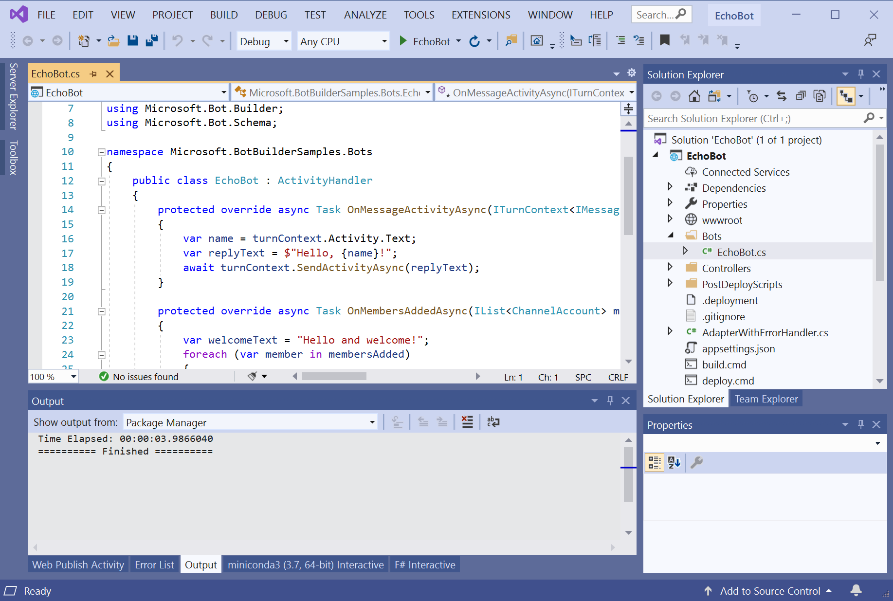

> [!Note]
> When the bot code opens, you might be prompted to install extensions. You can select **Show Recommendations** to review the options.
> If you choose, you can install the **C# extension** to apply formatting enhancements to your C# code.


## Modify the bot to provide a dictionary of capital cities

Let's try to make our bot do something useful. Consider the problem of learning the capital cities of different countries. Our first exercise is to turn our bot into a "capital dictionary" that returns the capital city of any given country.

> [!TIP]
> During this module, we'll describe a series of steps that add some functionality to the bot and provide pieces of code. We recommend that you try and develop the bot yourself alongside the instructions.
>
> You can get the code for the bot at different stages in the [mslearn-responsible-bots GitHub repository][GithubSample]. You can also get a copy of the complete code from that repo. The only additional step you have to take is to copy the *appsettings.json* file from your project into the root directory.

The [list of national capitals](https://en.wikipedia.org/wiki/List_of_national_capitals) on Wikipedia highlights an important fairness and data complexity problem. Some countries, like Switzerland, might not have a *de jure* capital. Other countries, like Israel, have a capital that's not officially recognized by all other countries.

To make our bot as responsible as possible, we have to keep these tricky situations in mind. Unfortunately, there's no easy way to solve this problem.  For this module, we'll choose the simplest solution, which is to cite our data source. To implement a more complex approach, here are some options to consider:

- Enable the bot to return different results based on the user's language.
- Make use of another technological mechanism to accommodate for the fairness and complexity issues.

There's one more important issue that we have to address: capitals and countries change. We need to update our bot periodically so users maintain trust in the bot. Maybe we can display a "last updated" date to make it clear how recent our data is.


### Get the initial data

As a starting point for our data, let's use the [World cities list from SimpleMaps.com](https://simplemaps.com/data/world-cities?azure-portal=true).

1. Go to the [SimpleMaps](https://simplemaps.com/data/world-cities?azure-portal=true) site.

1. Scroll to the Databases section. Under the **Basic** (free) option, select **Download**. When you're prompted, select **Download**.

1. Open the ZIP file, and extract the *worldcities.csv* file to the root folder of your bot project directory (*C:\bot-code* or similar).

   Here's a sample of the data in the *worldcities.csv* file:

   ```csv
   "city","city_ascii","lat","lng","country","iso2","iso3","admin_name","capital","population","id"
   "Tokyo","Tokyo","35.6897","139.6922","Japan","JP","JPN","Tōkyō","primary","37977000","1392685764"
   "New York","New York","40.6943","-73.9249","United States","US","USA","New York","","18713220","1840034016"
   "Bangalore","Bangalore","12.9699","77.5980","India","IN","IND","Karnātaka","admin","13707000","1356410365"
   ```


### Create classes to store the data

To represent the country data, we'll create a new class in the root of our project.

1. In the **Solution Explorer** in Visual Studio, right-click the **EchoBot** project, and then select **Add** > **Class**.

1. In the **Add New Item** dialog, configure the new class:

   - In the middle pane, select **Class** to create an empty Visual C# class declaration.

   - At the bottom, enter the name of the class, *CountryData.cs*.

   Then select **Add**.

   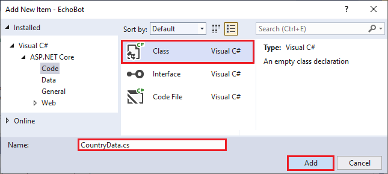

   A new file is opened for the *CountryData.cs* class and it's added to your *EchoBot.sln* solution. The file contains an empty declaration for the `CountryData` class:

   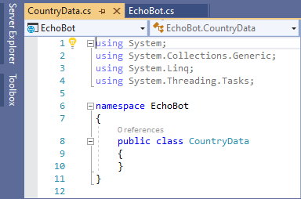

1. The `CountryData` class will load the whole table of data from the *worldcities.csv* file. In the *CountryData.cs* file, replace the empty declaration on lines 8 - 10 with the following code:

   ```csharp
   public class CountryData
   {
       protected Country[] Countries { get; set; }
   
       public CountryData(string fn)
       {
           var data = System.IO.File.ReadAllLines(fn);
           Countries = (from z in data.Skip(1)
                        select new Country(z)).ToArray();
       }
   }
   ```

   This class uses a **LINQ** expression to go through each line of the data file. It converts the data to `Country` objects, and then stores the objects as an array. To do these tasks, the `CountryData` class uses another new class named `Country`. For simplicity, we'll add the definition for the `Country` class in the same *CountryData.cs* file.

1. In the *CountryData.cs* file, add the following code to define the `Country` class. Place the code after the definition for the `CountryData.cs` class, but before the closing curly parenthesis for the file.

   ```csharp
   public class Country
   {
       public Country(string s)
       {
           var t = s.Split(',');
           Capital = t[0].Trim('"');
           Name = t[4].Trim('"');
           float res;
           Population = float.TryParse(t[9].Trim('"'), out res) ? (int)res : 0;
        }
    
       public string Name { get; set; }
       public string Capital { get; set; }
       public int Population { get; set; }
   }
   ```

   The `Country` class takes one line from the *worldcities.csv* table loaded by the `CountryData` class and parses the data into corresponding fields.


### Update the namespace

To make our project compile correctly, we need to change the namespace name to the same value that's used in other project files. In the *CountryData.cs* file on line 6, change the namespace value from `EchoBot` to `Microsoft.BotBuilderSamples`:

```csharp
namespace Microsoft.BotBuilderSamples
```


### Add a function to get the capital city

We need to extend the behavior of the `CountryData` class definition to get the capital for a given country. We'll create the `GetCapital` function inside the `CountryData` class. Add the following code to the end of the `CountryData` class definition, before the closing curly parenthesis for the class:

```csharp
public string GetCapital(string country)
{
     return Countries.FirstOrDefault(
         c => c.Name.ToLower() == country.ToLower())?.Capital;
}
```

The `GetCapital` function returns `null` if the country isn't found in the list.


### Implement the bot logic

Our last code update is to add the logic for our bot to the *Bots\EchoBot.cs* file.

Replace the body of the `OnMessageActivityAsync` function between the curly parenthesis with the following code:

```csharp
    var name = turnContext.Activity.Text;
    var f = System.IO.Path.Combine(System.Environment.CurrentDirectory, @"worldcities.csv");
    var cd = new CountryData(f);
    var cap = cd.GetCapital(name);
    var replyText = cap == null
        ? "I do not know this country"
        : $"The capital of {name} is {cap}!" ;
    await turnContext.SendActivityAsync(replyText);
```

> [!TIP]
> You can check if you made the code changes correctly by reviewing the complete version of the bot code [on GitHub][GitHubSampleStage1]. If you want to use the GitHub project code with your bot, you need to copy the *appsettings.json* file from your project directory (*C:\bot-demo* or similar) to the root of the GitHub project.
>
> In our code for these exercises, we're not too worried about performance. Instead we're focusing on simplicity. In a proper implementation, we'd get faster access by using a hash table structure to store the dictionary of countries and capitals.


## Configure your bot to publish to Azure

We need to make sure our bot can publish to Azure correctly. The data from the *worldcities.csv* file should always be copied with our project.

1. In Visual Studio Solution Explorer, go to your bot project directory, and locate the *worldcities.csv* file.

1. Right-click the *worldcities.csv* file, and select **Properties**. The **Properties** window opens.

   In the **Properties** window, expand the **Advanced** section, if necessary.

   - Use the drop-down to set the **Build Action** property to **Content**.

   - Use the drop-down to set the **Copy to Output Directory** property to **Copy always**.

   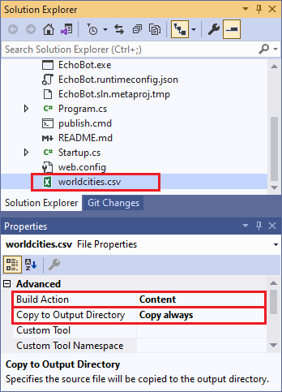


## Test the bot locally with the Bot Framework Emulator

After you update your bot, you can test your bot on your local machine. To do the test, install the [Bot Framework Emulator][BotEmulator].

Follow these steps to test your bot:

1. In Visual Studio, open the *appsettings.json* file.

   Copy and save the values of the **MicrosoftAppId** and the **MicrosoftAppPassword** properties.

1. Build the bot project in Visual Studio.

   If the bot code compiles correctly, a browser window opens:

   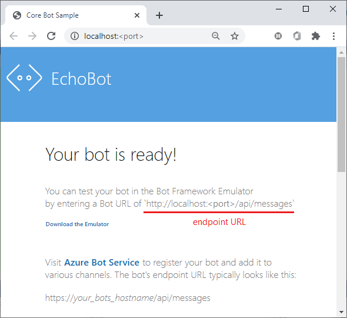

   The browser window shows the **endpoint URL** for your bot, such as `https://localhost:<port>/api/messages`. Copy and save this URL value. 

1. Start the Bot Framework Emulator, and select **Open Bot**.

1. In the **Open a bot** dialog, enter the bot **endpoint URL**, and the **MicrosoftAppId** and the **MicrosoftAppPassword** that you copied from the *appsetings.json* file. Select **Connect**.

   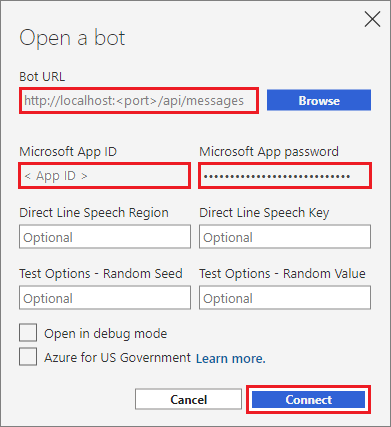

1. Start chatting with your bot!

   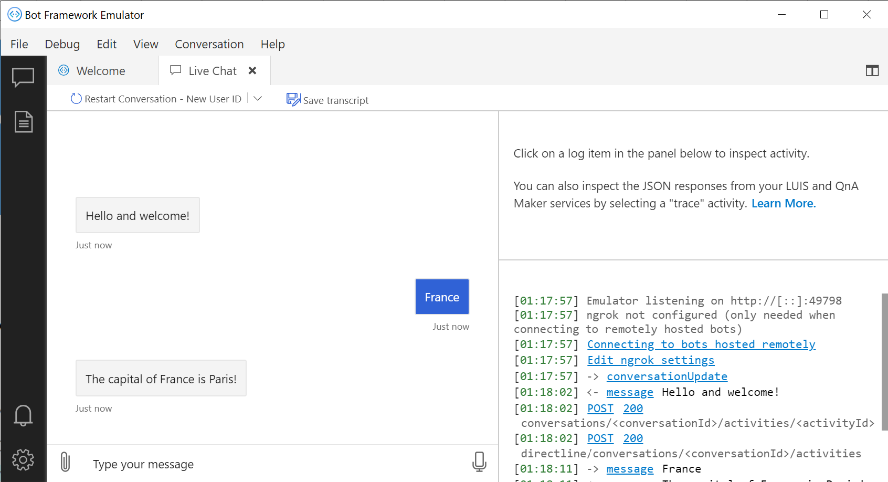


## Deploy the bot to Azure

To deploy the bot back to the cloud, the easiest way is to use Visual Studio.

1. In the **Solution Explorer** in Visual Studio, right-click the **EchoBot** project, and select **Publish**.

1. In the **Target** window, select **Azure** in the left pane. Select **Next**.

1. In the **Specific target** window, select **Azure App Service** in the left pane. You can choose **Windows** or **Linux**. Select **Next**.

1. In the **App Service** window, make the following selections:

   > [!NOTE]
   > You might have to sign in to your Azure account to complete this step.
   > If you don't see the correct App Service listed, check the top right to see if you're signed in to your Azure account.

   - **Subscription name**: Choose your current subscription.

   - **View**: Select **Resource group**.

   - **App Service instances**: Locate the resource group for your bot in the list. Expand the resource group, and then select the App Service that's linked to your bot. The selected App Service is used as the deployment target.

   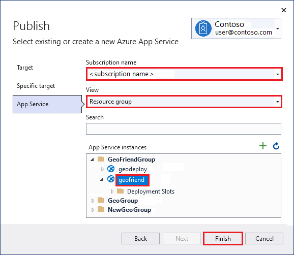

1. Select **Finish**.

   Visual Studio processes your selections and prepares the project for publication.
   When the project is ready to be published, the **Publish** summary window displays.

1. In the **EchoBot: Publish** summary window, select **Publish**:

   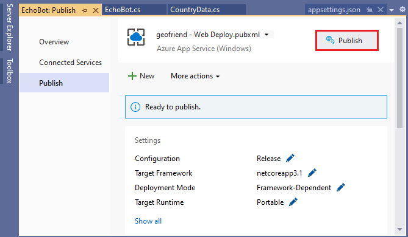

   Visual Studio publishes the bot. You might see some application messages during the deployment process.

   You can track the progress in the **Output** window in Visual Studio. When the deployment completes, Visual Studio shows the status in the **Web Publish Activity** window with a link to the deployed bot in Azure.

   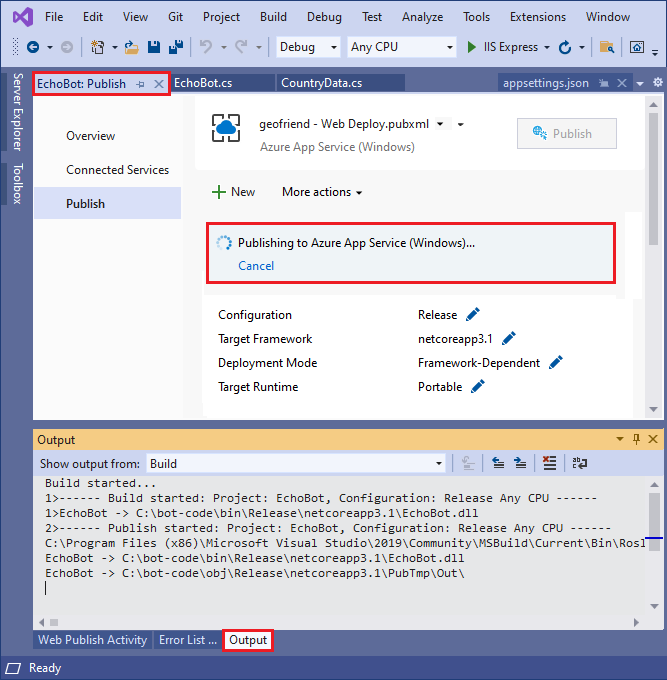 | 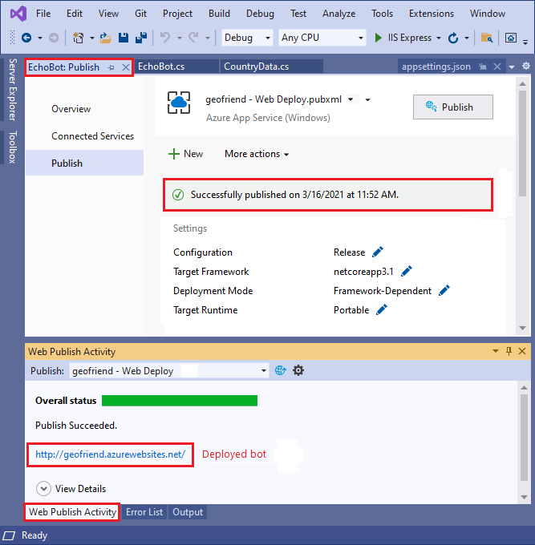
   ---|---

   > [!TIP]
   > After a successful publish, Visual Studio saves a deployment profile.
   > For future deployments, you can simply select **Publish** in the **EchoBot: Publish** summary window. You don't need to repeat the configuration steps.


## Test your deployed bot

After deployment, you can test your bot. In the Azure portal, open your bot page. Use the **Test in Web Chat** function to talk to your bot.

You can also test your bot in the Bot Framework Emulator. Repeat the steps outlined in the [earlier section](#test-the-bot-locally-with-the-bot-framework-emulator) to connect to your bot.


## Conclusion

In the last three units, we developed our bot into a useful tool, but it doesn't follow responsible conversational UI principles.
Our bot is also not usable without specific instructions.

Next, we'll enable our bot to understand human language, and we'll apply some of the principles of responsible UI.


<!-- Links -->

[BotEmulator]: https://aka.ms/abs/build/emulatordownload?azure-portal=true
[GitHubSample]: https://github.com/MicrosoftDocs/learn-responsible-bots?azure-portal=true
[GitHubSampleStage1]: https://github.com/MicrosoftDocs/learn-responsible-bots/tree/t1-capdict?azure-portal=true
[InstallVS]: https://docs.microsoft.com/visualstudio/install/install-visual-studio?view=vs-2019?azure-portal=true
