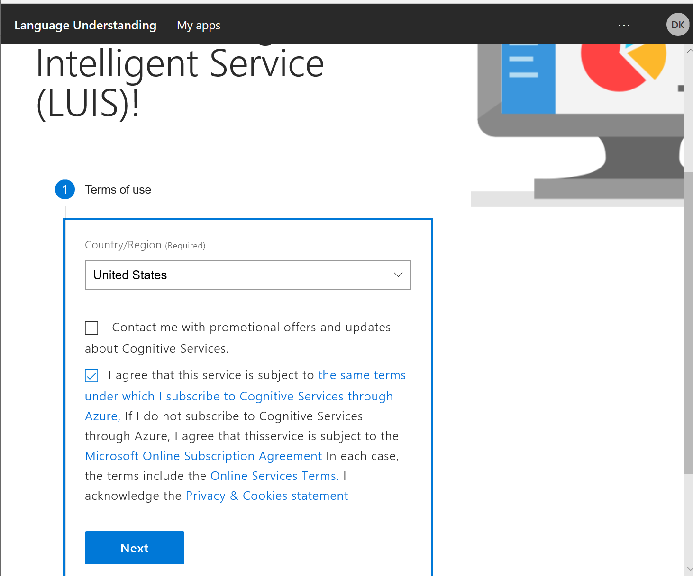
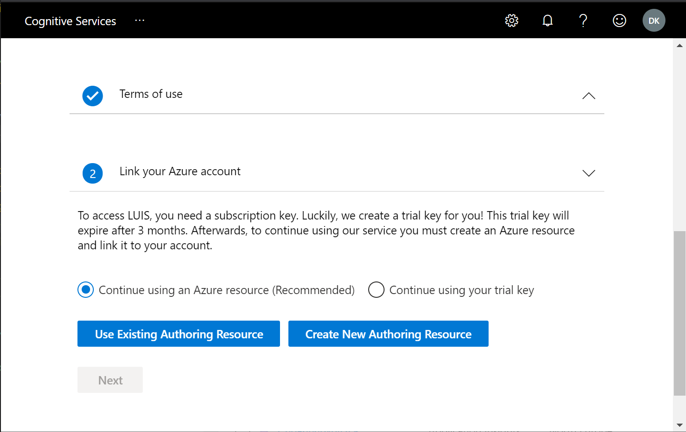
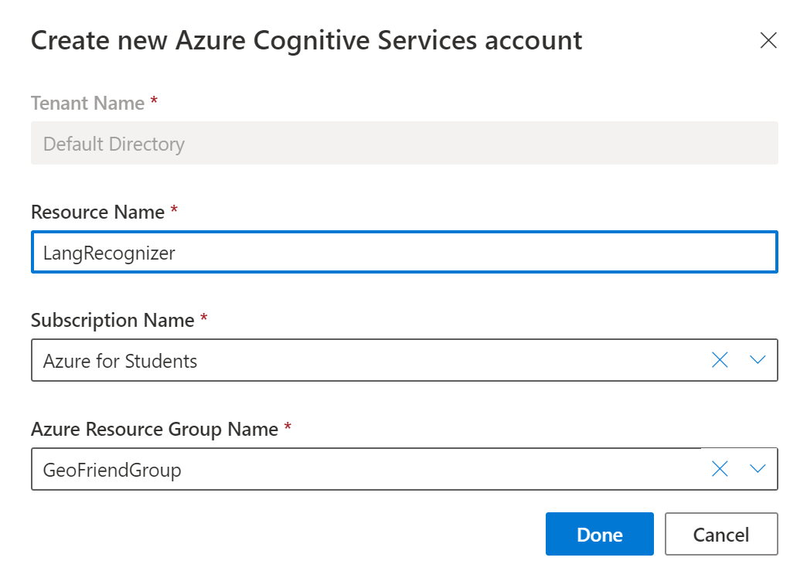
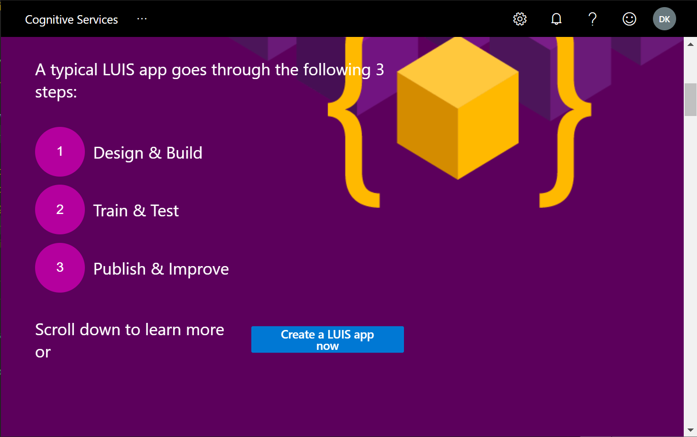
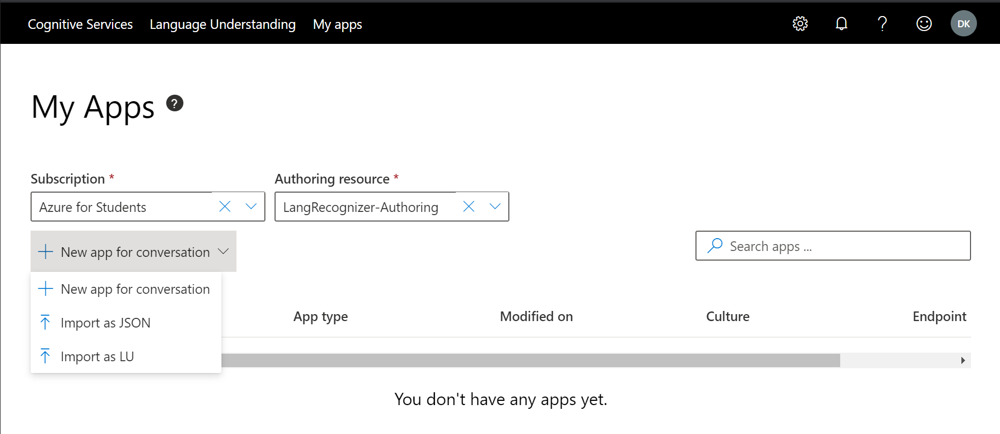
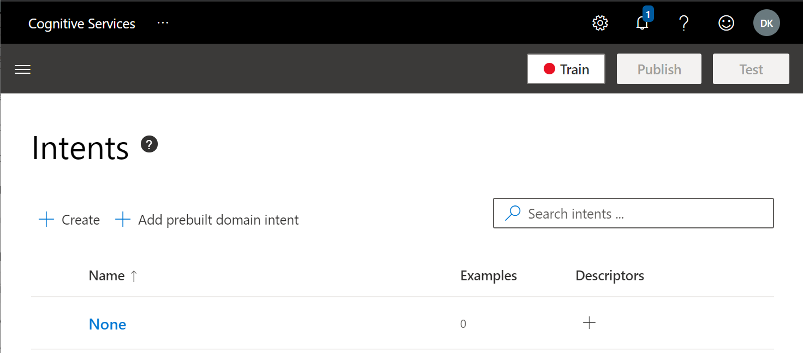
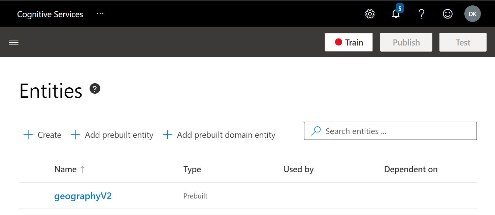
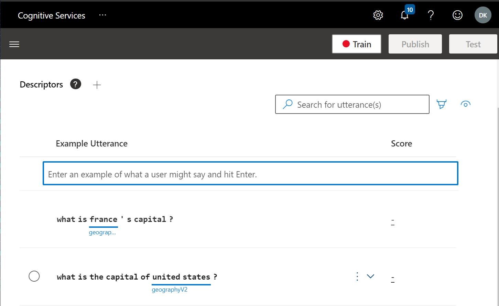
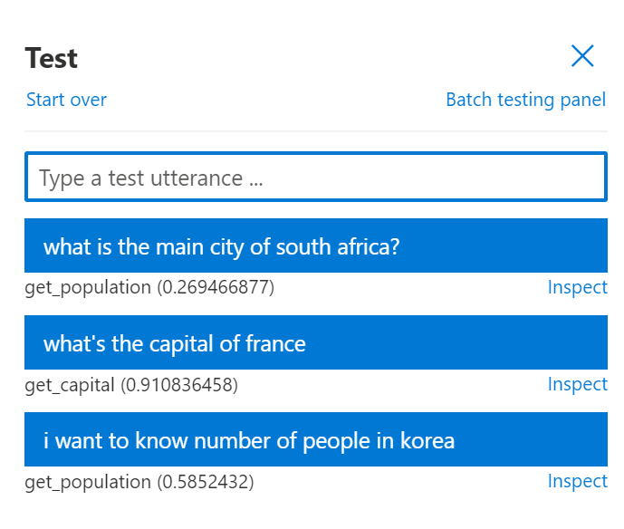

We've already developed one of the features of our bot, which is to tell capital cities from country names. Now we need to make the bot more human by teaching it how to understand simple natural language. To do it, we use a cognitive service called the Language Understanding Intelligent Service ([LUIS][LUIS]).

LUIS does two important natural language understanding tasks:

- **Intent Classification** allows you to classify each input sentence, a so-called utterance, with its intent, to figure out the overall meaning of a phrase.
- **Named Entity Recognition** extracts some known entities from the phrase, such as city names or dates.

For example, the phrase *What is the capital of France?* can be classified as a `get_capital` intent. *France* is extracted as a geographical entity. The same intent can be verbalized differently, for example. What is France's capital city?*. The extracted entity and intent are the same, which leads to the same result.

LUIS uses a machine learning model to match an input phrase to the best possible intent, but not an exact match. This model allows LUIS to classify phrases that aren't exact and find the best possible match. It also returns a *confidence* ranking with a number from 0 to 1, which indicates how certain the model is of the given classification. If the model returns a low confidence ranking, it means that the phrase wasn't understood well.

## Design intents

One of the principles of responsible conversational AI is that a bot should have a clear goal. A goal defines the set of intents that a bot can handle.

The goal of the **GeoFriend** bot is to help a student study geography and to act as an assistant. With this goal in mind, we'll implement the following functionality so that the bot can:

- Give a capital city for a given country name.
- Give a country name for a given capital city.
- Give the population of a city or country.
- Display some help on the bot's usage.

For simplicity, we'll limit ourselves to these cases. Ideally, the bot should include more intents and support more learning cases.

## Train the LUIS model

To train the LUIS model, we'll give it some sample phrases for each intent, as shown in this table.

| Intent | Phrase |
|---|---|
|`get_capital` | What is the capital of the *United States*? |
|`get_capital` | I need to know the capital city of *France*. |
|`get_country` | What country's capital is *Paris*? |
|`play_game` | I want to play! |
|`play_game` | Let's start a capital quiz! |
|`get_population` | What is the population of *Moscow*? |
|`get_population` | How many people live in *Seoul*? |

1. To set up the LUIS service, go to the [LUIS portal](https://luis.ai).

   > [!NOTE]
   > In this course, we're using a preview version of the LUIS portal located at [https://preview.luis.ai](https://preview.luis.ai).

1. When you first sign in, you're asked to specify your country and accept the terms of use.

   > [!div class="mx-imgBorder"]
   > 

1. Now link to your Azure account. Select the **Continue using an Azure Resource** option, and then select **Create New Authoring Resource**.

   > [!div class="mx-imgBorder"]
   > 

1. In the dialog box, select your subscription, enter a suitable name for the service, and select the resource group you previously used for the bot.

   > [!div class="mx-imgBorder"]
   > 

1. Next, the LUIS portal opens again, where you can create a new application.

   > [!div class="mx-imgBorder"]
   > 

1. Select **Create a LUIS app now**, and the LUIS portal opens again.

   > [!div class="mx-imgBorder"]
   > 

1. Make sure your **Subscription** and **Authoring resource** are selected. If you don't see your authoring resource, check that you're using the portal for the correct region.

   > [!NOTE]
   > LUIS supports three locations for authoring. They're the United States, Europe, and Asia. There are different portals for each location, and authoring resources from different regions aren't visible.

   > [!TIP]
   > If your LUIS training resource isn't visible, go to the Azure portal to make sure it was created. You can also create it manually from the Azure portal.

1. Select **New app for conversation**, and specify an application name and description. In this example, we  use **GeoFriend** as an application name.

   > [!NOTE]
   > If you don't want to train the model by providing sample phrases, you can train it from the saved data file. In this case, choose to create the model from a file. Use [this file][LUISCodeFile] from the GitHub repository.

   After some information screens, the main application dashboard appears.

   > [!div class="mx-imgBorder"]
   > 

1. To add a prebuilt entity for geographical locations, follow these steps:

   1. Select the menu on the left, and select **Entities**.
   1. On the **Entities** screen, select **Add prebuilt entity**.
   1. From the list, select **geographyV2**.

   You should see the entity added to the screen, as shown here.

   > [!div class="mx-imgBorder"]
   > 

1. To create the first intent, `get_capital`, follow these steps:

   1. From the menu, go to the **Intents** screen.
   1. Select **Create**, and enter the intent's name, `get_capital`.
   1. Enter a sample utterance like **What is the capital of the United States?**

   > [!div class="mx-imgBorder"]
   > 

   You can see that LUIS automatically detects geographical entities.

1. Using the same procedure, enter a few more sentences for the `get_capital` intent. Create other intents from the ones listed in the previous table.

1. After you've created intents, select **Train** to train the model. After training, select **Test** to see how well the model performs on some input sentences.

   > [!div class="mx-imgBorder"]
   > 

1. If you see some phrases classified incorrectly, select **Inspect** to get the details and add the utterances to the training data to improve the model.

You can see that each utterance has some associated probability. If the phrase isn't recognized well, the probability is low, as in the example with the *main city* phrase. In the application, we can set some probability thresholds and consider only phrases that are recognized well.

## Integrate LUIS into the bot

To use the LUIS model from the bot, first we need to publish the model.

1. Select **Publish**, select **Production Slot**, and then select **Done**. The screen with the prediction endpoint URL and key appears.

   > [!div class="mx-imgBorder"]
   > 

   > [!TIP]
   > Right now the model is deployed on some starter resources. To deploy it in production, select **Add prediction resource**. After you do that, you'll have another set of prediction keys and an endpoint URL that you can freely control through your subscription.

1. Add the LUIS model to the bot code. Open the Visual Studio project that we worked on in the last unit.

   > [!TIP]
   >The code described here is available [here on GitHub][CodeLUIS]. If you decide to take code from there, you still need to make changes to the `appsetting.json` file to provide your keys for the LUIS service.

1. To add the `Microsoft.Bot.Builder.AI.Luis` NuGet package, follow these steps:

   1. Right-click the project **EchoBot**.
   1. Select **Manage NuGet packages**.
   1. Select the **Browse** tab.
   1. Enter `Luis`, choose `Microsoft.Bot.Builder.AI.Luis`, and select **Install**.

   > [!div class="mx-imgBorder"]
   > 

1. To add LUIS Recognized to our bot, add the corresponding code to the `ConfigureServices` function in `Startup.cs`. Open the file, and insert the following code after the first line of the `ConfigureServices` function:

    ```csharp
        var luisApplication = new LuisApplication(
            Configuration["LuisAppId"],
            Configuration["LuisAPIKey"],
            Configuration["LuisEndpointUrl"]);
        services.AddSingleton(new LuisRecognizer(luisApplication));
    ```

   > [!NOTE]
   > The previous code requires a `using` statement to make the `LuisRecognizer` and `LuisApplication` classes visible. The easiest way to figure out the correct `using` statement is to select the bulb icon next to the undefined class and let Visual Studio automatically fix it. In this case, it adds the following line to the file `using Microsoft.Bot.Builder.AI.Luis;`.

1. This code takes the LUIS service parameters from the config file, so you also need to add the following to the `appsettings.json`:

    ```json
      "LuisAppId": "<your app id here>",
      "LuisAPIKey": "<your app key here>",
      "LuisEndpointUrl": "<your endpoint url here>"
    ```

   This data is taken from the LUIS prediction screen shown in the previous step. The only tricky thing is to get the app ID. In the prediction screen, you see the **Example query**, which looks similar to:

    ```json
    https://langrecognizer.cognitiveservices.azure.com/luis/prediction/v3.0/apps/5c9d81a8-2d13-448a-9f7c-df4ec1b5cdb4/slots/...
    ```

    The application ID is the sequence of numbers after `/apps/` and before the `/slots` portion of this URL.

1. After we've registered `LuisRecognizer` as a singleton, we'll be able to automatically receive its instance as a parameter to the `EchoBot` constructor. Open the `Bots\EchoBot.cs` file, and add a recognizer field and a constructor to the `EchoBot` class:

    ```csharp
    LuisRecognizer rec;
    
    public EchoBot(LuisRecognizer rec)
    {
        this.rec = rec;
    }
    ```

1. To make sure that the recognizer works, change the code for `OnMessageAcitivityAsync` to :

    ```csharp
    protected override async Task OnMessageActivityAsync(ITurnContext<IMessageActivity> turnContext, CancellationToken cancellationToken)
    {
        var res = await rec.RecognizeAsync(turnContext, cancellationToken);
        await turnContext.SendActivityAsync(res.GetTopScoringIntent().ToString());
        await turnContext.SendActivityAsync(res.Entities.ToString());
    }
    ```

1. This function calls the LUIS recognizer and displays the top event and associated entities. Run the bot in the emulator and observe the results:

    |Input utterance|Result|
    |---|---|
    |*What is the capital of France?*|`(get_capital,0.86)`<br/>`{"geographyV2": [{"location": "France","type": "countryRegion"}]`|
    |*What is the capital of Paris?*|`(get_capital,0.86)`<br/>`{"geographyV2": [{"location": "Paris","type": "city"}]`|

   You can see that entities are extracted correctly and that LUIS can also distinguish between cities and countries automatically.

1. Now let's add processing logic to the bot. In the `OnMessageActivityAsync` function, we'll check if the recognition result is good enough and call the corresponding function to process LUIS results:
    
    ```csharp
    protected override async Task OnMessageActivityAsync(ITurnContext<IMessageActivity> turnContext, CancellationToken cancellationToken)
    {
        var res = await rec.RecognizeAsync(turnContext, cancellationToken);
        var (intent, score) = res.GetTopScoringIntent();
        if (score>0.3)
        {
            await ProcessLuisResult(turnContext, intent, res.Entities);
        }
        else
        {
            await turnContext.SendActivityAsync("I am not sure I understand you fully");
        }
    }
    ```

   All intent processing happens inside the `ProcessLuisResults` function (parts of the code are omitted for clarity):

    ```csharp
    protected async Task ProcessLuisResult(ITurnContext<IMessageActivity> turnContext, string intent, JObject entities)
    {
        if (intent=="hel")
        {
            await turnContext.SendActivityAsync("This feature is not yet implemented");
            return;
        }
        var geo = entities["geographyV2"];
        if (geo==null || geo.Count()!=1)
        {
            await turnContext.SendActivityAsync("I am not sure which location you mean");
            return;
        }
        var loc = geo[0]["location"].ToString();
        switch (intent)
        {
            case "get_capital":
                var cap = CData.GetCapital(loc);
                await turnContext.SendActivityAsync(cap==null
                        ? $"I do not know the capital of {loc}"
                        : $"The capital of {loc} is {cap}");
                break;
            ...
            default:
                await turnContext.SendActivityAsync("I do not know that one");
                break;
        }
    }
    ```

Here's the logic of this function:

- We first check if the intent is `play_game`, which doesn't require a location. At the moment, we handle this request by displaying a message that the game isn't implemented.
- All other intents require exactly one location, so if no locations or more than one location is specified, we display an error message.
- When exactly one location is found, we use `switch` to handle each intent separately according to the logic.

We also need to add some more functions to the `CountryData` class to figure out the population of a city from a city name and a country name from its capital.

> [!TIP]
> You can find the complete code for this stage of bot development [in this repository][CodeLuis].

After we implement those changes, we can start the bot and have a little conversation.

> [!div class="mx-imgBorder"]
> 

## Conclusion

Now the bot seems to be much more intelligent, but it ignores some of the responsible AI principles, such as making the goal of the bot clear. In the next unit, we'll implement some of the responsible functionality, as well as a terms dictionary.

[LUIS]: https://docs.microsoft.com/azure/cognitive-services/luis/
[LUISPortal]: https://preview.luis.ai
[CodeLuis]: https://github.com/MicrosoftDocs/learn-responsible-bots/tree/t2-luisrec
[LUISCodeFile]: https://github.com/MicrosoftDocs/learn-responsible-bots/blob/master/models/GeoFriend.json
