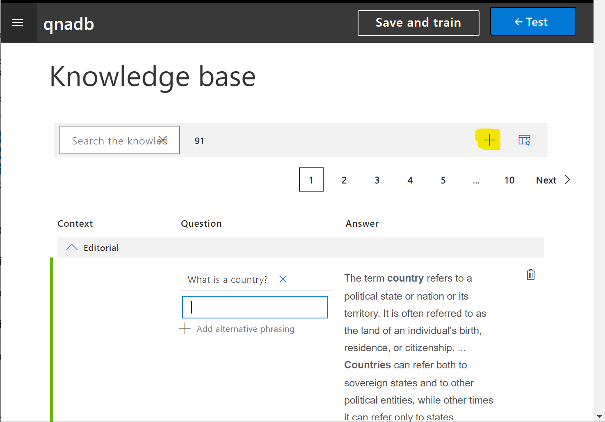
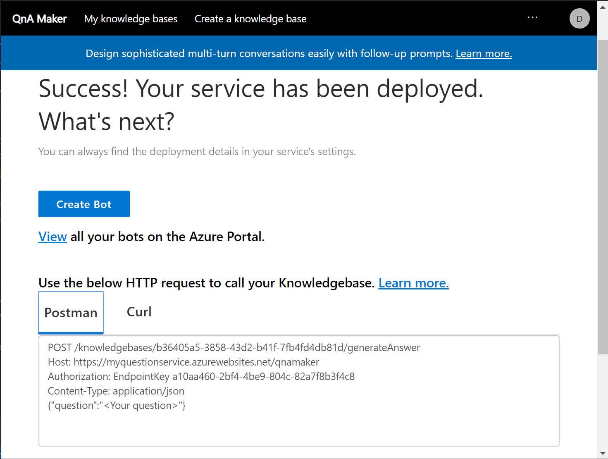

## Implementing Question Answering and Personality

Now out bot can handle a few specific requests, but it would also be nice to give it the ability to answer general questions on geography terminology, eg. act like a simple encyclopedia. We definitely could create this functionality using LUIS by creating separate intents, but there is an easier way. There is a special cognitive service to handle this type of scenarios called **[QnA Maker][QAMaker]**.

## Training Q&A Maker Model

Similar to LUIS, when adding QnA Maker to our bot, the first thing we need to do is to train QnA Maker on our specific data. To start, go to http://qnamaker.ai and sign in with your Microsoft Account:


Next step is to create a new knowledge base by clicking on the link at the top:


When you click **Create QnA Service** you are taken (in a separate browser tab) to Azure Portal, where you need to fill in the parameters for newly created service:

- Chose appropriate name for the service (I will use `myquestionservice`)
- You can select **F0** (free) pricing tier for demo purposes
- Select the same resource group we have been using for the bot
- Select **F** pricing tier for Azure Search
- Chose appropriate locations for Azure Search service and for Azure Web App. Those should preferably be the same as the location of all other bot components.
- Chose some reasonable web app name (I will again use `myquestionservice`)
- Disable application insights

  

Go back to the browser tab with QnA Maker, and complete **Step 2** of setup:

- Click **Refresh** button to make sure your newly created service is visible
- Chose correct subscription, tenant and service name
- Select the language to be used for the information extraction among those available in the dropdown boxes. Go ahead and select **English**


>[!NOTE]
>Some languages available in the dropdown will support **chit-chat** functionality, meaning that QnA Maker will also automatically support general conversation functionality. For other languages, only information extraction and basic QnA functionality will be available. For the purpose of this module, let's select English as the most supported language.

In **Step 3**, provide a name for your database. I will use `qnadb`.

In **Step 4**, you are asked to provide data sources. If you have a FAQ availabe, either in the form of an electronic document or a page on the web, you can enter the information here and have it automatically indexed by the service. In our case, we will prefer to skip this step and provide questions and answers later on manually through web interface.

You can also enable **chit-chat** functionality to your service. It will automatically support some level of general conversation, such as greeting the user, saying goodbye's, etc. 

>[!NOTE]
>General conversation capability plays an important role in Responsible Conversational UI, because it helps to build trust with the user, as well as maintain some degree of emotional connection.

We can select among different **personalities** for our general chat. We will go ahead and select **enthusiastic**, because that corresponds well to our goal and target audience.

The way chit-chat works in QnA Maker is by pre-populating our knowledge base with a set of potential common questions and possible answers. Thus, chosen personality would affect the initial set of phrases, and we would be able to change that later on according to our liking.

>[!NOTE]
>Choosing bot's personality is an important step, because we need to keep in mind potential diversity of the target audience. In QnA Maker, it is not easy to change personality "on the fly" during conversation. If you anticipate that your bot will be talking to different audiences, and different personalities are required, I recommend having a look at [Project Personality Chat][ProjectPersonalityChat].

Once we finish filling all the fields and click **Create** button, we will be taken to the knowledge base editing page:


Here you can see chit-chat knowledgebase being pre-populated as `qna_chitchat_Enthusiastic.tsv` file, and you have the interface to edit all questions and answers.

Let's add some geography terminology to this knowledge base. To do this, click on **+** button located in the task bar (see it highlighted in the picture below):



You will see the placeholder for a new question being added, and you can provide a question (or a set of possible questions) and a corresponding answer.

Let's add questions about definition of terms *country* and *capital*. You can also provide more specific Q&A functionality for the problem domain of geography, but for the sake of demonstration I will limit myself to two examples.

Once the data has been added, click **Save and train**. After that, you can click **Test** to see your model in action. You will see a chat dialog, and can enjoy the conversation right from the browser:


If you click on **Inspect** link (highlighted in the picture above) you will see the detailed QnA Maker response to your query, including the probability of the selected answer, and you can also provide feedback, to further improve model accuracy.

Once you are done putting the data and training the more, you can click **Publish** to have the model published in the cloud:


After publishing, you will get the final page with details on how to call the service, and a button to automatically **Create a Bot** that is tied up to the service.



In fact, using QnA Maker is probably the easiest way to get a bot up and running in the cloud. Even a bot without sophisticated functionality can implement Responsible UI!

## Adding QnA Maker Model to our Bot

In our case, we already have a working bot, and just want to add QnA Maker functionality to handle the chit-chat and question answering. This process would be quite similar to adding LUIS recognizer.

After publishing the QnA model, you saw the details of the deployed service, which looked like that:

```
POST /knowledgebases/b36405a5-3858-43d2-b41f-7fb4fd4db81d/generateAnswer
Host: https://myquestionservice.azurewebsites.net/qnamaker
Authorization: EndpointKey a10aa460-2bf4-4be9-804c-82a7f8b3f4c8
Content-Type: application/json
{"question":"<Your question>"}
```

From this text, you need the following 3 parameters:

- The **knowledge base id**, which is the sequence of numbers that follow `POST /knowledgebases/`
- **Endpoint Key** is the sequence of numbers after `Authorization: EndpointKey`
- **Hostname** is the address that follows `Host:` 

You need to put this information into `appSettings.json`. Somewhere in that file, insert those three lines:

```json
"QnAKbId": "<your knowledge base id>",
"QnAEndpointKey": "<your qna maker subscription key>",
"QnAHostname": "<your qna maker url>"
```

Now you need to make some changes to the application code:

1. Go to Visual Studio with our Bot project and use Nuget to add `Microsoft.Bot.Builder.AI.QnA` to the project.
1. Open `Startup.cs`, locate the function `ConfigureServices`, and insert the code below after the code that adds LUIS recognizer:

   ```csharp
   services.AddSingleton(sp =>
       {
           return new QnAMaker(
               new QnAMakerEndpoint
               {
                   EndpointKey = Configuration["QnAEndpointKey"],
                   Host = Configuration["QnAHostname"],
                   KnowledgeBaseId = Configuration["QnAKbId"],
               },
               new QnAMakerOptions
               {
                   ScoreThreshold = 0.9f,
                   Top = 1,
               });
       });
   ```

   Once again, to make the code compile you need to add `using Microsoft.Bot.Builder.AI.QnA;` to the top of the file. The easiest way to do so is to navigate to parts of code that show errors (`QnAMaker` or `QnAMakerEndpoint`) and click on the light bulb that appears next to it.
1. Open `Bots\EchoBot.cs` and add the following line to the class to define local variable for QnA Maker instance:

   ```csharp
   QnAMaker QnA;
   ```

1. Add `QnAMaker QnA` parameter to the `EchoBot` constructor, and the following line inside the constructor:

   ```csharp
   this.QnA = QnA;
   ```

1. Finally, let's change our message processing code to use QnA Maker model if the LUIS recognizer probability is not high enough:

   ```csharp
   protected override async Task OnMessageActivityAsync(ITurnContext<IMessageActivity> turnContext, CancellationToken cancellationToken)
   {
       var res = await rec.RecognizeAsync(turnContext, cancellationToken);
       var (intent, luis_score) = res.GetTopScoringIntent();
       var ans = await QnA.GetAnswersAsync(turnContext);
       var qna_score = ans == null || ans.Count() == 0 ? 0.0 : ans[0].Score;
       if (luis_score>0.3 && luis_score>qna_score)
       {
           await ProcessLuisResult(turnContext, intent, res.Entities);
       }
       else
       {
           if (ans == null || ans.Count() == 0)
           {
               await turnContext.SendActivityAsync("I am not sure I understand you fully");
           }
           else
           {
               await turnContext.SendActivityAsync(ans[0].Answer);
           }
       }
   }
   ```

The logic here is quite clever, because we need to understand subtle differences between phrases. For example, a phrase *What is a capital?* should be answered via QnA Maker, while *What is a capital or France?* - via LUIS and our bot code.

In our code, we call both LUIS and QnA Maker, and select which service gives us the higher score. We then display corresponding result.

>[!TIP]
>If you have problems putting the code in the right place - you can check out the complete project code at this state [in this repository][CodeQnA]

At this point, you can run the project and test it in Bot Emulator.

## Conclusion

The bot we have create so far already seems quite intelligence. Here is a sample conversation I had with a bot:

- What is a capital?
- *A capital is the city or town that functions as the seat of government and administrative centre of a country or region.* 
- What is a capital of Russia?
- *The capital of Russia is Moscow*
- How are you?
- *Awesome! Thanks for asking.*

 In the next unit, we will specifically focus on some final touches that implement Responsible Conversational UI principles.

[QAMaker]: https://docs.microsoft.com/azure/cognitive-services/qnamaker/
[ProjectPersonalityChat]: https://www.microsoft.com/research/project/personality-chat/
[CodeQnA]: https://github.com/MicrosoftDocs/learn-responsible-bots/tree/t3-qna
