We've already developed one of the features of our bot, which is to tell capital cities from country names.
Now we need to make the bot more human by teaching it how to understand simple natural language.
To add this behavior, we use a cognitive service called the Language Understanding Intelligent Service ([LUIS][LUIS]).

LUIS gives you the ability to do two important natural language understanding tasks:

- **Intent Classification**: You can classify an input sentence, referred to as an *utterance*, with its intent, to figure out the overall meaning of a phrase.
- **Named Entity Recognition**: You can extract known entities from a phrase, such as city names or dates.

Let's look at an example with the phrase "What is the capital of France?" This phrase can be classified as a `get_capital` intent. The country name "France" is extracted as a geographical entity. The same intent can be verbalized by using a different form of the phrase, such as "What is France's capital city?" The extracted entity and intent are the same, which leads to the same result.

LUIS uses a machine learning model to match an input phrase to the best possible intent, but not an exact match. It also returns a *confidence* ranking with a number from 0 to 1, which indicates how certain the model is of the given classification. If the model returns a low confidence ranking, it means the phrase wasn't well understood.

## Design intents

One principle of responsible conversational AI is for a bot to have a clear goal. The goal defines the set of intents that the bot can handle.

The goal of the **GeoFriend** bot is to help a student study geography and to act as an assistant.
With this goal in mind, our bot should have the following intents:

- Give a capital city for a given country name.
- Give a country name for a given capital city.
- Give the population of a city or country.
- Display help for how to use the bot.

For simplicity, we'll limit our bot functionality to these features. Ideally, a bot should include more intents and support more learning cases.

## LUIS portal access

LUIS has one portal where all users can connect to the service regardless of their country and region, www.luis.ai.

> [!Note]
> As of January 20, 2021, the region-specific portals, luis.au and luis.eu, are consolidated into the primary LUIS portal, www.luis.ai.

Although all users connect to LUIS through the same portal, each user authors and publishes their content in the designated region for their country. For details about supported countries, regions, and publishing endpoints, see [LUIS: Authoring and publishing regions and associated keys][LUISKeys].

## Authoring resources

To access LUIS, you need an authoring resource that's linked to your Azure subscription. Authoring resources are defined by region, and authoring regions are defined for each location.

The location settings for your Azure subscription determine the authoring resources that you can use in LUIS. If you have an existing resource in your subscription, and the resource is in an authoring region that's supported for your location in LUIS, then the resource is considered valid for access to LUIS.

If you have existing resources, but none of them are in regions that are supported for your location in LUIS, then you need to create a new authoring resource to access LUIS. We'll go through these steps in the next section.

## Connect to the LUIS portal

Follow these steps to connect to the LUIS portal:

1. Go to the [LUIS portal][LUISPortal] and sign in. When you sign in, you might be prompted to specify your country and accept the terms of use.
   
   - If you're using LUIS for the first time, you'll see a **Welcome** dialog:
   
      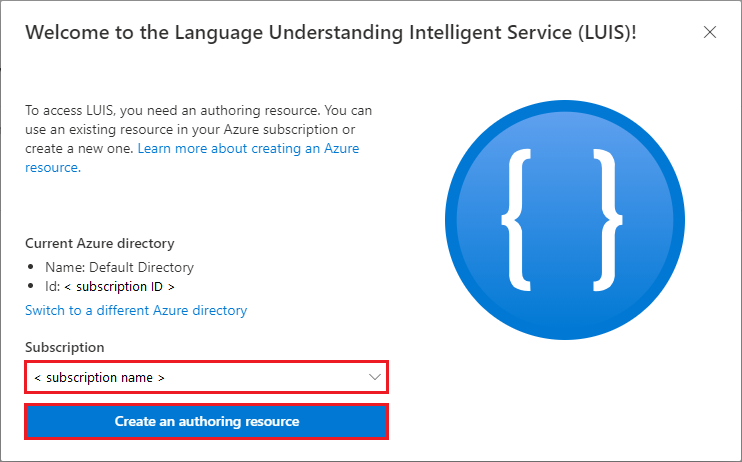
      
      1. Select the **Azure subscription** that you used to create your bot.
      
      1. To access LUIS, you have to create a new resource. Select **Create an authoring resource**, and continue to step 2.

   - If you have an existing authoring resource for LUIS, you'll see the **Choose an authoring resource** dialog:
   
      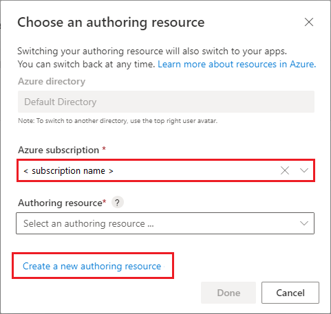
      
      1. Select the **Azure subscription** that you used to create your bot.
      
      1. If you have a valid existing resource for your subscription, it should be listed in the **Authoring resource** drop-down. You can choose an existing resource, or create a new resource.

         - To use an existing resource, choose the authoring resource from the drop-down, and then select **Done**.
         
         - To create a new resource, select **Create a new authoring resource**.
      
1. In the **Create new Azure Cognitive Services account** dialog, configure these settings to create a new authoring resource. (If you're using an existing authoring resource, you can skip this step.)

   - **Azure subscription**: Select the same subscription that you used to create your bot.
   - **Azure resource group**: Select the resource group that you used for your bot, such as **GeoFriendGroup**.
   - **Azure resource name**: Enter a name for your new resource, such as **GeoFriendLUIS**.
   - **Location**: Choose a valid authoring region for your new resource.

   After you configure the settings, select **Done**. A new authoring resource is added to your account.

After you sign into the LUIS portal, your account name and authoring resource are shown above the list of apps:

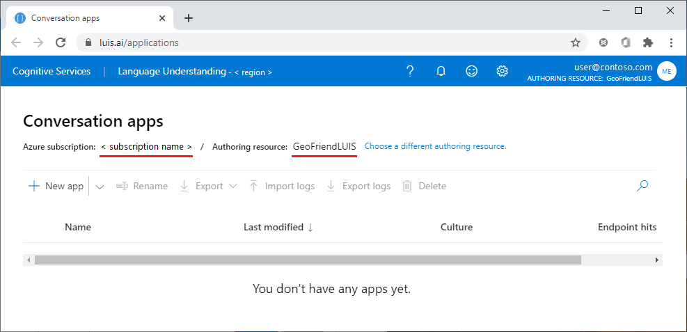

### Troubleshooting

If you don't see your new authoring resource in the LUIS portal, try these troubleshooting steps:

- Confirm that you're using the LUIS portal for the correct region.
- Check for your new resource in the Azure portal. The new resource should be listed under **All services** > **AI + machine learning** > **Cognitive Services**. 

> [!TIP]
> You can also create the authoring resource manually from the Azure portal.

## Create a conversation app

To use language understanding with our bot, we need to create a conversation app.

Select **New app** (the plus + symbol). In the **Create new app** dialog, configure these settings:

- Enter an **Application name**. In this exercise, we'll use **GeoFriendApp**.
- Choose a **Culture** setting that's appropriate for your region and location.
- You can enter a **Description** for your new app, but it's not required.
- Ignore the **Prediction resource** setting.

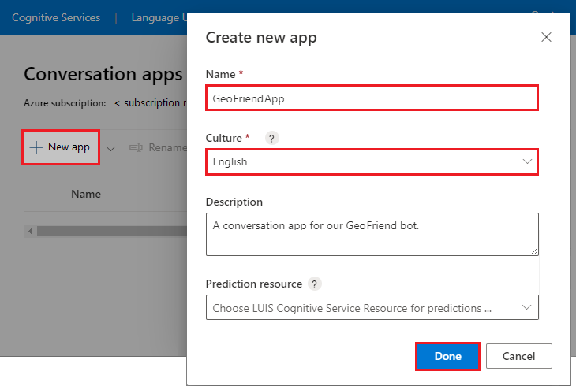

When you're done with the configuration, select **Done**.

The new app is created and the main dashboard view in the LUIS portal is refreshed. You might also see a popup window that shows an animation for how to complete your app development. You can browse the animation by using the **Previous** and **Next** arrows, or use the **Slide #** radio buttons.

## Add a prebuilt entity with geographical locations

For our app, we'll use a prebuilt entity of geographical locations.

1. On the left, select **Entities**. On the **Entities** screen, select **Add prebuilt entity**.

   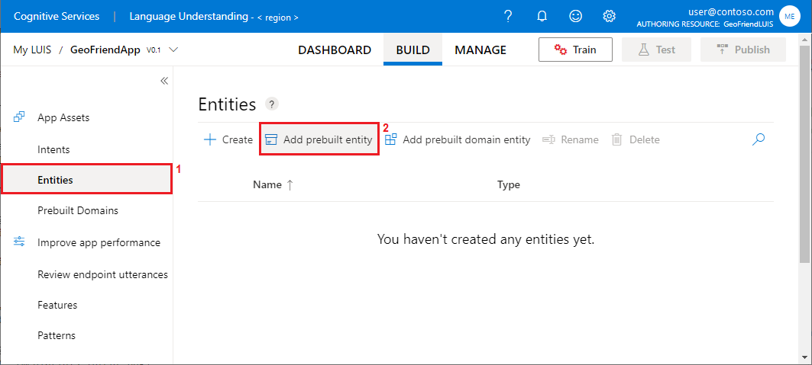

1. In the **Add prebuilt entities** dialog, select the **geographyV2** entity, and then select **Done**.

   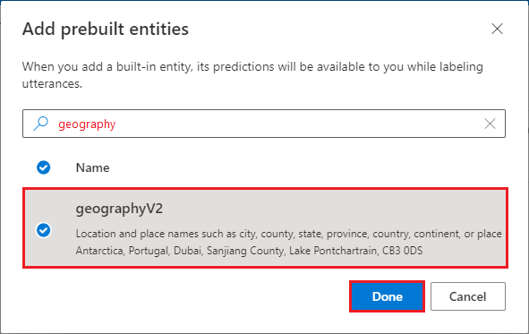

   The entity is added and the **Build** > **Entities** view in the LUIS portal is refreshed.

## Add intents and sample utterances

The last step before we train our app is to add the intents for our bot.

1. On the left, select **Intents**. On the **Intents** screen, select **Create**.

   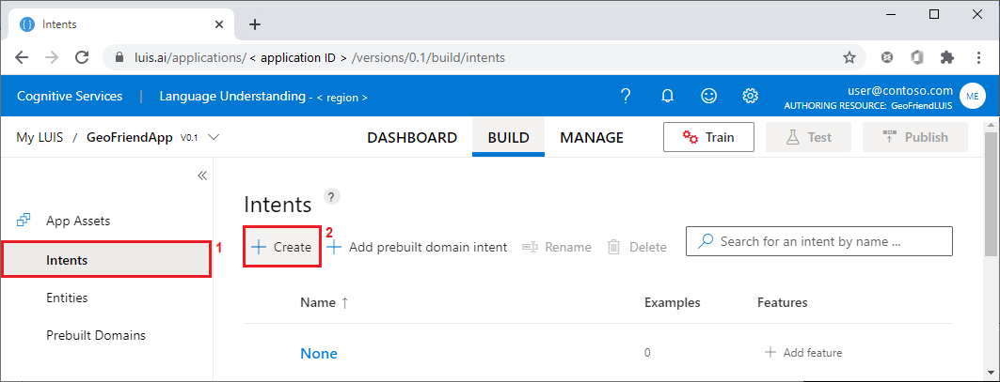

1. In the **Create new intent** dialog, enter the name for the new intent, `get_capital`. Select **Done**.

   The intent is added and the **Build** > **Intents** view in the LUIS portal is refreshed.

1. Now we need to provide sample phrases, or *utterances*, for our intent.

   We'll start with the sample phrase, "What is the capital of the United States?"
   Under the **Examples** section, enter the sample phrase in the box that says, *Type an example of what a user might say and hit Enter*.
   After you type the phrase in the box, press Enter.

   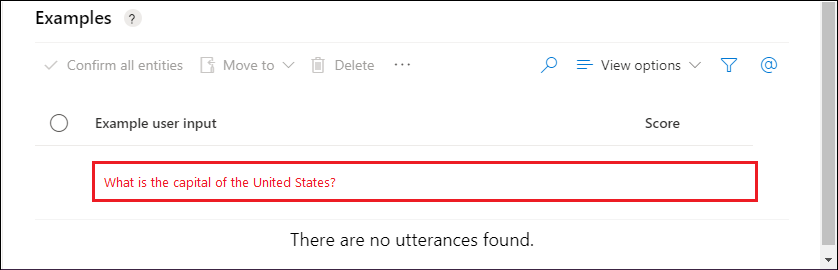

   The utterance is added to the intent and the view in the LUIS portal is refreshed.

   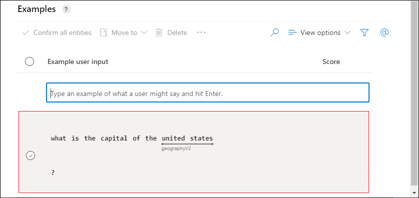

   Notice that LUIS automatically detects geographical entities. The "United States" portion of the utterance is a recognized location in the **geographyV2** entity.

1. Use the same procedure to enter a few more sample phrases for the `get_capital` intent. Another example is shown in the following table.

1. Follow the same steps to create the intents listed in the following table. Then add sample utterances for each intent.

   | Intent | Phrase |
   |---|---|
   |`get_capital` | What is the capital of the *United States*? |
   |`get_capital` | I need to know the capital city of *France*. |
   |`get_country` | What country's capital is *Paris*? |
   |`play_game` | I want to play! |
   |`play_game` | Let's start a capital quiz! |
   |`get_population` | What is the population of *Moscow*? |
   |`get_population` | How many people live in *Seoul*? |

   
## Train your LUIS model

There are two ways you can train your model:

- **Sample phrases**: You can train your model with sample phrases like those you entered in the last section. 
- **Data file**: You can use a saved data file to train your model. If you want to use this method, you can create the training model from scratch by using [this file][LUISCodeFile] in the GitHub repository.

For this exercise, we'll complete the training by using the sample phrases that you entered.

To start training your model, select **Train**:

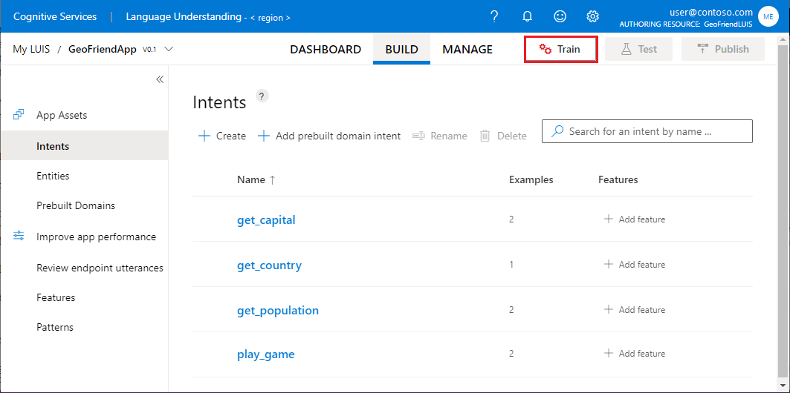

## Test your LUIS model

After training completes, select **Test**. In the **Test** region, enter input phrases or sentences to see how the model performs.

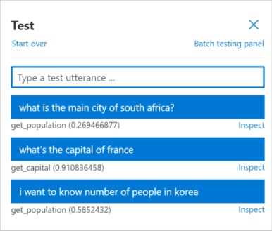

Each utterance has an associated probability. If a phrase is not recognized well, the probability is low. An example of a phrase with lower probability is the *main city* phrase. In the application, we can set some probability thresholds and consider only phrases that are recognized well.

If you notice a phrase that's classified incorrectly, select **Inspect**. You can see details about the phrase analysis and add utterances to the training data to improve the model.

## Publish your LUIS model

To use the LUIS model from the bot, we need to publish the model.

1. Select **Publish**. In the **Choose your publishing slot and settings** dialog, select **Production Slot**, and then select **Done**.

   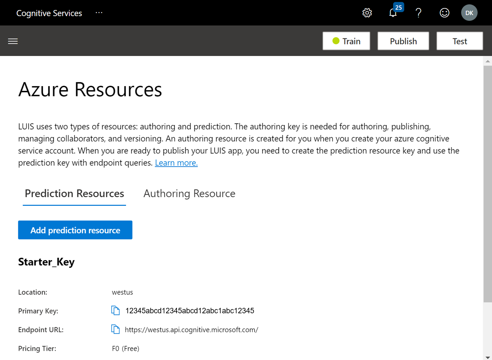

   After the model is published, you'll see a status message that has a link to the endpoint URLs for the model:

   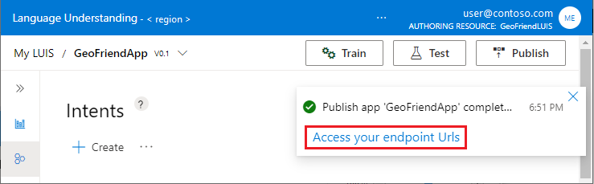

1. In the status message, select the **Access your endpoint Urls** link. The **Azure Resources** screen displays. To view the access keys and endpoint URL for your authoring resource, select **Authoring resource**.

   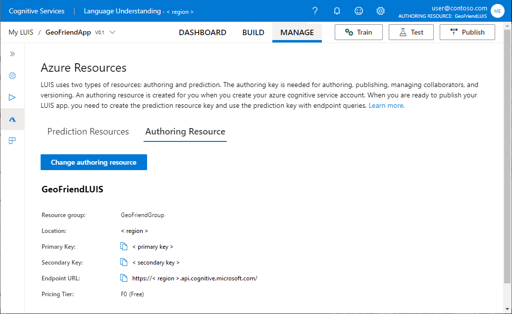

## Deploy your LUIS model

To deploy your LUIS model, you'll need a prediction resource with a set of access keys and an endpoint URL.

In this section, we'll create a prediction resource for your deployment. If you have an existing prediction resource that you would prefer to use, you don't need to create a new resource.

1. On the **Azure Resources** screen, select **Prediction Resources**, and then select **Add prediction resource**.

1. In the **Add a prediction resource** dialog, configure these settings:

   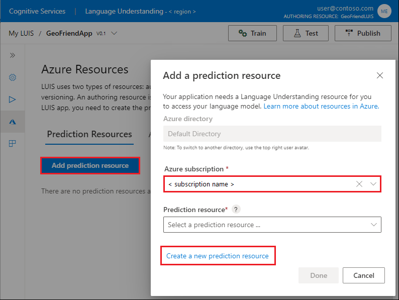
      
   1. Select the **Azure subscription** that you used to create your bot.
      
   1. If you have an existing prediction resource for your subscription, it should be listed in the **Prediction resource** drop-down. You can choose an existing resource, or create a new resource.

      - To use an existing resource, choose the prediction resource from the drop-down, and then select **Done**.
         
      - To create a new resource, select **Create a new prediction resource**.

1. In the **Create new Azure Cognitive Services account** dialog, configure these settings to create a new prediction resource. (If you're using an existing prediction resource, you can skip this step.)

   - **Azure subscription**: Select the same subscription that you used to create your bot.
   - **Azure resource group**: Select the resource group that you used for your bot, such as **GeoFriendGroup**.
   - **Azure resource name**: Enter a name for your new resource, such as **GeoFriendPrediction**.
   - **Location**: Choose a valid authoring region for your new resource.
   - **Pricing tier**: Choose F0 (free).

   After you configure the settings, select **Done**. A new prediction resource is added to your account.

   

   Now you have the necessary access keys and endpoint to deploy your model. 

## Save app settings

To integrate our bot source code with LUIS, we need to copy and save some resource settings.

1. In the LUIS portal, under **MANAGE**, select **Azure Resources**, and select **Prediction Resources**. Copy and save the following values:

   - **Primary Key**: For example, 0123ab4567cd890123efgh4567890123.
   - **Endpoint URL**: For example, https:\/\/my-region.api.cognitive.microsoft.com/.

1. Under **MANAGE**, select **Settings**. On the **Application Settings** page, copy and save the following value:

   - **App ID**: For example, 01234567-abcd-efgh-9876-0123456789ab.

We'll use these values in the next unit, when we integrate our LUIS model with our bot code.

<!-- Links -->

[LUIS]: https://docs.microsoft.com/azure/cognitive-services/luis/?azure-portal=true
[LUISCodeFile]: https://github.com/MicrosoftDocs/learn-responsible-bots/blob/master/models/GeoFriend.json?azure-portal=true
[LUISKeys]: https://docs.microsoft.com/azure/cognitive-services/luis/luis-reference-regions?azure-portal=true
[LUISPortal]: https://luis.ai?azure-portal=true
