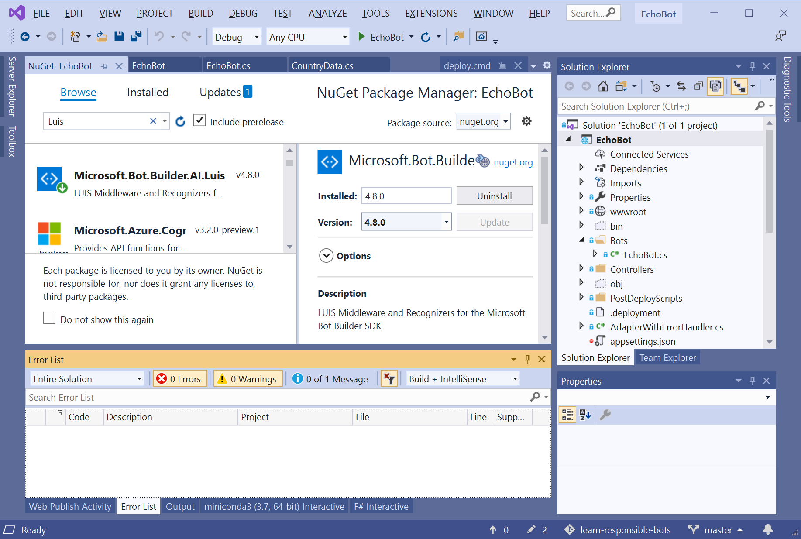
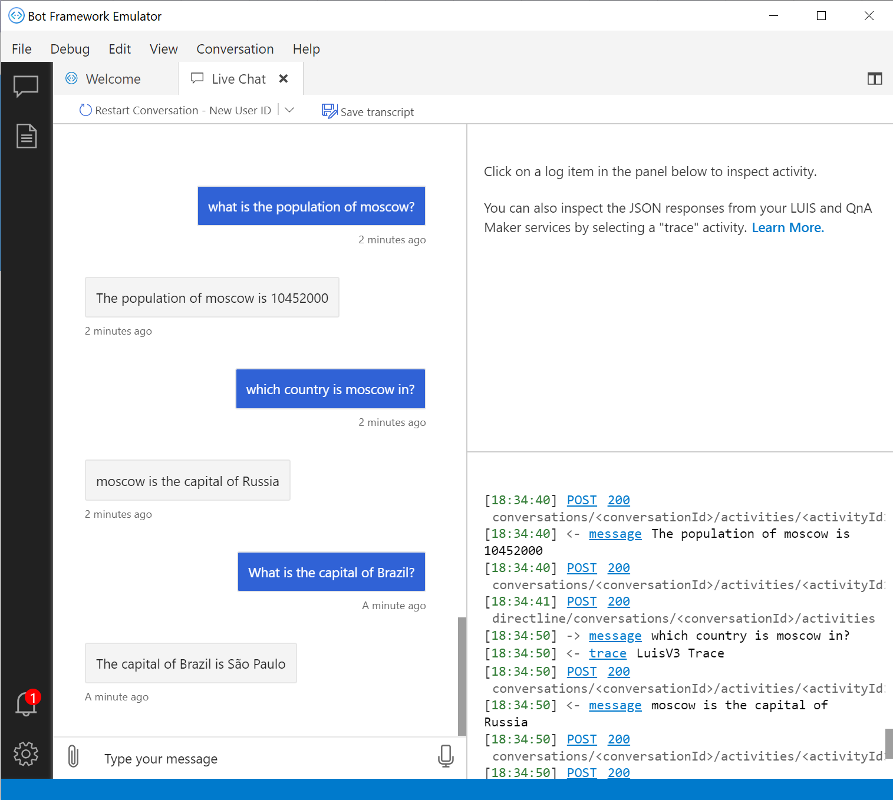

We have the LUIS model trained, tested, published, and ready for deployment.
To use the model with our bot, we need to update our *EchoBot* project code in Visual Studio.


## Install the LUIS NuGet package

The Microsoft.Bot.Builder.AI.Luis NuGet package provides APIs to interact with LUIS from code.

1. Open the Visual Studio project that we worked on in an earlier unit.

   > [!TIP]
   > The code described in this section is available [on GitHub][CodeLUIS]. If you want to use the GitHub project code with your bot, you need to update the *appsettings.json* file to use your keys for the LUIS service.

1. To add the Microsoft.Bot.Builder.AI.Luis NuGet package, follow these steps:

   1. Right-click the **EchoBot** project.
   1. Select **Manage NuGet packages**.
   1. Select the **Browse** tab.
   1. In the search box, enter "Luis." Choose **Microsoft.Bot.Builder.AI.Luis** from the results list.
   1. In the description pane for the Microsoft.Bot.Builder.AI.Luis NuGet package, select **Install**.
   1. In the **Preview changes** popup, select **OK**, and **Accept** the various license agreements.
   
   The Microsoft.Bot.Builder.AI.Luis NuGet package installs. The package provides several APIs, including Microsoft.Bot and Microsoft.Recognizers. You can monitor the install progress in the **Output** window.

   


## Integrate a LUIS recognizer into your bot

We use the LUIS Recognizer APIs in the Microsoft.Bot.Builder.AI.Luis NuGet package to interact with our LUIS model from our bot.

1. To use the LUIS Recognizer APIs with your bot, you need to update the `ConfigureServices` function in the *Startup.cs* file. Open the *Startup.cs* file, and insert the following code at the beginning of the `ConfigureServices` function on line 28:

   ```csharp
       var luisApplication = new LuisApplication(
           Configuration["LuisAppId"],
           Configuration["LuisAPIKey"],
           Configuration["LuisEndpointUrl"]);
       services.AddSingleton(new LuisRecognizer(luisApplication));
   ```

1. After you add the new code in the `ConfigureServices` function, Visual Studio displays a light bulb icon. The icon indicates there's a problem in the code.

   We need to add a `using` statement to define where to find the declarations for the `LuisRecognizer` class.
   If you select the **light bulb** icon, Visual Studio automatically fixes the issue. In this case, it adds the following `using` statement near the top of the file:

   ```csharp
   using Microsoft.Bot.Builder.AI.Luis;
   ```

1. The new code looks for the LUIS service parameters in the *appsettings.json* file. Add the following statements to the end of your *appsettings.json* file. Update the \<placeholders> with the LUIS prediction resource values that you saved in the previous unit.

   ```json
     "LuisAppId": "< LUIS application ID >",
     "LuisAPIKey": "< LUIS API key >",
     "LuisEndpointUrl": "< LUIS endpoint URL >"
   ```

   - `LuisAppId`: The LUIS application **App ID** value, such as 01234567-abcd-efgh-9876-0123456789ab.
   - `LuisAPIKey`: The LUIS prediction resource **Primary Key** value, such as 0123ab4567cd890123efgh4567890123.
   - `LuisEndpointUrl`: The LUIS prediction resource **Endpoint URL** value, such as https:\/\/my-region.api.cognitive.microsoft.com/.

1. After we register the `LuisRecognizer` class as a singleton, we can automatically receive a class instance as a parameter to the `EchoBot` constructor. Open the *Bots\EchoBot.cs* file, and add a recognizer field and a constructor to the beginning of the `EchoBot` class near line 14:

   ```csharp
   LuisRecognizer rec;
    
   public EchoBot(LuisRecognizer rec)
   {
       this.rec = rec;
   }
   ```

   To support the `LuisRecognizer` class, we need to add another `using` statement.
   Add the following statement near the top of the file where the other `using` statements are located:

   ```csharp
   using Microsoft.Bot.Builder.AI.Luis;
   ```

1. To make sure the recognizer works, replace the code for the `OnMessageActivityAsync` function with this new definition:

    ```csharp
    protected override async Task OnMessageActivityAsync(ITurnContext<IMessageActivity> turnContext, CancellationToken cancellationToken)
    {
        var res = await rec.RecognizeAsync(turnContext, cancellationToken);
        await turnContext.SendActivityAsync(res.GetTopScoringIntent().ToString());
        await turnContext.SendActivityAsync(res.Entities.ToString());
    }
    ```

   The `OnMessageActivityAsync` function calls the LUIS recognizer and displays the top event and associated entities. 

1. Rebuild your `EchoBot` solution, and then run your updated bot in the Bot Framework Emulator. Observe the results:

   <!-- Revised code fails with errors in VS. Not able to test bot. -->
   <!-- After failure fixed, add image to show how the Results. -->

   |Input utterance|Result|
   |---|---|
   |*What is the capital of France?*|`(get_capital,0.86)`<br/>`{"geographyV2": [{"location": "France","type": "countryRegion"}]`|
   |*What is the capital of Paris?*|`(get_capital,0.86)`<br/>`{"geographyV2": [{"location": "Paris","type": "city"}]`|

   You can verify that the entities are extracted correctly, and that LUIS can distinguish between cities and countries automatically.


## Add processing logic

Let's add processing logic to our bot. In the `OnMessageActivityAsync` function, we'll check if the recognition result is good enough, and call the corresponding function to process the LUIS results.

In the *Bots\EchoBot.cs* file, replace the code for the `OnMessageActivityAsync` function with this new definition:

```csharp
protected override async Task OnMessageActivityAsync(ITurnContext<IMessageActivity> turnContext, CancellationToken cancellationToken)
{
   var res = await rec.RecognizeAsync(turnContext, cancellationToken);
   var (intent, score) = res.GetTopScoringIntent();
   if (score>0.3)
   {
      await ProcessLuisResult(turnContext, intent, res.Entities);
   }
   else
   {
      await turnContext.SendActivityAsync("I am not sure I understand you fully");
   }
}
```

All intent processing happens in another function named `ProcessLuisResults`.

> [!Note]
> You don't need to update the following code in this exercise. We're simply looking at a portion of the code to review the logic.
> You can find the complete code for this stage of bot development in this [GitHub sample repository][CodeLuis].

```csharp
protected async Task ProcessLuisResult(ITurnContext<IMessageActivity> turnContext, string intent, JObject entities)
{
   if (intent=="hel")
   {
      await turnContext.SendActivityAsync("This feature is not yet implemented");
      return;
   }
   var geo = entities["geographyV2"];
   if (geo==null || geo.Count()!=1)
   {
      await turnContext.SendActivityAsync("I am not sure which location you mean");
      return;
   }
   var loc = geo[0]["location"].ToString();
   switch (intent)
   {
      case "get_capital":
         var cap = CData.GetCapital(loc);
         await turnContext.SendActivityAsync(cap==null
            ? $"I do not know the capital of {loc}"
            : $"The capital of {loc} is {cap}");
         break;
         ...
      default:
         await turnContext.SendActivityAsync("I do not know that one");
         break;
   }
}
```

Here's a summary of the logic in the `ProcessLuisResults` function:

- The bot checks if the intent is to play a game (`play_game`), which doesn't require a geographical location. The bot says the game isn't available.
- For all other intents, the bot expects exactly one geographical location. If no location or more than one location is entered, the bot says there's an error.
- When the bot finds exactly one location, the bot uses the `switch` statement to process each intent according to the logic.

In the next unit, we'll add a few functions to the `CountryData` class to implement more logic:

- When the bot finds a city name, it returns the population for that city.
- When the bot finds a capital city name, it returns the name of the corresponding country.


## Talk to your bot

Rebuild your `EchoBot` solution, and then run your updated bot in the Bot Framework Emulator. Have a conversation to test the new logic features.




## Conclusion

Now your bot seems to be more intelligent, but it still needs improvement to align with responsible AI principles. The most important principle is to make the goal of the bot clear. In the next unit, we'll add one more feature. After that's done, we'll take a closer look at how to implement responsible conversational principles.


<!-- Links -->

[CodeLuis]: https://github.com/MicrosoftDocs/learn-responsible-bots/tree/t2-luisrec?azure-portal=true
